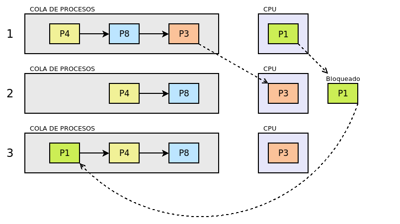
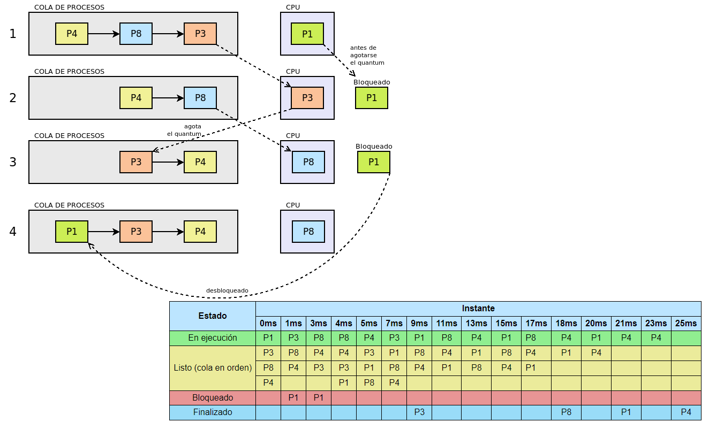
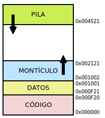

# Operating Systems
El OS es el software básico (conjunto de programas) que está justo "por encima"
del hardware, y sobre el que corren el resto de aplicaciones. Es lo que se 
intenta cargar al arrancar la máquina.

Permite que las aplicaciones puedan "olvidarse" de la parte física del sistema
y se ejecuten sin que ninguna monopolice todos los recursos (memoria/procesador)

Las funciones básicas serían: controlar el hardware y ponerlo a disposición de
aplicaiones y usuarios. Facilitar una base para ejecución de aplicaciones,
independientemente del hardware. Gestionar la ejecución de aplicaciones.
Facilitar comunicación con dispositivos. Supervisar y (si es posible) corregir
fallos que se produczcan. Ofrecer una interfaz al usuario para trabajar
con el sistema informático y administrarlo.

## Funciones
El OS tiene que gestionar los recursos del sistema y dar acceso a ellos a las
aplicacviones

### Gestión de procesos
Un proceso (está también más abajo) es un programa en ejecución. Si el programa
no está en ejecución, son ficheros en memoria secundaria (hard drive). Cuando
se ejecuta, pasa a memoria principal (RAM).

Un programa son instrucciones en uno o varios ficheros. El pedirse la ejecución
de un programa, se crea el proceso y se pasan las ainstrucciones a RAM para 
ejecución. cada vez que se ejecuta un programa, se crea un proceso asociado
a esa ejecución. El mismo programa ejecutado varias veces crea procesos 
diferentes.

Es normal que varios procesos se ejecuten a la vez, y necesiten acceso a 
distintos recursos. El OS se encarga de  qué se ejecutan cuando y evita 
problemas de acceso a recursos. La gestión de procesos incluye:

- crear y destruir procesos
- qué se ejecuta y por cuanto tiempo (time-shared), ie, parar y reanudar 
procesos
- sincronizar y comunicar procesos

Para la gestión el OS asocia a cada proceso un PCB (Process Control Block)

#### Threads
Son procesos que pueden descomponerse en secuencias de instrucciones que,
aunque compartan recursos, se pueden ejecutar en paralelo. Si la máquina tiene
varios procesadores, puede distribuir trabajo y va más rápido

#### Tipos de proceso
Clasificación según varios criterios

##### Mono o Multi thread
uno o varios hilos de proceso

##### Responsable de ejecución
Quién ejecuta el proceso. Si es el sistema operativo, se dicen en modo kernel
o privilegiado. Si es el usuario (no tiene por qué ser físico), se dice que
es modo usuario.

##### Interacción con user
En primer plano, o interactivo. Interactúa con u usuario (un juego).

En segundo plano, no hay interacción directa con el usuario, en general proveen
servicios, y se llaman servicios en vez de procesos. En sistemas UNIX se suelen
llamar *daemon*

#### Caracterización
El OS asigna a cada proceso un PCB, que es una agrupación de datos que se
crea al iniciarse la ejecución y se destruye al acabar. Tiene:

- ID: idntificador del proceso único. No pueden volver a usarse hasta que se 
resetee el OS. Se suele llamar PID = Process IDentifier

- Estado: 
    - Listo: listo/en espera/preparado para ser ejecutado, en cuanto se le 
    asigne un procesador
    - En ejecución: Tiene un procesador asociado y se están ejecutando 
    instrucciones. Si cambia d estado, será porque se saca del procesador para
    que entre otro proceso (pasa a listo), requiere un recurso no dispoible
    (pasa a bloqueado), o termine
    - Bloqueado: Necesita un recurso que no está disponible; queda así hasta que
    el recurso esté disponible, entonces pasa a listo
    - Creado: El estado pre-listo, se están asigando el PBC y memoria.
    - Zombie: En UNIX, procso finalizado pero con PBC no eliminado y sigue en
    cola de procesos.
    - Suspendido: Detenido a petición de usuario. No va a pasar a ejecución.
    El usuario decide cuando reactivarlo (pasa a listo) o cancelarlo.

- Prioridad: define cuanto de importante es el proceso. A más prioridad, más
tiempo de procesador se le da.

- Propietario: quién ha pedido este proceso. Determina los permisos del proceso

#### Vida

- creación: un proceso se crea al pedirse la ejecución de un programa. Puede ser
porque el OS lo requiere, o porque se ha configurado por el admin (p. ej.
que una DB arranque con el sistema); puede ser porque lo pide un usuario,
puede ser porque un proceso invoque a otro programa. Una vez que se crea un 
proceso (con su PBC), se le mete en la PT (Process Table), una tabla con el
PID y un puntero al PCB. Con esto, se reserva memoria para ejecución y se marca
como ready

- desarrollo: según el OS le vaya dando tiempo de procesador, avanza la 
ejecución. Miestras está en ejecución, lo puede parar el OS o queda bloqueado
a la espera de algún recurso. Cuando pasa que no hay un recurso disponible, 
dices que hay un cambio de contexto, que es una interrupción que hace el 
hardware para que el OS sepa que tiene que "echar" al proceso del procesador. El
cambio de contexto es: guardar el estado del proceso (su contexto), seleccionar
otro proceso a ejecutar (hay un algoritmo por detrás que lo hace), cambiar 
estado del proceso que se va a ejecutar, ejecutar el proceso. Si el proceso está 
en PT ready, el planner podrá asiganrle un procesador si queda alguno libre

- fin: cuando han terminado las instrucciones, por un error en ejecución, 
se ordena su fin, otro proceso ordena su fin. Cuando el proceso acaba, a veces
queda en estado de finalizado en vez de desaparecer de PT y borrar PCB

#### Algoritmos de planificación
Hay distintos algoritmos que pueden usar los planificadores de procesos
para decidir cuando un proceso tiene tiempo de procesador

- Plazo fijo: Se establece el tiempo que debe durar una tarea. Es compleja, 
porque el usuario debe decir con antelación qué recursos necesita, debe 
completarse el proceso antes del plazo (sin causar problemas a otros procesos),
el sistema debe planificar necesidades pero no sabe si aparecerán otros procesos
que necesiten las mismas cosas, la planificación se complica mucho si aparecen
muchas tareas de este tipo

- FIFO/FCFS: FIFO = First In First OUT o  FCFS= First Come First Served es
"el primero que llega es el primero que entra", o de otr manera, el que más 
tiempo lleve esperando para un procesador es al que se le asigna un cuando esté 
libre. Es muy sencillo, solo necesitas una cola que tenga el tiempo de cuando
se marca el proceso como listo. Pero para cosas interactivas no es bueno, porque
si entra "rápido" algo que come muchos recursos, lastra a los de detrás, sin
tener en cuenta su importancia.

Ejemplo con tiempo de un FIFO:

- SFJ: Short First Job. como FIFO, ejecuta el proceso que coge, hasta que acaba
o se bloquea. Pero elige el que estima que va a tardar menos primero. Minimiza
el tiempo medio de finalización. Ejemplo: 3 procesos, que tardan 3, 2, 1 
segundos cada. Con FIFO, el P1 tarda en finalizar 3s. El P2 tarda 3+2=5s,
el P3 5+1=6s; en promedio, el tiempo de inalización es (3+5+6)/3. Con SFJ,
primero se ejecutaría P·, fin en 1s, luego P2, fin en 1+2=3s, luego P1, fin
en 3 + 3 = 6s, timepo medio de finalizacion (1+3+6)/3

- SRTF: Short Remaining Time First. Prioriza el que le quede menos tiempo de
ejecución. Se necesita una cola queguarde el proceso junto con el tiempo
que quede de ejecución .Si en la ejecución de un proceso aparece algo "más 
rápido", se echa al que está en procesador y se mete al nuevo, ordenándose en 
cola según el timepon que le quede.

- Tasa de respuesta más alta: se calcula, para cada proceso, cuanto lleva
esperando (TE) y cuento va a tardar (TF). Con la expresión `1+TE/TF` se da
la priorida para entrar a procesador (a más alto ese número, antes entras)

- Round Robin: o turno rotatoio. Buena para los time-shared, porque cada proceso
tiene un intervalo de tiempo de ejecución, se dice *quantum* Cuando nun proceso 
agota su quantum, le echas y vuelve a cola si no terminó. Define tiempo máximo
de ocupación de CPU, no tiempo de espera en cola, por tanto se combina con las
otras sin problemas (ie puedo hacr un FIFO+Round Robin)

Ejemplo de FIFO + RR con quantum de 2ms:

El quantum depdende del reloj, porque equivaldrá a nosecuantos ciclos del reloj.
El quantum puede ser fijo o variable, depender de usuario... En general, hay 
peor rendimiento a menor quantum, el tiempo de respuesta es peor cuanto mayor
quantum. La idea es que el quantum sea mayor que la mayoría de las peticiones
interactivas.

### Gestión de memoria
La ejecución de un programa supone copiar los ficheros "físicos" + datos
que manipule a RAM. La RAm está dividida en cells, cuyo contenido es un byte,
y tienen una dirección única. Una RAM de 16MiB tiene direcciones desde 
`0x000000` hasta `0xFFFFFF`. Las direcciones que identifican las celdas
se dicen direcciones físicas de memoria. La memoria RAM ES CARA, es importante
que el OS gestione bien esto porque no va a tener mucho.

#### Ocupación de memoria
Al crear un proceso, necesitas: 
- un PCB, para gestionar el proceso
- Un espacio virtual de memoria para almacenar código y datos. Es la parte de 
espacio físico que ocupa un proceso. Las cells de este espacio se referencian 
via VAS (Virtual Address Space), relativas al comienzo del espacio. Hay que
hacer traducción entre estas direcciones y las físicas, porque son con las
que trabaja el proceso. De eso se encarga la MMU (Memory Mangement Unit),
una parte del procesador. El espacio virtual tiene 4 partes:
    - Código: reservado a las instrucciones del programa. no cambia
    - Datos: datos iniciales del programa. No cambian de tamaño.
    - Montúclo: donde se guardan datos que se creen durante ejecución. Tamaño 
    variable
    - Stack: contiene llamadas a otros códigos, con sus datos y demás. Es normal
    que un código llame a otro código antes de terminar la ejecución. La pila
    se encargará de "acordarse" de por donde iba.

Al crear el VS (Virtual Space), en su dirección 0x0 (no es la dirección
física 0x0, es la del VS), se ponen codigo y datos, que es lo fijo. Arriba de
estos se pone el montículo, que crece "hacia arriba", y al final de todo se 
pone el stack, que crece "hacia abajo"

#### Técnicas de ocupación
Un proceso puede que ocupe un VS "de seguido", o "fragmentado" (posiciones
de la memoria física no contiguas).

Si el VS es indivisible, puedes usar particiones fijas o dinámicas. Si es
fragmentado, puedes usar paginación o segmentación

##### Particiones
Divides la memoria en cachos seguidos que ocupan espacio. Cada cacho
es una partición. Tiene una dirección de memoria de incio (registro base), y
el tamaño (que es fijo) determina el registro límite (fin de la partición). 
Con esta técnica, cada proceso tiene exactamente una partición, y cada partición
tiene exactamente 1 proceso. El OS gestiona el inicio, tamaño y proceso de cada
partición. Esta técnica obliga a que los Espacios Virtuales de Memoria sean 
pequeños. El particionado puede ser fijo o variable. 

Si el particionado es fijo, quiere decir que se ha particionado la memoria
de antemano, las particiones es lo que no cambia, pero pueden ser distintas
entre sí. Si el VS del proceso no "llena" la partición, hay espacio 
desaprovechado (fragmentación interna)

Si es particionado dinámico, se crean particiones que se ajusten a los procesos.
No tendrás fragmentación interna, pero si acaba un proceso, se libera esa 
partición. El espacio que queda libre puede ser ocupado por otro proceso, pero
puede ser que no ocupe todo lo liberado, y lo que reste no sea suficiente para
otro proceso; eso es fragmentación externa.

##### Paginación
El OS divide la memoria física en *frames*, que son cachos de tamaño fijo, y
también el VS de un proceso en cachos llamados páginas, del mismo tamaño o
menores que los
frames. La técnica es asociar a cada página un frame, pero no hay que darle a 
páginas de un mismo proceso frames consecutivos. El OS controla via una tabla
la asignación. En el PCB necesito un pointer a esa tablas.

Puedo tener fragmentación interna, porque una página sea más pequeña que un 
frame.
 
##### Segmentación
Troceas el espacio virtual de memoria en *segmentos* (no tienen por qué
ser iguales). Estos segmentos se asignan a memoria física, no necesariamente
continuada, se van buscando huecos. El OS crea una tabla que diga inicio
y tamaño de dónde va cada segmento, info que tendrá que ir en el PCB.
Pude generar fragmentación externa.

##### Virtual Memory
Lo combinas con Paginasción/segmentación, lo que hace es que  no carga todo el 
proceso a RAM, solo lo que esté utilizando/ejecutando. El resto queda en 
hard drive. Se rescata si es necesario. Como el hard drive es lento, solo se usa
esto si el proceso necesita más memoria de la que hay disponible. Existe
una zona del herd drive, que se llama swap, que está reservada para
este proceso. En windows suele ser un fichero, en LKinux es normalmente una
partición. Usar mucho swap dice que tienes qe poner más RAM

### Gestión de I/O
### Gestión de ficheros
### Gestión de seguridad
### User Interface (UI)

## Componentes
### Kernel
O núcleo. es "el OS en sí", Es quien traduce software/hardware, gestiona
cosas. Este programa se carga a memoria y ahí se queda hasta que se apague
el sistema. Aparte de ser el traductor, se encarga de gestionar memoria y 
procesos.

### Interfaz
Es la amnera que el OS tiene de comunicarse con el user. Normalmente una CLI
o una GUI

### Aplicaciones
Programas que permiten hacer cosas sobre el OS. P. ej, monitorizar procesos 
existentes (task manager de windows)

## Tipos
Hay diferentes tipos de clasificaciones:

### Modo de operación
#### Por lotes
Ejecuta tareas secuencialmente, ie, una tras otra. Si la primera no acaba, no
empieza la segunda. No puede hacer más de 1 cosa a la vez. Es el más lento

#### Time-sharing
Parece que hace muchas cosas a la vez, pero realmente hace un poco de cada
cosa secuencialmente (a cada proceso le dedica un tiempo). El OS se encarga de
optimizar las cosas para que, si hay interacción con el usuario (escribir con 
el teclado y que se vea) eso se ejecute antes que cosas que están en background.

Los OS actuales suelen funcionar así.

#### Real time
Son para cosas muy específicas (ie control aéreo). Se preestablece un tiempo 
de respuesta (muy corto en genereal), y si se sobrepasa ese tiempo de respuesta
provoca un fallo en el sistema.

### Número de usuarios
Se refiere a cuántos usuarios pueden usar/acceder al OS *a la vez*

#### Monousuario
Solo un usuario usando el sistema a la vez. Monousuario no quiere decir que
solo pueda exitir un usuario de ese sitema, puede haber otros, pero no lo 
pueden usar a la vez.

#### Multiusuario
Varios usuarios a la vez pueden consumir recursos del sistema. Todos los
derivados de UNIX (Linuz, FreeDB, MacOSv.10) y las versiones server de windows
(NT, 20XX)

### Número de procesos
**IMPORTANTE**: un proceso es un programa que se está ejecutando y sus 
instrucciones están parcial o totalmente cargadas en memoria principal (RAM).

Un programa, antes de ejecutarse, son ficheros en memoria secundaria (hard 
drive).

Cuando se da la orden de ejecución de un programa, pasa a cargarse a RAM
y se constotuye en un proceso. Cada ejecución es un proceso diferente (aunque
sea el mismo programa)

#### Monotarea
O monoproceso; hasta que no acaba un proceso no pasa a ejecutarse el siguiente.
Esto ya no existe

#### Multitarea
O multiproceso, hacen varias cosas a la vez. Realmente lo que hacen es usar
varios procesadores de la CPU a la vez. No quiere decir que no usen también 
time-sharing, porque podríamos tner más procesos que procesadores.

Es posible también ejecutar 1 proceso en varios procesadores, es lo que se 
conoce como multithreads (multihilos). Esto hace que el proceso vaya más rápido.

Hoy en día todo el multiproceso, poruqe las CPU tienen varios nucleos.

### Arquitectura
El OS (su kernel) tiene distintos módulos (partes) que hacen cosas, por ejemplo,
llamar al sistema, VFS (Virtual File System), Sistema de ficheros, IPC 
(Inter-Process Communication), Virtual Memory, Planner, Drivers, Gestión de 
I/O...

Estos "mini programas" pueden ejecutarse en modo *kernel* o privilegiado o
en modo *usuario*. Una aplicación que no sea del OS siempre se ejecutará en 
modo usuario. Esencialmente el modo privilegio es que puedo "tocar" el 
hardware. El modo kernel se reserva al los programas de OS y procesos
Trusted del sistema. Es una manera de asegurar el sistema

Se pueden clasificar los OS según como ejecutan estos "mini programas"

#### Monolithic
El OS es un único programa y todas sus partes se ejecutan en modod kernel.
Es más simple y compacto, suele tner mejor rendimiento.

Ejemplos: MD-DOS, Windows no NT, MacOS hasta v8, Linux y los 
UNIX de la familia BSD

#### Micro Kernel
Lo que se ejecuta en modo kernel es lo más básico: IPC, gestión de memoria
y planificaci´ñon de procesos. Todo lo demás no es privilegiado.

Su ventaja es que los errores se aislan en los programitas mas pequeños.
Ejemplo: Kurd y Minix

#### Hírbido
Como un micro kernel ampliado; hay tareas que sin ser parte del kernel
se ejecutan en modo kernel.

Ejemplo: Windows NT y MacOS actuales

## Mercado
Más o menos lo que está en la actualidad

### Familia

#### Windows
Desarrollados por Microsoft, es para los PC compatibles de IBM. Antes había 2 
ramas: la derivata de MS-DOS y la derivada de Windows NT. La primera murió
y solo queda la rama de NT. La rama NT luego derivó en 2 ramas: para PCs y para 
servers. La rama PC son los Windows XP, Vista, 7, 8, 10, 11. La de servers
son los Windows server 20XX (03, 08, 12, 16, 19, 22).

Uso: sobre todo en PCs y seridores corporativos de servicios de red

#### BSD
BSD = Berkeley Software Distribution. Derivó de UNIX, y leugo derivó en
otras distribuciones: FreeBSD (se usó parcialmente para el kernel de MacOS), 
OpenBSD (orientada a la seguridas, de aquí salío OpenSSH [SSH = Security SHell]),
NetBSD

#### Linux
"es" un UNIX para ordenadores de IBM, desarrollado por Linus Torvald, que
liberó el desarrollo con una GPL y se hizo desarrollo colaborativo. Es el UNIX
más extendido y lo desarrollan voluntarios y grandes empresas. Donde no se 
suele usar en en PCs, pero se usa en superservidores, servidores, móviles
(via android) y en switches  y routers empotrado

#### MacOS
Es para las máquinas que desarrolla Apple. Hay 2 OS con este nombre, el clásico,
y, desde la versión 10, y hasta hoy, se conoce como OsX. El actual es un UNIX
que viene de FreeBSD y NeXTSTEP. OsX es la base de iOS, que es para los móviles

### Tipo de dispositivo
Qué OS se usa en qué hardware. En superordenadores y mainframes, Linux adaptado
a la compañía por el fabricante del hardware. En servers, Windows server para 
LAN y Linux para internet. Para PC, Windows, OsX, a veces Linux. Para móvil,
iOS o Android (Linux).

En otro dispositivos, como los de red, puede existir un OS específico del 
fabricante. El ejemplo es el CISCO iOS (internetwork Operatin System) que se
usa en los dispositivos de CISCO