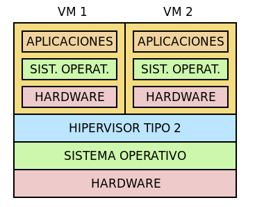
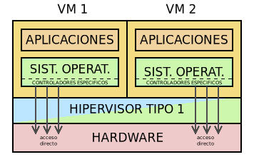

# Virtualización de plataforma
Consiste en crear un sistema informático virtual (que no existe físicamente)
que se denomina máquina virtual, constituido por un OS+hardware (=plataforma)

## Conceptos
### Máquina virtual
Es el conjunto de hardware virtual, OS y apps que corren sobre ese OS

### Hypervisor
es la plataforma software que  controla la virtualización de diferentes máquinas

### Host
Es el equipo sobre el que se hace la virtualización

### Guest
Es el equipo que corren en la VM

### Virtualización completa
Se virtualiza una plataforma hardware funcional; el guest debe usar las 
componentes de la plataforma (tener los drivers). Hay 2 clasificaciones
de virtualización completa:

#### Por tipo de Hypervisor
##### Virtualización nativa o tipo 1
En este caso, el hypervisor se ejecuta directamente sobre el hardware


Es más eficiente, ya que no "hay que pasar" por el OS del host

##### Virtualización alojada o tipo 2
En este caso, el hipervisort se ejecuta sobre el OS del host



#### Por "privilegios"
Algunas plataformas incluyen en los procesadores instrucciones para ayudar en
la virtualización del hardware; así los guests pueden ejecutar cosas 
directamente sobre el procesador sin afectar al host. Podemos tener entonces
**virtualización acelerada por hardware**, si podemos hacer lo mencionado arriba,
o **emulación**, donde la virtualización del hardware es via software (menos
eficiente)

### Paravirtualización
Para el guest no se crea un hardware virtual, tiene los drivers para hacer las
peticiones al hardware del host. Como no virtualiza hardware, mejora rendimeinto.
A cambio, no todo OS se puede paravirtualizar



Hay una versión híbrida entre la completa y la para, donde se paravirtualiza
hardware que sea difícil de virtualizar

### Containers
Se crean espacios de usuario aislados. Cada uno de estos es un contendor
que maneja sus recursos hardware asignados. Esto no virtualiza hardware
ni OS para guest; solo apps (de base o de user), que corren dentro del container.

Puedes tener contenedores de sistema, donde tienes un espacio de usuario
completo y aislado (que no incomunicado) del host. Aquí la gestión del
guest es muy parecida a la virtualización completa.

También puedes tener contenedores de aplicación; ejecutan una app aislada. Muy
de moda, gracias a Docker

Lo bueno de los containers es que pesan poco y rinden bien. Lo malo es que
como no tienen OS (usan el del host), las apps que corran en los containers
tienen que estar hechas para el OS host


## Software de virtualización
Al usar software de virtualización para instalar y probar OSs queremos,
entre otrs cosas:
- Manipular cómo se conecta la VM a la red, para simular escenarios.
No es lo mismo virtualizar un sistema de escritorio, que necesitará
salida a internet y ya, que virtualizar un server, donde necesitaremos 
conectarnos desde el host probablemente
- Poder tomar snapshots, esto es, "fotos" del estado de la VM,
para poder recuperar en caso de romper algo
- Crear plantillas de máquinas
- Virtualizar los firmwares BIOS (Basic Input/Output System) y UEFI (Unified
Extensible Firmware Interface)
- Tener mecanimos de intercambio de datos entre gurst y host
- Exportar o imoprtar VMs de un host a otro.

## VirtualBox
es un hypervisor tipo 2 con aceleración por hardware. Hay una versión con
licencia GLP. Es fácil de usar.

### Tipo de máquina
Podemos elegir, al crear máquinas, la plataforma (CPU + OS). La elección es
CPU de 32 o 64 bits; si escogemos la de 32, solo se puede instalar 
software para plataforma x86

### Red
Tenemos 4 interfaces de red:
- Desconectada: interfaz de red desconectada
- Bridged Adapter: la interfaz está en la misma red que la interfaz de verdad
a la que se conecta; esto es hacer que la VM sea una máquina más de nuestra
red local
- NAT: La VM está en una red interna exclusiva; para acceder al exterior usa
el software VirtualBox, que hace de Router y server DHCP y DNS. Esta máquina
es inaccesible desde fuera, salvo redirección de puertos (se hace desde
el software de VirtualBox)
- Red NAT: permite incluir vaias VMs en una red interna, para que se vean
entre sí. Hay que crearla previemante (la red)
- Red interna: igual que Red NAT, pero no ha enroutamiento; está completamente
aislada
- Adaptadr solo anfitrión: red exclusiva para host y guests

### Discos
Los discos del guest son ficheros en el host. VirtualBox tiene estos formatos:
- VDI (Virtual Disk Image), el nativo
- VMDK (Virtual Machine DisK), el formato abieto de VMWare
- VHD (Virtual Hard Disk), un formato de Microsoft
- RAW, es un fichero que contiene byte a byte el contenido del disco virtual.
Como es raw, su tamaño es el mismo que el del disco que virtualiza. El resto
solo se come lo que realmente esté virtualizado

Lo mejor es unar VDI, aunque se puede cambiar el formato del disco
para usarlo en otro software de virtualización.

Al usar VDI, tenemos snapshots, "multi-attach", para usar un mismo disco
como plantilla para varias máquinas.

### Arranque
Por defecto es BIOS. Se puede seleccionar UEFI (con consecuencias)

### Guest Additions
Lo primero tras instalar un OS es instalar guest additions (Devices --> 
guest addtions). Con esto, en entorno gráfico del guest se ajsta a 
la ventana del VirtualBox, y se puede copy/paste de host a guest
facilmente ajustando una config, se pueden definir carpetas compartidas
entre guest y host

### puerto serie
pdte

### exportar
Hay 2 opciones para exportar la VM a otro host:
- Exportar en formato OVA (Open Virtual Appliance). No respeta snapshots.
Generará en el host destno un VDI con el estado último
- Copiar el dir donde esté la VM al host destino y "añadir" una nueva VM
usando el ficheor `.vbox`. Puede dar problemas si todo lo que necesitamos
no está en el directorio

### Ejemplicios
Vamos a usar un Windows 11 que será lo más familiar para probar a ahcer cosas.
Necesitamos la ISO: https://www.microsoft.com/software-download/windows11

Abrimos el programa, pulsamos en new, vamos a "expert mode". 
Hay que darle un nombre significativo, que refleje el OS que se va a instalar y 
la funcion. Por ejemplo, Windows11x64_test. Elegimos una carpeta de destino
para la VM, vamos a crear una carpeta en D para almacenar nuestras VMs.

Seleccionamos la ISO. Eso debería detectar automaticamente tipo y versión
del OS; para cosas raras hay que hacer más trabajo.

De momento vamos a hacer unattended install; no pulsamos el tick.
Tenemos que elegir un usuario, un password, nombre para el sistema
(el resto de momento no lo vemos)

Seleccionamos el hardware que queremos: RAM y procesadores. La RAM que 
seleccionemos se le quita al host, así que no podemos darle toda (aunque 
luego podemos cambair el settings. Hay que darle lo básico para que arranque,
si necesitamos una mejor eprformance a posteriore, veremos qué se puede hacer).

Los procesadores, no "se roban" del host pero sí, es recomnedable no dar más de
la mitad.

Para el almacenamiento, seleccionamos cuánto queremos darle (normalmente en
las install x defecto te dice el mínimo recomendado). Luego el tipo; en general
vdi es el mejor formato que es el nativo de VirtualBox, pero se pueden elegir
otros formatos si pretendes exportar la VM a otras herramientas de 
virtualización. En geeral, no interesa hacer el "pre allocate full size", ya que
nos "roba" del host todo ese espacio; si lo dejmos en dynamic, el disco virtual
irá creciedno de verdad según necesidades.

Terminados, le dejamos que inicie la máquina.

#### Intall guest addtions
esto hace nuestra vida más fácil. Para instalarlo en un guest Windows,
vamos, en la pantalla de VirtualBox, a "devices", "insert guest additions CD
image". Eso debería lanzar solo el installer. Si hubiese que actualizarlos,
es el mismo proceso

#### Shared folders
Con los guest additons podemos crear carpetas compartidas entre host y guest.
Tenemos que crear una carpeta en el host. Vamos a la m´´auiqna, devices,
shared folders, settings, y ahí podemos especificar una shared. Hay 2 tipos,
las permanentes y las transitiend (las transitiens "desaparacen" del guest 
en reboot). También puedes hacerlas read-only.

Puedes pedir que se monten solas, o hacerlo manual. En Windows, para
qye la encuentre hay que escribir:
```
net use X: \\vboxsvr\foler-name
```

donde X es la letra de disco que le asignas

#### Drag & Drop
En ppio solo para Windows guest y hosts; se activa en devices

#### Cuando cierras la VM
Tienes 3 opciones: save machine state: es como que se congela, y cuando
la reinicie está en le mismo estado. send sutdown signal, es como decir que
se apague. poweroff the machine, es como quitar la fuente de alimentación

#### Grupos
puedes agrupar las VMs para gestionarlas colectivamente. Es fácil, drag & drop
en la interfaz de VirtualBox

#### Details
Ver los detalles, aon bastante autoexplicativos

#### Snapshots
consiste en sacar una foto a la VM en un momento dado al que puedo volver
más adelante (sobre todo si vamos a hacer algo que pueda ser una cagada).

podemos guardar mucho, se les da nombre y descripcion. Podemos verlos en la
interfaz. Si sleccionas varias, los ves todos. Podemos hacer varias cosas con 
los snapshots: borrar, restaurar, clonar (basados en el snapshot), hacer
cambios de configuración... Ojo que los snapshots se comen espacio.

Los snapshots contienen una copia de los settings, si restauras, se vuelve a esa
config. El estado de los discos duros attached también, se perderán datos

#### Move & Remove
podemos eliminar y recolocar en el host la VM. Solo posible cuando la máquina
está parada.


#### Añadir volumen a un disco
Puede ocurrir que en un momento dado necesitemos aumentar el espacio
de disco asignado a una m'auina. Para ello, con la máuina apagada, vamos a
la tools, hard disks, seleccionamos el que queremos ampliar, y le damos
más espacio. Iniciamos la VM, vamos al admin de discos y veremos que 
tenemos espacio libre no asignado. Con botón derecho podemos amplicar la 
partición. OJO: VirtualBox solo te permite aumentar el tamaño, nunca reducir.
Puedes reducir liberando espacio de una partición, pero es un apaño, aunque
puede resultar útil si no quieres que el disco crezca indefinidamente.

#### Añadir un nuevo disco virtual
Vamos a la máquina, settings, storage, SATA, añadimos hard disk y seguimos 
el asistente. Luego tenemos que formatearlo en la VM. Para eliminarlo, en los
mismos settings, remove attachment, y es como quitarlo.

#### Añadir/quitar RAM y procesadores
en los settings de la máquina, en system

#### Crear plantillas de máquinas
Puede ser que necesites muchas máquinas iguales (para simular una red local,
por ejemplo). Para no repetir 100 veces una instalación, podemos clonar una 
máquina y con eso lo tendríamos. Pero tiene el problema de que crea un nuevo
disco virtual, con su consumo de espacio correspondiente. Podemos hacer 
otro apaño, si no vamos a quedarnos cortos de espacio, que es poner el
disco de la máquina "plantilla" en modo multi-attach. Para ello, vamos a tools,
selecionamos el disco y le cambiamos de normal a multi attach. Luego clonamos
la VM, y en discos, le quitamos el disco clonado y le ponemos el disco multi
attach; de esta manera tenemos 2 máquina iguales pero que son diferentes, es 
decir, podemos cambiar cosas en una sin que la otra se vea afectada.
Ojo que esto puede dar problemas a la hora de exportar (los clones) pues su
vdi no está en su carpeta. Lo correcto sería eliminar el vdi del clon.

Con esto podemos también jugar a agrupar máquinas y ver cómo encenderlas
todas de una etc

#### Cloning
Clonar una máquina virtual significa crear una copia exacta de una máquina 
virtual existente. Esta copia, conocida como "clon," es una duplicación completa
de la configuración y el estado de la máquina virtual original. El propósito 
principal de clonar una máquina virtual 
es crear instancias adicionales que sean idénticas a la original, lo que puede 
ser útil en diversos escenarios, como la implementación de entornos de prueba, 
desarrollo, o cuando necesitas varias 
máquinas virtuales con la misma configuración.

Para clonar, seguimos el asistente de clonación, no tiene mucho misterio.
Quizás mencionar que puedes elegir linkear el disco al clonar, lo cual hace que 
el clon no tenga disco propio, y sea compartido con la máquina. 

#### Exportar/importar (backups)
Seleccionamos la máquina, exportar, y formato ova.
Nos llevamos ese ova a un nuevo host, y en virtualbox --> file --> import
appliance selecionamos el ova.

También podemos copiar la carpeta donde está la VM; ojo que este método puede
dar "problemas", en el sentido de que si nos llevamos una máquina cuyo disco es
compartido, también tenemos que copiar ese disco. Una vez en el host, creamos
una nueva máquina y que apunte al disco copiado

#### Rendimiento
Es importante que las VMs vayan bien, para ello tenemos que saber leer cuándo
se les pide demasiado y entender cuales pueden ser los problemas y posibles
soluciones. Hay varias cosas a tener en cuenta:

##### Uso de CPU
De momento solo estamos con una máquina W11, para ver el uso de CPU podemos
meternos al admin de tareas (ctrl+shift+esc) y ver que el uso de CPU no está
siempre cerca del 100%. Si lo estuviera, hayq ue averiguar qué procesos se stán
comiendo la CPU. Si queremos alguna mejora, quizás hay que dar más procesadores 
a la VM. Igualmente tenemos un monitor en el propio VirtuaBox que nos dice
cuanta carga tiene la CPU del guest.

Paraver que las cosas funcionan, vamos a usar el programa Prime95; lo descargas
e instalas en la VM (es fácil), y jugamos a putear un poco a la VM para ver 
cómo responden las mñétricas

##### Uso de RAM
lo podemos ver en performance del task manager. En procesos, podemos averiguar 
qu'e se est'a comiendo la memoria. PDTE ver qué es la swap en windows, algo así
como paged, pero no me queda claro pq no lo hace igual que linux

##### Espacio en disco
hay que monitorizar el espacio total y el dispoinble en discos, así
como el I/O del disco. Se puede ver en el task manager y en virtualbox.

Falta de espacio puede hacer que baje el rendimiento en apps y tener
bottlenecks en almacenaminto.

podemos ver cómo cambia esto haciendo un txt "grande"

#### Cosas de red
En la máquina tenemos podemos poner hasta 4 tarjetas de red diferentes
configuradas diferente.

La config por defecto es NAT, que crea una red con conexión a internet 
para la VM pero está incomunicada del resto de VMs e incluso del host
(de manera entrante).
Podemos comprobar eso desde la VM haciendo ping a goolge, pero vemos que desde
host no hay manera de hacer ping a la VM

Adaptador puenter es como añadir la VM a la red local. Podemos comprobar
ahora que ambas maquinas estan en la misma subred y que podemos pingear
ambas (hay que descativar firewalls). La VM tiene accesoa  internet

adaptador host only crea una minired paa host y guest. El guest no tiene 
concexión a internet

red nat es como nat, pero para hacer una red de VMs que puedan hablar entre sí.
Para ello, primero tenemos qe crear una red (file--> tols --> network)

#### arranque?