# Instalación de OS
Hay que entender 2 cosas:
- Particionado de discos
- Proceso de arranque

## Particionado de discos
Una partición es cada una de las partes lógicas en que se divide una unidad de
disco. Cada una de estas divisiones lógicas se registra en la zona específica 
del propio disco dedicada a ese efecto, es independiente de cuál sea el sistema 
operativo o los sistemas operativos instalados, y está constituida por sectores 
contiguos. LAs particiones, en general, se tratan como discos independientes.

Un disco virtual es es una unidad virtual constituida por una o varias unidades 
físicas, que se comportan como un todo. En Windows se llaman volumen distribuido
y en Linux grupo de volúmenes

Partición virtual es una división de un disco virtual. En Windows se llaman
volúmenes y en Linux se llaman volúmenes lógicos

El soporte para las versiones virtuales depende del sistema operativo que 
utilicemos. En consecuencia, un disco físico tiene existencia por sí mismo y sus
divisiones son independientes y se definen de forma que son vistas por 
cualquier sistema operativo, mientras que para definir discos virtuales y 
volúmenes sobre ellos necesitamos las herramientas que nos proporcione un 
sistema operativo y sólo este tipo de sistema operativo será capaz de entender 
tal virtualización.

Las divisiones virtuales no exigen que el espacio de disco sea contiguo. Por 
tanto, pueden llevarse a cabo una primera división y a posterior ir aumentando 
el tamaño de las partes que nos interese, incluso aunque estas adiciones se 
encuentren en discos físicos distintos.

Las particiones tienen asociadas un filesystem, pueden ser diferentes entre
particiones de un mismo dicso.

### Particiones según función

#### Partición de sistema
Es la que alberga un OS, necesitamos al menos una 

#### Partición de datos
Destinada a almacenar información, no cotiene un OS. No es imprescindible,
pero sí recomendable (es decir, puedes tener una "partición de datos" en
la misma partición de sistema). Ayudan a separar el sistema (y aplicaciones)
de los datos (fotos, videos...)

#### Especiales 
Si no es ninguna de las anteriores. Por ejemplo, en Linux, una partición para 
swap o una ESP (EFI System Partition) para guardar cargadores de arranque


Desde que se creó UEFI (Unified Extensible Firmware Interface) para el arranque,
el particionado que se ha impuesto es GPT (GUID [Globally Unique Identifier] 
Partition Table), antes el más extendido era DOS (Disk Operation System)

#### Concepto: alineación
Es el número de sectores (sector = unidad mínima de lectura/escritura)
múltiplo del cual se situan los inicios y finales
de la partición. Por ejemplo, si la alineación es de 1MiB (2048 sectores), 
tenemos que
```
1 sector = 2^9 B = 2^-1 KiB y 1 MiB = 2^10 KiB
1 sector = 2^-11 MiB --> 2^11=2048 sectores = 1MiB
```

entonces las particiones tienen que empezar en en el sector 2048, 4096...
Las particiones que no empiezan en esos sectores se llaman no alineadas.

### Particionado DOS
Se basa en la existencia de un MBR (Master Boot Record), que es que 
un primer sector del disco tiene la metainfo del particionado:

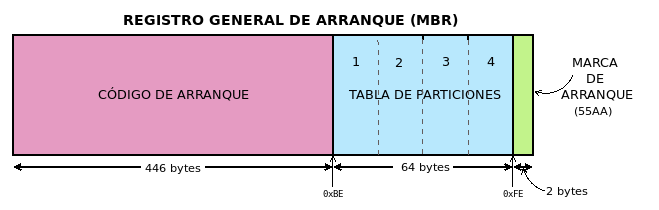

- Los primeors 446 bytes tienen un código de arranque
- los siguientes tienen una tabla de particiones del disco
- los últmo son una marca de arranque que contiene siempre 0x55AA

#### Tabla de particiones
defina las particiones del disco. Cada aprticion se defie con 16B, por tanto, 
en ppio solo puedo tener 4 particiones. Para cada partición se almacena
la siguiente info:


Notas: solo puede existir una partición como activa y su valor del byte de 
activa será de 0x80, el resto 0x0. Se usa un direccionamiento de bloque lógico
que es asignar un índice consecutivo a cada sector del disco (sector 0, 
sector 1, ...). Como tenemos 4B para ese direccionamiento, a lo más el disco
puede tener un tamaño de 2TB, porque 4B = 32b, por tanto puedo indexar
2^32 sectores, como cada sector tiene 512B de info, 2^32*512B aprox 2TB de info
posible a almacenar. Se llama partición primaria a la que tiene info en
la tbla de particiones. 

En este ejemplo:
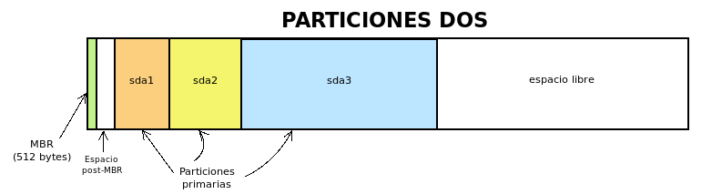

se muestra como queda un particionado con 3 particiones primarias.
El espacio entre MBR y la primera partición es porque hay alineamiento, entonces
la primera partición debe empezar en el sector  2048

#### Particiones lógicas
Como este sistema de particionado tiene 2 limitaciones, que el tamaño
máximo de disco es 2TiB y que solo puedo tener 4 particiones, se inventan (Windows)
las particiones extendidas, que son particiones primarias para contener más 
particiones. Las particiones que están en una extendida se laman lógicas.
Solo puedes tener una partición primaria extendida.

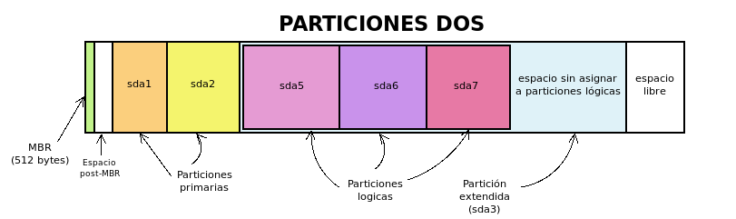

La partición primaria que va a ser la extendida se marca con 0x05; el primer
sector de una extendida se llama EBR (Entended Boot Record) y es igual que un
MBR. En su tabla de particiones tiene solo 2 entradas:
- la primera es una descripción de la partición lógica contigua (la primera)
- la segunda es el sector donde empieza el siguiente ERB
- las otras 2 no se usan; el siguiente ERB e sigual, hasta que aparezca un ERB
que no tiene la segunda tabla de particiones informada, indicando el fin
de las particiones lógicas

### Resumen de particionado DOS
- Una tabla de particionado DOS solo puede tener 4 primrias
- La definción de las primarias está en el MBR
- Solo una puede ser extendida, conteniendo en principio infintas lógicas
- La definición de las lógicas está en distribuida en la extendida


### Ejercicios particiones
#### Particiones DOS Windows
Crear un VM para instalar W10x64ProN. Dalra 4GB de RAM (si se puede)
y 2 Procesadores (si se puede), 50GB de espacio, instalar GAs, crear snapshot.

Crear un disco virtual de 100GB llamado particiones, 
guardarlo en la misma carpeta que la VM y enchufarlo a la VM.

Iniciar la VM, abrimos el gestor de particiones escribiendo en la barra de 
búsqueda "create and format hard disk partitions". Seguramente nos salte
un mensaje de inicializar disco; podemos darle a ok seleccionando MBR como
estilo de particion:

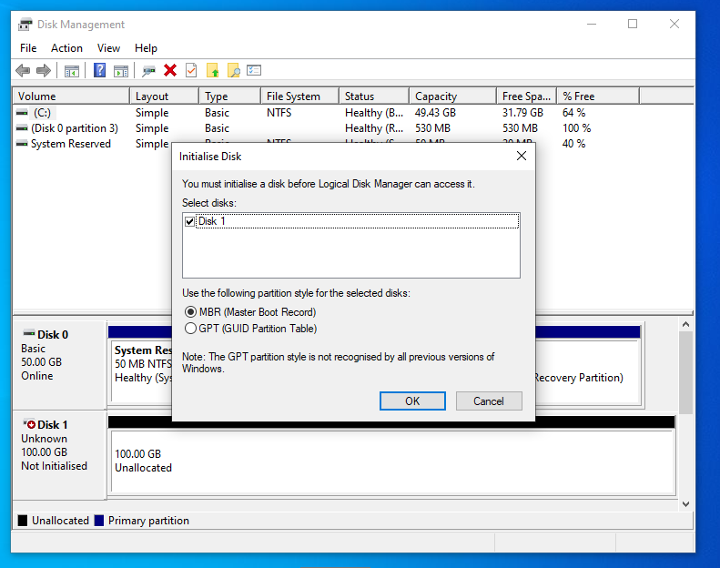

Con eso hemos creado un sistema de particionado tipo DOS en el disco.
Creamos 4 particiones de 20GiB cada (20480MiB=20GiB). No les damos formato.
¿Qué pasa al crear la 4a particion? 
En la 4a partición, crear 5 particiones de 1 GiB (=1024MiB), ver que en la
partición extendida sí puedo crear muchas particiones (más de 4). Ver que 
el Os la detecta correctamente como primarias y lógicas

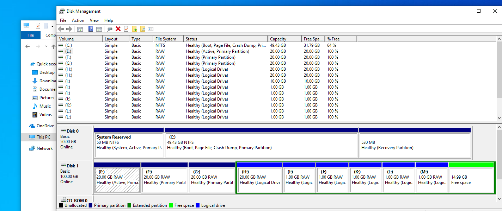

Tomar una snapshot, que vamos a romper cosas. En el disco C en el que instalamos 
el OS, tenemos una partición primera que dice "System Reserved", es activa
y de System. Vamos a la partición de C y la marcamos como activa (botón derecho).

Seguramente nos amenace, le decimos que sabemos qué hacemos. Si reiniciamos el 
equipo, nos dirá que:


Es correcto que pase esto, pues la partición activa es la que tiene los ficheros
para bootear es sistema; y estaban en System Reserved. No es que no podamos
eliminar esa partición, pero tendríamos que mover los ficheros de boot a otra
partición y marcarla como activa.

Borremos todas las particiones del disco de 100GB, y creamos una nueva partición
de 50GiB (51200MiB); no lo formateamos.

Si queremos info de las particiones, podemos ir a properties de un disco
(ver en que bus está el disco usando también VBox), y selecionamos, y en
volumen --> populate veremos info:

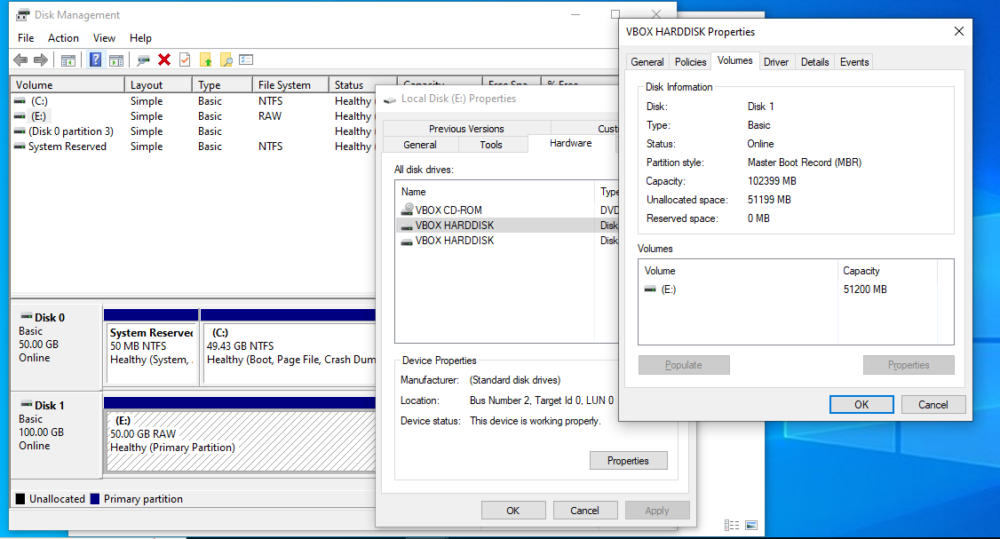

Para sacar info completa de los discos, podemos usar diskpart: vamos a un 
CMD y escribes diskpart (necesitaras permisos de admin). 
Enchufado en diskpart, dices `list disk` --> `select disk n` -->
`list partition`

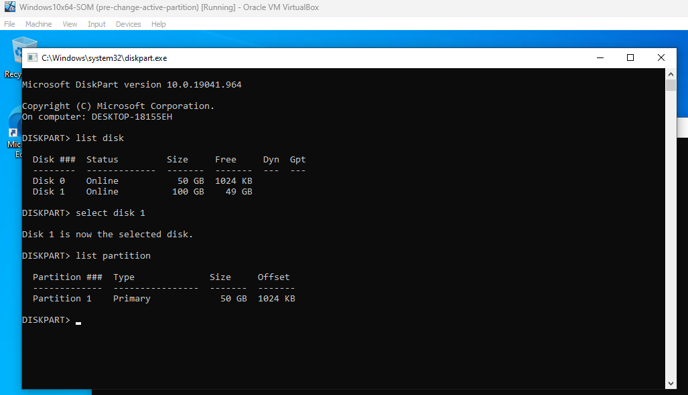

Y ahí vemos más info, en concreto el offset: es donde empieza la partición
(entre el bloque MBR y 1MiB hay espacio no usado). Si ahora creamos
otra partición veremos que el offset es 50GB, obvio, porque se desplaza el inicio
del volumen los 50GB del volumen anterior.

Pero esto da info a medias; la herramienta buena para ver las alineaciones es
```
wmic partition get BlockSize, StartingOffset, Name, Index 
```
desde la CMD:


Starting offset nos dice en bits donde empieza la partición, y blocksize es 
el tamaño de sector. Las particiones están bien alineadas si 
(starting offset)/(blocksize) es un múltiplo de 2048. Una buena alineación
de discos hace que el rendimeinto mejore mucho.

Acabado esto, apagar máquina y sacarla el disco de particiones y 
eliminarlo

#### Particiones DOS Linux
Crear VM con Ubuntu22.0.03-LTS con 4RAM 2 procesadores (si se puede), 25GB
de disco. Hacemos una snapshot con la fresh install. 
Según acabe las inatlación, desde la terminal lanzamos
```
sudo apt update && sudo apt upgrade -y
```

Si queda algo sin upgradear nos da igual ahora. Instalamos las GAs:
https://www.linuxtechi.com/install-virtualbox-guest-additions-on-ubuntu/
y configrar un poco lo que quramos.

Ya que estamos vamos a empezar a entender Linux. Desde la terminal,
le decimos `sudo fdisk -l /dev/sda`, y nos dirá muchas:

<!-- 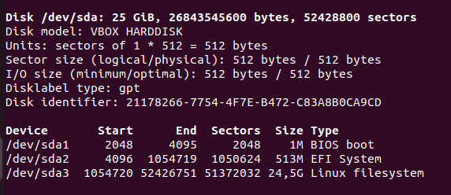 -->

Eso nos dice que tenemos un  disco en `/dev/` que se llama sda, de 25GiB, 
sus sectores, el modelo... Ojo que el particionado es de tipo GPT, que aún no hemos
visto. Luego nos dice que ese disco tiene 3 particiones, donde empiezan,
donde acaban, sus sectores tamaño  y qué hacen. Bastane mejor que windows.

No es la única manera de sacar info de los discos.
Podemos usar `cat /proc/partitions` para que nos diga las particiones
físicas (no volúmenes lógicos) que ha registrado el sistema.

podemos usar también `lsblk -f /dev/sda`, que nos cuenta otras cosas, como
el tipo de fs que se usa, un UUID, que espacio tenemos disponible, y donde
están montadas las cosas.

También podemos usar ``df``, que da la info más minimalista.

Y se puede usar `blkid /dev/sda*`, que nos habla sobre los sitemas de ficheros

Podemos ver que efectivamente ahí están los discos con `ls /dev | grep sda`

Com se dijo, en  linux todo son ficheros, los discos también. Aquí no nos hace
falta crear un nuevo disco, porque gracias a que todo son ficheros, podemos
crear un fichero y hacer como que es un disco.

hacemos `truncate -s 20G 0.disk` en el home para crear a efectos un fichero
vacío que representa un disco.

Si hacemos `fdisk -l 0.disk`, nos dice menos que con los sda porque no tiene
ni tabla de particiones.

Vamos a crear una partición que okupe todo el disco. Para ello, usamos
`fdisk 0.disk`, y comienza un programa interactivo que nos va guiando para
crear la partición. Las ordenes que tenemos que meterle son (en este orden):
p (crear tabla de particiones), n (crear nueva particion), p (particion
primaria), 1 (particion 1), 2048 (1er sector), el tamaño que queramos
(default), y w (write, escribir cambios; podemos ver antes con p
la tabla de particiones creada).

Si volvemos a usar fdisk, ahora nos da info de como si fuese un disco, idem
los otros comandos.

Para marcar una aprtición DOS como activa (booteable) se usa la utilidad
`fdisk` con la opción `a`

Podemos usar también la herramienta sfdisk, que funciona muy parecida a
fdisk, pero en lugar de ser interactiva, permite meter parámetros 
como algumentos, lo cual hace que sea útil es scripts.

Para consultar info (creo un nuevo "disco" con `truncate -s 20G 1.disk`)
se usa com fdisk: `sfdisk -l 1.disk`

Para crear una tabla de particiones, primero necesitamos saber unos códigos
que corresponden a cada tipo de partción, que se hace con
```
sfdisk -TXdos
```

para crear particiones el formato es:

```
sfdisk 1.disk <<EOF
lineas iniciales que definen caracteristicas del particionado (formato k:v)
lineas que definen las particiones (formato (sector_inicial, tamaño_sectores,codigo_tipo_ficheros,[*|-]))
EOF
```
Puedes dejar campos sin rellenar y tomarán valores por defecto. Para el sector 
inicial, es el primer sector disponible; para el tamaño, el máximo posible,
para el código, 83 (Linux), y a última opción solo marcas "*" siq quieres que
sea la partición activa.

Ejemplo: crear una partición tipo dos que ocupe todo el espacio:
```
sfdisk 1.disk <<EOF
label: dos
,,,,
EOF
```

esto, a efectos, ha hecho lo mismo que hicimos en el ejemplo con 0.disk,
lo podemos comprobar con `sfdisk -l 1.disk` y `sfdisk -l 0.disk`

Otro ejemplo:
```
sfdisk 1.disk <<EOF
label: dos
,$((32*1024**2/512)),83,*
,,5
,$((2*1024**3/512)),7
,$((1*1024**3/512)),82
,,83
EOF
```

Hace lo siguiente: crea tabla de particiones tipo DOS. Crea una primera
partición en el primer sector disponible. El tamaño de la partición es

```
(32*(1024)^2)B/512(B/sector) = 32MiB
```

Esta cuenta sale de: cada sector son 512B, es decir, hay 512B/sector.
El tamaño de la particion lo tengo que decir en sectores; en este caso
lo quiero de 32MiB, hay que traducir ese a sectores. Como sé que
hay 512B/sector, si divido entre este número tendré los sectores. Así que solo
tengo que saber cuantos son 32 MiB en B: fácil, es 32*(2^10)^2. De ahí la cuenta.

La particion es tipo Linux.

Luego crea una partición en el primer sector disponible, con todo el tamaño 
que encuentre, tipo extendida.

Luego crea una partición lógica de 2GiB de tipo NTFS

Luego una partición lógica de 1 GB para swap

Y finlmente una partición que termina de ocupar la extendida.

Podemos cambiar la tabla de particiones con la opcion -Nx, donde x es
la partición afectada. Por ejemplo:
```
echo ",$((3*1024**3/512)),," | sfdisk -N2 2.disk
```

cambia el tamaño de la partición 2 a 3GB (tampoco tiene mucho sentido).
Podemos borrar articiones con `sudo sfdisk --delete 2.disk N`, con
N la partición a borrar
Podemos también añadir nuevas particiones con ese comando:
```
echo ",$((3*1024**3/512)),L," | sfdisk -N 2.disk
```


Probar a jugar con esto para crear otros particionados con distintos tamaños


### Particionado GPT
GPT (GUID [Globally Unique IDentifer] Partition Table) es para referise
a la tabla de particiones. Las particiones con esta técnica se llaman 
particiones GUID, GPT o UEFI. Las particiones GUID se diseñaron para
arranque UEFI.

Una partición GUID tiene:
- un MBR, aunque no se usa en arranque UEFI, pero que se reserva por si
se usa una herrameinta que no soporta particiones GUID. La zona correspondiente
al sector de arranque y la parte de la taba de particiones DOS definen
una particione tipo 0xEE (este es el tipo de GPT). Sirve para que si se usa
una herrameinta que no sabe lo  que es GUID, tenga un MBR con su tabla de 
particiones y no se cargue las particones GUID

- El seundo sector tiene una cabezra donde está el identificador único del disco
y las particiones definidas (y alguna cosa más)

- Los siguientes sectores guardan info de particiones a razón de 4
particiones por sector (la definicion de una particón ocupa 128B). Se establece
que la tabla de particiones ocupe 16KiB, así que se podrán tener 128 particiones
(es ampliable). Por tanto, ya no tienen sentido partciones primarias y lógicas

- La definición de cada partición es:
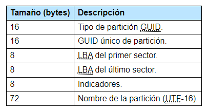

- al final del disco hay una copia de la estructura

- La primera partición empieza en el sector que determine la alineación; como
normalmente es de 1MiB, empezará en el sector 2048

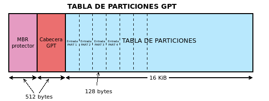

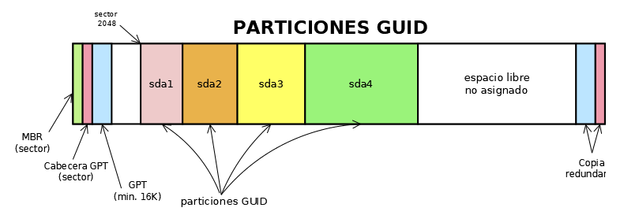


## Arranque del sistema
Cuando das la señal de arranque (pulsar el botón de encender), el primer
software que se carga es el firmware de la placa base. Hace 4 cosas:

- Iniciar el proceso POST (Power-On Self-Test), que analiza el hardware
    del equipo y, si detecta algún problema, para el arranque y suele emitir
    un pitido. Este POST solo ocurre en un arranque n frío (cuando el ordenador
    estaba apagado). Un arranque en caliente es cuando se reinicia un ordenador.

- Proporciona la gestión básica de I/O (al menos poder usar el teclado y monitor)

- Permitir una reconfiguración del propio firmware (lo más habitual, cambiar el 
    bootloader -  el programa que cargará al OS)

- Cargar el siguiente software, al que se cede el control. normalmente, el 
    kernel de un OS 

Hay 2 arranques, BIOS (Basic Input Output System, el antiguo) y 
UEFI (Unified Extensible Firmware Interface), el más actual y que acabará por 
imponerse.

En ppio no existe compatibilidad entre ambos aranques, pero algunos equipos con
UEFI tienen un modo `legacy` que permite a la placa base buscar un bootloader
para BIOS o un bootloader para UEFI. Es normal tener el modo legacy y el "normal"
a la vez.

Independientemente del uso de BIOS o UEFI, en el arranque tenemos estas fases:
- POST - comprobación del hardware. Dentro de este proceso, se puede tocar una
    tecla que pausa el proceso para:
    - Entrar en la BIOS (reconfigurar el firmware)
    - Presentar un menú para selección de qué programa o dispositivo se desea 
        arrancar. Las cosas que aparecen en ese menú son los items de la
        `secuencia de arranque`

- Arranque de algún programa siguiendo la ``secuencia de arranque``, que es 
    un listado de todos los dispositivos detectados en busca de un programa
    de arranque válido. En cuanto se encuentra, el firmware cede el control.

### Bootloader
La idea del firmware es buscar algo que en última instancia cargue un OS a RAM.
Técnicamente un bootloader es cualquier cosa que se cargue antes que un OS.
Pero los boootloader pueden hacer distintas cosas:
- Algunos es simplemente cargar el OS a RAM y cederle el control (por ejemplo
    EFIStub, el bootloader para arranque EFI que vene con el kernel de linux)

- otros hacen una función concreta, pero no cargan un OS a RAM. Por ejemplo,
    `memtest` comprueba la integridad de la RAM

- Otros bootloaders lo que hacen es cargar otros bootloaders. En particular
    destaca el ``bootmanager``, cuyo objetivo es permitir seleccionar
    entre distintos `bootloaders`


### BIOS
Lo que intentará un arranque con BIOS es cargar el código de arranque que
hay en el MRB. Para ello, va dispositivo por dispositivo hasta que encuentra
un código de arranque válido. Este firmware lo único que sabe hacer es leer
el priemr sector de los dispositivos.

No es un bootmanager, las únicas cosas que ve son los potenciales bootloaders.
En particular, 2 OS en 2 dispositivos diferentes, podemos escoger entre ambos;
pero 2 OS en un mismo dispositivo no. Habría que instalar un bootmanager como
GRUB para poder hacer eso.

Con firmware BIOS, el particionado suele ser DOS, pero no es obligatorio. 
Para conseguir un dispositivo
arrancable co firmware BIOS necesitas:

- un MBR
- un bootmanager en el MBR (GRUB o Windows Boot Manager) (o un bootloader)

Cosa: cada vez que instalas un OS el programa que instala sobreescribe el MBR
del dispositivo co el bootloader/manager del nuevo OS; el nuevo
gestor debería incluir en sus entradas los antiguos OS que pudiera habr en
el disco; pero no siempr ees así. Por ejemplo, el Windows Boot Manager
solo se preocupa de de Windows. Si se van a instalar en un mismo disco varios
OS, el orden que da menos trabajo para poder acceder a todos es: primero los
Windows, de más antiguo a más moderno, y luego los Linux
    
### UEFI
UEFI sí entiende particiones GPT y FS FAT (y CDFS en discos), y tiene un
bootmanager incluido (aunque se suele instalar otro). El bootmanager puede
almacenar en NVRAM items ordenados de arranque, que tienen un nombre
(el del OS que van a arrancar, habitualemnte), y hace referencia a una
ruta de un fichero en alguna partición GUID de algún dispositivo, y ese
fichero lo que tiene que ser es un bootloader (la partición debe tener
un FS comprensible para el firmware).

Es decir, para arrancar un OS solo necesitas una partición para almacenar
el bootloader y que el bootmanager del firmware sepa de su existencia.

Como, a diferencia de la BIOS, las entradas del bootmanager son cargadores
(y no dispositivos), se puede tener en un mismo dispositivo varios
bootloaders sin necsidad de instalar un bootmanager como GRUB.

Si en las entradas del boootmanager hay dispositivos (en vez de bootloaders),
lo que hace realmente eso es buscar un boootloader en una ruta predefinida
en el dispoitivo.

Además de las entradas que haya en NVRAM, en la fase POST que se detctan 
dispositivos se añaden entradas para poder arrancar desde un USB por ejemplo.

Puedes poner los bootloaders donde te de la gana, pero se suele seguir unas
reglas: en particionado GPT de un disco se crea una partición de FS FAT32 y tipo
ESP (EFI System Partition); en esa partición se crea una estructura de directorios
como esta:

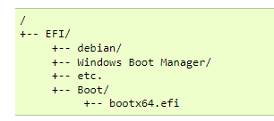

Cada OS crea un directorio dentro de /EFI con lo básico para arrancar el OS
o comenzar el arranque.

Gracias a esta estructura, los arranques de los OSs no interfieren entre sí.
Normalmente con 100MiB para est partición vale.

Aunque al instalar un OS, es normal que se auto de preferencia en las entradas
de la secuencia de arranque. Puede que el OS sea "respetuoso" con otros
OSs que hubiese (es decir, al arrancar nos planta un bootmanager) o puede que no
(como hará Windows Boot Manager); en cualquier caso pulsado la tecla
adecuada entraremos al bootmanager del firmware y podremos arrancar el OS que 
queramos.

También se puede reordenar la secuencia de arranque (con algún método gráfico
en la config del firmware; con alguna shell del propio firmware [habrá que saberse 
los comandos], o desde el propio OS [Linux te da efibootmgr]).

En los dispositivos extraibles, que el POST detecta y se añaden dinámicamente
a las entradas del bootmanager del UEFI, el EFI intenta cargar siempre lo mismo:
la primera partici´que sepa leer y dentro de esa partición el fichero
`/EFI/Boot/bootx64.efi`. Si lo encuentra, el dispositivo arranca.

Esto es o que ocurre cuando instalas el primer OS en un ordenador virgen en 
el que ningún instalkador ha toqueteado la NVRAM.

Véase que esa ruta también está en el arbol de directorios de la partición
ESP; ahí lo que habrá normalmente es la secuencia de arranque del último OS
instalado; si la entrada del bootmanager se refiere al dispositivo (al disco)
y no a un bootloader concreto; se arranca el OS que esté en esa carpeta

### GRUB: un bootmanager
GRUB (GRand Unified Bootloader), se carga en 3 fases.
La primera, se corresponde con el fichero `boot.img`, que es el código
que se planta en el MBR (446 bytes). Solo pretende cargar la siguiente fase.

La fase 2 (o 1.5 a veces) es el fichero `core.img`, de tamaño 32KiB. Solo carga
la fase 3 (a veces fase 2)

La fase 2 son módulos que están en `/boot/grub` y son ficheros en un FS. Estos
presentan al usuario el menú de inicio de GRUB, y el usuario elige qué kernel
cargar.

Si el arranque es UEFI, no hace falta partir en boot y core, y el fichero
`grubx64.efi` hace el trabajo de ambos.

Si se van a instalar varios OSs conviene reservar una partición pequeña (32MiB)
para `/boot/grub`. Eso independiza GRUB de Linux (u otros OSs) y podemos 
elminar linux sin perder GRUB.

#### Particiones DOS y arranque BIOS
boot.img siempre irá en el MBR y core.img  irá entre el MBR y la
primera partición:

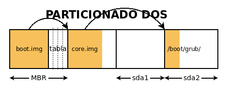

Este sería un particionado ara multiboot con GRUB:


#### Particiones GPT arranque UEFI
El fichero `grubx64.efi` (que sustituye a `core.img`) se guarda en la partición
ESP, y el resto del gestor en la partición para `/boot/grub`. Un posible 
particionado es:


#### Partición GPT arranque BIOS
`boot.img` irá en el MBR del disco, pero el `core.img` no debe ir
en el espacio post MBR porque la tabla GPT en ppio puede crecer.
Se necesita una partición propia para `core.img`, con el nombre de
BIOS Boot Partition. Esa partición se suele forzar a alineación 4KiB
y que vaya antes de la primera partición alineada a 1MiB.

Un posible particionado:


#### Arranque híbrido
Si quieres preparar el sistema para un paso de arranque BIOS a UEFI y que no
duela mucho, puedes hacer lo siguiente: poner las 2 particiones de arranque,
la BIOS Boot Partition y la ESP:

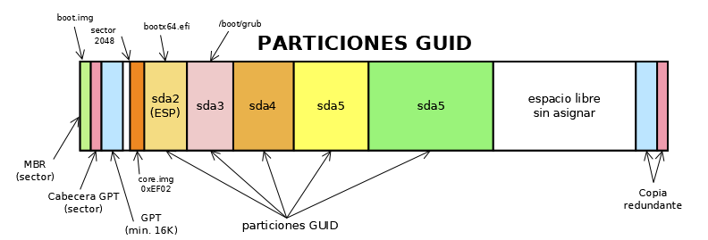

## hibernar y suspender
Son "alternativas" a apagar el equipo. Su propósito es el mismo: conservar
el estado en el que estaba el OS (a diferencia de un apagado, que cierra
todos los procesos). Es decir, es una manera de poder dejar trabajo a medias y
no perderlo.

En supensión, el equipo solo consume la energía que neceista para mantener la 
RAM activa, y ahí es dodne se almacena el estado del sistema. Obviamente
es mucho más rápido el arranque si ya está todo el RAM que desde un encendido.

En hibernación, es lo mismo pero se lamacea en disco duro, así que realmente
on se gasta energía casi. Es más rápido que un encendido pero más
lento que una suspensión.

En sistemas de Kernel Linux, que te animan a crear una partición para
swap, esta partición depede de la RAM del equipo. Si no se prentende
hibernar, la fórmula para estimar cuanta swap necesito es:

- 2*RAM GiB si mi RAM es menos de 1 GiB
- 2 GiB de RAM si mi RAM es entre 1 y 4 GiB
- del orden de la raiz cuadrada de la RAM si mi RAM es mas de 4GiB

Si se preveé que el equipo pueda hibernar, entonces la fórmula rtecomendada
para la swap es la misma que arriba, pero le sumammos el tamaño de la RAM.
Es decir, siu tenemos de 1GiB de RAM, deberíamos tener un tamaño
de swap de 1GiB + 2*1GiB = 3GiB de swap, etc


## Proceso de arranque Windows
Para el arranque Windows usa un fchero readonly que se llama BOOTMGR y es un
boot manager. Se gura en la carpea raiz del sistema, en la partición system 
reserved.

BOOTMGR invoca a Winload.exe, que es el bootloader de OS. Winload.exe
carga los drivers esenciales (con BOOT_START) y el kernel del OS (ntoskrnl.exe)

Si hubiese una imagen de hibernación, BOOTMGR invoca a Winresume.exe, y es
este programa quien carga a RAM el sistema.

LOs pasos de arranque son:
POST --> encontrar un disco booteable --> ese disco nos dice donde está
BOOTMGR --> BOOTMGR nos permite elegir el OS (Windows) que queremos lanzar,
si hubiera más de uno
--> BOOTMGR cede el control a Winload.exe o Winresume.exe

Si lo que s elanza es Winload (es decir, la máuina estaba apagada),
éste lanza los drivers esenciales (drivers de disco y de bus -- BOOT_START)
y pasa el control a ntoskrnl.exe, que carga el OS en RAM

## Arranque Linux
Linux no tiene un bootmanager propio, puede usar cualquiera, el que se incluye 
en todas las versiones e GRUB. GRUB realmente permite cargar cualqueir
OS, 
pero suponiendo que elegimos que cargue un OS con kernel Linux, lo que se
pasa al sistema es el fichero initramfs y el fichero vmlinuz. initramfs
es el file system inical que se carga que permite al kernel (vmlinuz) tener
acceso a drivers y herramientas básicas para poder arrancar el equipo 


## arranque BIOS o UEFI

### Windows
Vamos a `C:\Windows\Panther`, buscamos `setupact.log` y lo abrimos, 
y ahí buscamos `Detected boot Environment`, y eso dirá BIOS o UEFI

## Linux
si existen los directorios `/sys/firmware/efi` y `/boot/efi` es probalbe
que el arranque sea UEFI; pero no necesariamente; si quieres estar segura
el comando 

```console
sudo dmidecode -t system
```

te soluciona las dudas

## puntos de restauración (solo Windows)
Es una "partida guardada" que almacena configs, programas y datos por si algo
se rompe, poder volver a ese punto.

Ocupan espacio de disco, pero si es un equipo que va a necesitar una reisntalación
habitualmente o estás jugando cn fuego y podrías cargarte algo,
restaurar es más ´rapido y menos destructivo que reinstalar todo el OS

Este proceso es compatible con hacer backups, y de hecho es recomendado;
si se jode el disco duro, seguramente la restauración no funcione; ahí solo
podremos recuperar nuestras cosas si teníamos un backup.

Para crear un punto de restauración, buscamos "restore point", 
habilitamos en config "system protection" y elegimos cuanto especio quremos 
que se coma (para discos "grandes" y que nos están muy ocupados, lo
recomendable es dejar entre 5 y 10% a los puntos de restauración)

Le damos a crear y se crea.

Tenemos que entrar a windows en modo seguro, que es un windows "básico"
para detectar problemas y corregirlos.

Pulsas la tecla de windows+I --> update & security --> recovery --> restart now

Salta una pantalla azul, eliges troubleshoot --> advanced --> system restore

## memtest86+
memtest es un bootloader que no carga nada, solo checkea que la RAM del equipo
esté bien (a nivel hardware).

Es independiente del OS.

Se suele meter en un USB y se configura al sistema para arrancar desde ahí.

Para probarlo, podemos usar el dualboot pues se ha instalado el programa
junto con Linux y en GRUB aparece la opción