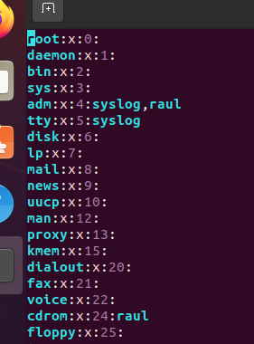
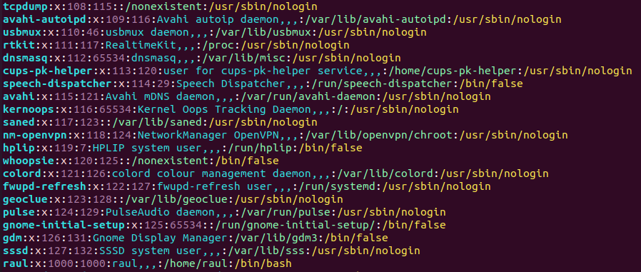
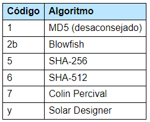

# Usuarios en Ubuntu
Usuario: se trata de una "personalidad" (no necesariamente una persona
de verdad) que ejecuta programas en el OS. Un usuario NO tiene por qué
ser un humano interactuando con el sistema operativo; muchos usuarios
son *usuarios de sistema*, es decir, que los crea el propio OS para que un
programa sea ejecutado por ese "usuario".

Grupo: es un conjunto de usuarios a los que se les da una(s) característica(s)
comunes, en general se usan porque es más eficiente la administracióin 
de permisos via grupos que usuarios.

Puede haber 2 tipos de usuarios/grupos: locales (definidos en el propio OS)
y remotos (definidos via server de usuarios); solo veremos locales

## Archivos que contienen la info de usuarios y grupos
Todos los archivos siguen el mismo formato: cada linea representa una
nueva entidad (usuario/grupo) y los campos (características, como nombre,
password,...) se separan por `:`

### /etc/group
Almacena info de los grupos locales

**Nota** para bichear estos ficheros creo que lo mejor es usar VIM porque
seguramente no sepan usarlo y así podemos ver los ficheros sin romper nada.
Como seguramente VIM no esté instalado, ejecutar:

```bash
sudo apt install vim -y
```

Con VIM instalado, podemos ver el fichero `/etc/group` con

```bash
sudo vim /etc/group
```

veremos algo así:



Cada linea del fichero es un grupo, y cada campo info sobre ese grupo:
1. primero, el nombre del grupo
2. segundo, la contraseña del grupo. Su valor en los UNIX modernos siempre es
    `x`, que quier decir que la contraseña del grupo no está en este fichero,
    si no en el fichero `/etc/gshadow`. La contraseña de grupo sirve para dar
    acceso a un usuario al grupo. Aunque en la práctica esas contraseñas no
    se usan, porque plantean una falla de seguridad, que es que varios usuarios
    compartan una misma password
3. el GID (Group IDentifier), es decir, un ID único para el grupo. Esto es 
    lo realmente importante, ver más abajo en ``passwd``
4. Los usuarios que pertenecen al grupo, pero no todos, solo los usuarios que
    pertenecen al grupo y su grupo principal NO es ese grupo

### /etc/passwd
Almacena usuarios y sus datos. Tiene esta pinta:




La info que tiene cada linea es la siguiente:
1. nombre del usuario
2. contraseña del usuario. De nuevo, en los UNIX modernos es una `x` que
    quiere decir que la contraseña está almacenada en `/etc/shadow`
3. UID (User IDentifier), es decir, un identificador de usuario. Realmente
    este número es lo importante, es decir, la propiedad de un fichero no será
    del usuario "raul", si no del usuario con UID 1000; si cambio "raul" por
    "alfonso", no pasa nada con los ficheros, siguen perteneciendo a UID 1000
    se llame raul o alfonso
4. El GID del grupo principal del usuario. Un usuario puede estar en varios
    grupos; a efectos de permisos (de poder hacer cosas), es irrelevante
    que un usuario tenga un grupo principal u otro; lo que importa es la 
    pertenencia; esto es relevante más adelante con permisos, porque
    los ficheros tienen usuario y grupo propietario; cuando un usuario cree
    un fichero, su grupo propietario será el grupo principal del usuario que
    crea el fichero.
5. información personal del usuario (nombre real, teléfono, mail...)
6. el directorio personal del usuario
7. la shell por defecto que se ejcutará cuando el usuario haga login.
    Los usuario que son de sistema o que sirven para lanzar ciertos programas
    (en general, que no son personas usando el OS), suelen tener como
    shell predeterminada `/bin/false` o `/usr/sbin/nologin`.
    Esto es para que esos usuarios no puedan interactuar con el OS

**Nota**: puedes encontrar las shells que tiene el sistema en `/etc/shells`.
Un servicio (programa que corre sin que lo haya lanzado el usuario, es
decir, que está a la espera de recibir alguna petición) que interactúe
con un usuario via una shell (login, ssh. ftp...) comprobará en ese fichero
que la shell que está usando el usuario es una de esas; si no lo es, te
deniega el acceso.

### /etc/shadow
Almacena las contraseñas (cifradas) de los usuarios, e info adicional sobre esas
contraseñas:


La info que se muestra es:
1. nombre del usuario
2. separados por `$`
    - el algoitmo que se usa para cifrar la contraseña, los posibles valores son:
    
    - la "sal" que se usa para cifrar la contraseña
    - la contraseña cifrada
3. Es el último cambio de password, contado en dias desde el 1 de enero de 1970,
    que es la epoch de UNIX. Si hay un 0, quiere decir que el usuario debe
    cambiar su password en su próximo login
4. El número mínimo de días que deben pasar entre cambios de password. 0 
    quiere decir que no hay mínimo
5. Número máximo de días en los que el password es válido; cuando pasen,
    el usuario está obligado a cambiar el password
6. el número de días ANTES de que el password expire en los cuales se le va a
    dar un warning al usuario
7. EL número de días que, tras que expire el password, se deshabilita 
    el usuario
8. el día que expira la cuenta, contado en número de días desde el epoch


**NOTA** cómo se general la contraseña: es un algoritmo matemático que 
parte de una "sal" y genera un cifrado; si se la sal y la password, puedo
recuperar el cifrado, pero no al revés:

```bash
mkpasswd -m sha512crypt -S feeCGVjY raul
```

(aquí yo se de antemano que 'raul' es mi password)

### /etc/gshadow
Almacena password (cifrados) de grupos, y otra info; en realidad casi no se 
toca este fichero así que lo ignoramos

### NOTA IMPORTANTE
NUNCA TOCAR ESTOS FICHEROS A MANO SALVO QUE SEA NECESARIO; HAY PROGRAMAS QUE
LOS MANIPULAN Y HAY QUE USAR ESOS PROGRAMAS

## Sacar info

### who
Me dice quién está actualmente conectado al sistema (solo usuarios que
no sean de sistema). La info que da es:
1. el nombre del usuario
2. cómo está el usuario concectado. Si dice `tty` es desde una terminal local,
    si dice `pts` es una terminal remota. si dice `:0` es que usa una GUI
3. cuando se ha loggeado al sistema
4. la IP del remoto si aplica

Otra opcion útil es `-b`, que dice cuando arrancó el sistema.
Importnte: solo muestra usuarios que loggearon; si ese usuario luego
cambió a otro usuario, eso no se muestra

### whoami
muestra que usuario estoy utilizando

### logname
muestra el usuario con el que se hizo el loggin; si hago loggin con un usuario
y cambio a otro, whoami y logname serán diferentes.

### groups
muestra los grupos a los que pertenece el usuario que se pasa como parámetro,
si no se pne parámetro, se asume que es el usuario que lanza el comando

### id
muestra info detallada del usuario que se pasa com argumento, si no se 
proporciona argumento, se entiende que es el usuario que lanza el comando

### getent
sirve para sacar info de los ficheros `passwd, shadow, group`.
Se usa así:
```bash
getent (passwd|group|shadow) [<nombre>]
```

Explicación de la notación: lo que esta entre ``()`` es que debo escoger
exactamente una opción de esas; lo que está entre ``[]`` es que puedo
poner una o varias opciones

## Cambiar cosas
Crear, eliminar, y modificar usuarios y grupos. NO USAR NUNCA LA MANIPULACION
DIRECTA DE LOS FICHEROS.

### adduser
Añade un usuario al sistema. Se usa así:

```bash
adduser [opts] <nombre>
```

Si ejecutas sin opciones, solo dando un nombre de usuario, el programa
te preguntará por el password para el nuevo usuario, y su info personal.
Además hace una serie de presuposiciones sobre lo que quieres basado
en el fichero `/etc/adduser.conf`. Se puede tocar este fichero para
ajustar opciones.

Además, el programa crea un UID que será el siguiente disponible, un grupo
que se llamará igual que el usuario y será su grupo principal, no se añade
al usuario a ningún grupo y se le crea un `home`.

Respecto al fichero de config, si te da por leerlo, verás que hay unos
números predefindos para usuarios: 0 siempre es root (local admin), 
1 a 99 son para usuarios que vienen con la instalación,
100-999 son usuarios de sistema (es decir, su propósito es ser los que
ejecutan un programa en el backgroup, también llmado servicio o daemon).
1000 en adelante son usuarios para "personas".

No puedo dar a adduser la contraseña (como parámtro), pero puedo dejar al usuario
sin cointraseña, lo que lo hace virtualmente inutil.

Otro uso habitaul de adduser es añadir un usuario (que ya exixtía) a un
grupo (que ya existía)

```bash
adduser <user> <group>
```

### deluser
borra usuarios LOCALES; en ppio solo borra al usuario y su grupo principal
si era el úbnico usuario en ese grupo; se pueden usar las opciones
`--remove-home` y `--remove-all-files` para borrar también su home y
todo fichero que le pertenezca.

**NOTA**: mira el --help de este comando, porque hay una opción interesante
que permite backupear sus cosas.

deluser también saca usuarios de grupos, igual que adduser.

**NOTA** si borras el usuario pero se mantienn sus ficheros, estos quedan
en "propiedad" del UID (se verá con, por ejemplo, `ls -l`).
Si creo un nuevo usuario y le doy (a mano) un UID "huérfano", los ficheros
cuyo UID estaba huérfano de usuario pasan a pertenecer al nuevo usuario.

### passwd
Cambia la passwd de un usuario. Ver opciones con --help, porque permite
hacer otras cosas como bloquear el usuario, forcar a que expire su 
contraseña, cambiar opciones de la password...

se usa:

```bash
passwd <nomre-usuario>
```

Opciones útiles: `--expire`; obliga al usuario a cmabiar su passwd en el 
próximo login


### chpasswd
igual que passwd pero no interactivo (es decir, es el que se usa en scripts).
Se usa "un poco raro" (de momento), pero hay que pasarle argumentos en 
formato `user:pass`:

```bash
sudo chpasswd
pepe:epep
```

le vas pasando el istado de "user:pass"; cuando acabes, pulsas ctrl+d
para que el programa sepa que no tiene que leer más entradas

**NOTA** posibles problemas de seguridad por quedar la pass sin cifrar
en `~/.bash_history`, pero parece que no...


### chfn
permite cambiar info personal del usuario

### chsh
permite cambiar la shell del usuario. Los usuarios solo pueden cambiar
su propia shell, no la de otros, salvo que el usuario sea admin, entonces
puede cambiar la de otros.

```bash
chsh -s /bin/dash
```

para cambiar la shell del usuario ue quiere cambiar las shell,

```bash
chsh -s /bin/dash pepe
```

para cambiar las shell a pepe. En particular, podemos hacer a un usuario
"inutil" quiántole la bash y dándole `/usr/sbin/nologin` o `/bin/false`


### usermod
modifica un usuario existente. Puede hacer de todo (bloquear, desbloquear,
modificar el home, cambiar nombre de user/group; VER MANUAL).

Ejemplos:
cambiar el nombre de usuario y su directorio personal moviendo los ficheros:

```bash
usermod -l otro -md /home/otro nuevo
```

añadir al usuario a grupos:

```bash
usermod -aG audio,video nuevo
```

el usuario no puede iniciar sesiones interactivas:

```bash
usermod -s /usr/sbin/nologin nuevo
```

### groupmod
El equivalente a usermod pero para grupos.

Cosas útiles: cambiar nombre:

```bash
groupmod -n nuevo_nombre antiguo_nombre
```

definir miembros:

```bash
groupmod -U usu1,usu2,usu3 grupo
```

ojo que si lanzas ese comando borra a los otros usuarios que hubiese y
pone a estos 3 como nuevos usuarios de ese grupo; si quieres añadir a los
ya existentes, usas la opcion -a

### chage
cambia política de contraseñas de un usuario.
Cosas útiles:


ver la política de contraseñas
```bash
chage -l usuario
```

forzar cambio de contraseña en próximo login:
```bash
chage -d0 usuario
```

establacer vigencia (en dias):
```bash
chage -M30 usuario
```

establecer días de warning para próximo cambio de contraseña:
```bash
chage -W5 usuario
```

establecer cuantos días permanece activa una cuenta cuando su contraseña
ha caducado:

```bash
chage -l15 usuario
```

(si la cuenta caduca el admin debe reactivarla)

## Cambio de usuario
A veces necesitas cambiar de usuario para hacer una cos determinada 
(lanzar un programa o hacer algo administrativo, por ejemplo).

### su
permite un cambio de usuario (a uno que ya exista), sin tener que salir y entrar
de nuevo.

```bash
su - otro-user
```

Hay que dar la pass del otro-user (es como hacer un login).

Además, puedes añadir la opción `-c` para que se ejecute un comando
como si fuese el otro usuario e inmediatamente salir:

```bash
su - otro-user -c "pwd"
```

Si no dices qué otro user quieres loggear, se sobreentiende root

**NOTA IMPORTANTE DE SEGURIDAD** si no hemos establecido, al instalar, una
password para root, el usuario está deshabilitado para tener sesión interactiva,
lo cual es lo correcto. Si quiero usar sus privilegios, tengo el `sudo`, que
me otroga los privilegios que necesito de manera puntual.

Puedo acceder al usuario root dándole a mano una passwd con alguno de los 
comandos anteriores, pero esto puede ser un riesgo (si te pillan la password
del admin esencialmente te han robado el sistema)

### runuser
programa de admin que permite lanzar un comando como si fese otro usuario:

```bash
runuser -u usuario -- whoami
```