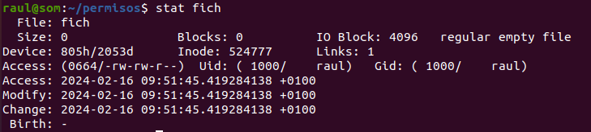

# Permisos en Linux
Archivos y directorios están protegidos por permisos que permiten o impiden
a usuarios hacer cosas con los ficheros/directorios.

## DAC
Los permisos en linux siguen un esquema DAC (Discretionary Access Control)
y puede ser complementado por un esquema ACL (Access Control List) que no
suele ser necesario.

La estrategia DAC de permisos se basa en la identidad de los usuarios.
Cada "cosa" (fichero, directorio,...) en el sistema tiene un usuario
propietario (normalmente, pero no necesariamente, el creador). El
propietario de esa "cosa" es quien tiene la potestad de dar/quitar permisos
sobre la "cosa" a otros usuarios *a discreción*.

Por tanto, no es un sistema centralizado de permisos, si no que cada usuario
decide qué se puede hacer con sus "cosas".

En sistemas UNIX, la implementación de esta DAC se hace via UGO
(User Group Others), esto es, cada "cosa" en el sistema tiene un Usuario
propietario y un Grupo propietario y luego se tiene en cuenta a los Otros
(usuarios que ni son el propietario ni están en el grupo propietario).

Así la accesibilidad viene en 3 grados: lo que puede hacer el propietario,
lo que pueden hacer los usuarios que están en el grupo propietario y
lo que puede hacer el resto.

Podemos ver los permisos de una "cosa" con `stat` o `ls -l`:


La info que muestra esto es:
1. perimer símbolo: tipo de fichero (ya se vio en cosas básicas de linux)
2. siguientes 9 símbolos, agrupados de 3 en 3: los permisos UGO (de User, 
    Group y Others). Para cada elemento del UGO, se definen 3 permisos:
    r -> read, w -> write, x -> execute
3. El siguiente número lo podemos obviar aquí
4. Luego dice el usuario propietario y el grupo propietario

Si en la ristra de permisos se ve `-`, es que el permiso no existe,
e otro caso vendrá marcado con su letra correspndiente (r,w,x)

Los permisos se pueden expresar también de manera numérica, como 3 números,
de tal manera que cada número representa a cada elemento de UGO.

Para carcular la expresión numérica de los permisos se hace este mapeo:
r = 4, w = 2, x = 1. 

Podemos ver los permisos en formato numérico con `stat`:



¿Cómo se traduce de números a letras? En el fichero del ejemplo vimos que
los permisos eran U=`rw-` G=`rw-` O=`r--`; usando la conversión, se traduce en los
3 núemros: `664` porque `r+w+0=6` y `r+0+0=4`.

Al revés, si vemos unos permisos que fuesen `510`, se traducirían a
`5=4+1=r-x` `1=--x` `0=---`

## Significado de los permisos según tipo de fichero
Ignorando los ficheros que no son regulares o directorios, lo
que significan los permisos para cada cosa es:

### ficheros regulares
r - puedo ver su contenido, ie, puedo hacer `cat` sobre el fichero
w - puedo modificar su contenido
x - si el fichero es un programa, puedo ejecutarlo (si no es un programa, no
    tiene sentido)

### Directorios
r - puedo ver su contenido (y el de sus subdirectorios), ie, puedo hacer ls
w - puedo modificar su contenido, ir, puedo crear y borrar ficheros dentro
    del directorio
x - permite el acceso al directorio y sus subdirectorios (si también tienes
    el permiso)

OJO: borrar (u otra operación) un fichero no es solo permisos sobre el fichero, 
si no también sobre el directorio que contiene al fichero, pues para eliminar
un fichero es necesario poder modifciar el directorio que lo contiene.

## Permisos espaciales
Hay otros 3 permisos sobre los ficheros:
1. stickybit, con valor numérico 1
2. setgid, con valor numérico 2
3. setuid, con valor numérico 4

Y se representan con un valor numérico igual que lo permisos normales de UGO
como la suma de sus valores. Entonces podemos representar los permisos
como 4 números, el primero se refiere a los especiales, los otros 3 a los UGO.

**NOTA** si se ven los permisos como un número de 3 cifras es implícito que
los permisos especiales son 0.

### permisos espaciales en ficheros ejecutables (programas)
Los permisos espaciales solo tienen sentido en programas (ejecutables), 
no en otro tipo de ficheros. El stickybit quedó obsoloeto y ya no se usa.
El setgid es que el programa se ejecuta con los privilegios del grupo
propietario. El setuid que se ejecuta con los privilegios del usuario 
propietario.

**NOTA Ténica**: al decir programa lo que hay que leer es "programa compilado",
que son los que realmente se ejecutan; un interpretado no se ejecuta per sé, 
es el intérprete quien realmente está siendo ejecutado.

Esto nos importa a la hora de entender bash scripting: los scripts (programas)
de bash son interpretados (por [el intérprete de] bash); entonces un
script que pertenezca a root y tenga activado el setuid NO será ejecutado
con permisos de root (porque no está siendo ejecutado, lo que se está
ejecutando es bash, con los permisos que tenga el usuario que está lanzando
el programa)

### directorios
el stickybit en un directorio es que los contenidos del directorio
solo pueden ser elminados por el propietario del directorio o el
propietario del fichero. Caso de uso: quiero un directorio en el que
todos puedan escribir pero que no puedan borrar cosas ajenas (ver
`stat /tmp`)

setgid es que los archivos del direcotrio tienen como grupo propietario
el grupo propietario del directorio, y no el grupo principal del creador.
Además, esto es hereditario: los directorios creados bajo un directorio
con setgid activo también lo tendrán activo

setuid no vale para nada aquí.

### Como se ven los permisos espaciales
El sticky bit se ve como una `t` donde debería estar la `x` en Others
(ver ``ls -l /tmp``).

El setgid se ve como una `s` en donde debería estar la `x` en el Group

El setuid se ve como una `s` donde debería estar la `x` en User

Y, si la letra es mayúscula, es que el permiso "oculto" no está concedido

## Máscara
Al crear un fichero/directorio el user propietario es el que crea el
fichero y el grupo propietario es el grupo principal del usuario creador.
Entonces mágicamante se asignan unos permisos a la cosa creada.

No es mágicamante, es un comportamiento por defecto que marca `umask`
Si lanzas el comando `umask` veras algo así como `0002`.

Este número (octal) hay que restarlo a `0666` si quiero conocer los
permisos por defecto que llevará un fichero y a `0777` si quiero
conocer los permisos por defecto que llevará un directorio.

Así, si `umask=0002`, por defecto los ficheros aparecen con permisos 
`0664=rw-rw-r--` y los directorios con permisos `0775=rwxrwxr-x`

Para cambiar la máscara predeterminada (hasta próximo logout) haces
`umask XYZ` siendo XYZ lo que quieres restar (se puede hacer el cambio
permanente tocando ficheros de arranque de sesión)

## Cambiar cosas
Podemos cambiar tanto propietarios (usuario y grupo) como los permisos en sí

### chgrp
cambia el grupo propietario del fichro/directorio. Solo puede hacerlo
el propietario o root, y solo puede cambiarlo a un grupo del que sea
miembro.

Se usa
```bash
chgrp nuevo-grupo fichero
```

Tienes la opción -R para que el cambio se haga a las cosas que hay por
debajo en el arbol de directorios.


### chown
cambia propietario o propietario y grupo propietario. El cambio de usuario
propietario solo lo puede hacer root (o alguien con sus permisos).

Se usa así:

```bash
chown [user][:group] fichero [otro_fichero otro_fichero ...]
```

es decir, si quiero cambiar el propietario hago:

```bash
chown nuevo-propietario nombre-fichero
```

si quiero cambiar solo el grupo propietario

```bash
chown :nuevo-grupo-propietario nombre-fichero
```

si quiero cambiar ambos:

```bash
chown nuevo-propietario:nuevo-grupo-propietario nombre-fichero
```

También tengo la opción -R para las "cosas de por abajo"

### chmod
Cambia los permisos (del actual propietario o grupo propietario)

Se usa:

```bash
chmod <permisos> fichero [fichero2 fichero3 ...]
```

Puedo expresar los permisos en modo núemro (más fácil), por ejemplo, 
dar todos los permisos a Others:

```bash
chmod 0447 fichero
```

**NOTA** si quiero quitar los permisos espaciales, necesito 2 ceros
porque el programa entiende que el primer 0 indica que el número es 
octal y los otros 3 se refieren a los permisos UGO normales.

Es decir, si tengo un directorio con permisos `6775`  y quiero cambiarlos a
`0775`, tengo que hacer `chmod 00775`


Expresar lo que se quiera cambiar alfabéticamante es más complicado:
Tienes 3 partes: a quien se modifican permisos (u,g,o,a [all]),
un símbolo (=,+,-) de si se fijan, añaden o quitan permisos y una 
expresión r,w,x que expresa el permiso. Se pueden separar las cosas por comas
para mejor lectura:

```bash
chmod u=rwx,g=,o=wx fichero
```

lo qe hace es dar todos los permisos al usuairo propietario, quitar todos
los permisos al grupo propietario, y dar permisos de wx a otros.

Si quieres permisos espaciales, se indican con `s` (en u y g) o `t` (en o)


```bash
chmod u+s,o=rt fichero
```

esa expresión añade el permiso setuid, y hace que los permisos de otros
sean r y añade el permiso especial stickybit

Si queremos aplicar cosas "hacia abajo", opción -R