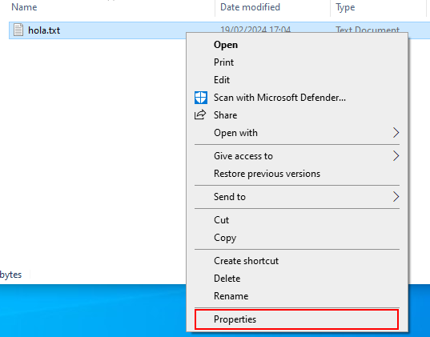
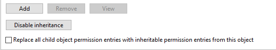

# Seguridad
Windows implementa un sistema DAC (Discretionary Access Control) basado
en reglas ACL (Access Control List; es complementario al (S)UGO, es decir,
puedes tener los 2 a la vez [en sistemas que puedan implementar ambos]).

Las reglas ACL consiten en que para cada objeto del sistema se definen conjuntos
de permisos para usuarios y grupos. Se suele definir un conjunto de permisos
por defecto que serán los que tengan los usuarios que no aparezcan en los 
listados.

Las reglas se definen en los objetos (ficheros o directorios), se aplican
a un usuario o grupo y conceden o quitan permisos. Se pueden definir,
sobre un mismo recurso, varias reglas. Existe el concepto de *herencia*, que
cosiste en una regla para un directorio que se extiende a todo lo que
tiene por debajo.

## Conceptos

### Regla explícita
Aquella que se concede directamente sobre un objeto

### Regla heredada
Aquella que se obtiene por estar el recurso dentro de un directorio que define
la regla

### Regla de concesión
Una regla que da permisos

### Regla de denegación
Una regla que quita permisos

## Precedencia
Hay que entender cómo se aplican las reglas ya que pueden existir solapamientos:

- Primero se aplican siempre las relgas explícitas antes que las heredades
- Para cada caso anterior, tiene preferencia la relga de denegación a la de 
    concesión

## Permisos
Hay muchos más que 3 permisos, que se pueden dar a usuarios o grupos, o
se puede no decir nada, o se pueden denegar explícitamente. Son:

### Ejecución
Para directorios, acceder, para ficheros (que sean programas), ejecutar

### Lectura
Pueden ser varias cosas:
- Ver el contenido de un fichero, ver qué hay dentro de un directorio
- Leer los atributos de un archivo (más adelante atributos)
- Leer los permisos que tiene un archivo

### Escritura
- Crear ficheros dentro de un directorio o cambiar el contenido de un directorio
- Crear directorios en un directorio o añadir contenido a un fichero sin alterar
    lo exixtente
- modificar atributos de un archivo
- eliminar el archivo
- elminiar archivos de un directorio

### Otros
- Modificar atributos de un archivo
- modificar permisos
- Tomar posesión (cambiar propietario)

## Llegar a los permisos
Para poder tocar estas cosas, vamos a un fichero o directorio y damos botón 
derecho:

Seleccionamos la tab de "security":

Y ahí, en "edit", podemos añadir/elminar/modificar grupos o usuarios
y los permisos básicos que tendrá sobre le objeto; si queremos ver todos los
permisos que podemos conceder, debemos seleccionar al usuario o grupo
y pulsar "advanced"

Donde podemos explícitamente ceder o dendegar cualquiera de los permisos
que nos ofrece Windows.

La dificualtad de los permisos aquí reside en que puede haber solapamientos, 
y que además Windows tiene "grupos de permisos" que incluyen unos cuantos
de estos permisos, como:

- Control total: tener todos los permisos
- Lectura: todos los permisos de lectura
- Lectura y ejecución: los de lectura más ejecución
- Mostrar contenido de la carpeta: es como el anterior pero para directorios
- Escritura: todos lo permisos de escritura menos borrar, y también se pueden
    leer permisos
- Modificación: son los permisos de lectura, ejecución y escritura, pero si    
    es sobre un directorio, no se permite eliminar contenidos

El poder denegar explícitamente un permiso es por los solapamientos:
puedes hacer que un usuario tenga control total de un fichero pero no quieres
que pueda cambair al propietario: tienes que explícitamente decir
que le quitas ese permiso.

Respecto a la herencia, en un directorio, al tocar permisos, puedes
decidir que sean o no heredables:

Y sobre archivos puedes decidir si una regl heredada debe convertirse en
propia (ya que realmente no es una regla del archivo), o directamente
deshabilitar herencia.

En cualquier caso, las reglas las podemos defnir para un usuario concreto o
para un grupo, teniendo en cuenta que definirlas para un grupo es dárselas
a todos los usuarios de grupo. Además, si sobre una regla no se dice nada,
se considera denegada. 

Este cuadro es un ejeplo de permisos efectivos, es decir, tras aplicar
reglas (darlas o quitarlas) a un usuario (que se llama "Usuario") y a un 
grupo (que se llama "Usuarios") al que pertence el usuario, ¿qué reglas se 
aplican al usuario?:

## Directivas de seguridad
Permiten configurar aspectos de seguridad. Se accede buscando "local security
policy" o "secpol.msc"

Las interesantes son las de "account", donde podemos cambiar aspectos
relacionados con las contraseñas, y las directivas locales, que permiten
asiganr a usuarios/grupos permisos para hacer cieretas tareas. No me meto más a
detalle porque son demasiadas cosas; lo importante es saber que están por aquí.

## Directovas de grupo
Permiten (des)habilitar elementos de Windows. Las que afectan a todos los usuarios
se pueden encontrar en "gpedit.msc". 

También se pueden aplicar directivas a usurios/grupos concretos via `mmc.exe`,
ver https://www.miprimoinformatico.es/configurar-directivas-locales-no-afecten-al-administrador-windows-10/
