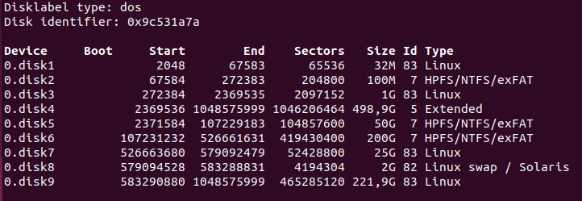
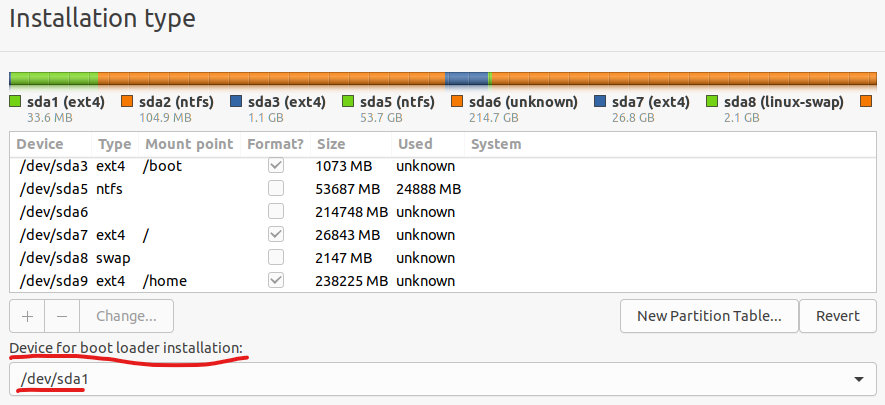

<!-- # Idea
Vamos a crear una VM que tenga un dual boot W7 y Ubuntu20.04 con arranque en 
BIOS, particionado DOS y GRUB como BootManager

## Paso 1: particionado de disco
En vez de ir "a lo bruto" e instalar en un disco virgen, primero pensamos
qué queremos y luego hacemos las instalaciones.

Digamos que vamos a tener un único disco duro de 500GiB en la máquina,
con 4GiB de RAM.

Investigando un poco los requisitos hardware:

https://support.microsoft.com/en-us/windows/windows-7-system-requirements-df0900f2-3513-a851-13e7-0d50bc24e15f

vemos que Windows 7 necesita 2GiB de RAM y 20GiB de disco para su versión 
de 64 bits y que Ubuntu20.04:

https://docs.cpanel.net/installation-guide/system-requirements-ubuntu/

necesita 1GiB de RAM y 20GiB de disco (minimo).

Con lo que tenemos debería de sobra darnos para ambos OSs.

Como en principio no hay ninguna otra restricción, podemos asumir que
partimos el disco en 2, y la mitad para cada OS. Como el arranque es BIOS,
la única manera de tener 2 OS en un único disco y poder seleccionar
cual arranca es tener un Bootmanager; vamos a instalar GRUB como
Bootmanager, lo cual implica que también necesitaremos una partición
para almacenar `/boot/grub` (los otros 2 ficheros que necesita GRUB van,
uno en el MBR y el otro en el espacio post MBR). Esa partición basta que sea
de 32MiB y su tipo ext4 (en principio admite otros FS).

Además, por hacer las cosas bien, por cada OS que instalemos vamos a
crear una partición para el sistema (los programas) y otra para los datos.
Y además pensamos en que quizás en un futuro necesitemos otras particiones
para cualquiera de los 2 OS, así que vamos a dejarnos espacio.

Con todo esto, un posible particionado sería:
- una particón primaria de 32MiB para `/boot/grub`
- una partición extendida que ocupe el resto del diso (a efectos prácticos 
    500GiB)
- una partición lógica de 50GiB para el sistema de Windows7
- Una partición lógica de 100GiB para los datos de Windows7
- Una partición lógica de 50GiB para el sistema de Ubuntu
- Una partición lógica de 100GiB para los datos de Ubuntu

Así de los 500GiB totales del disco, 250 van para cada OS, de los
cuales usamos 150GiB para cada, y les dejamos 50GiB libreas a cada uno
por si necesitásemos algo extra en el futuro.

Ahora que sabemos lo que queremos, vamos a hacer el particionado
incluso antes de tener el disco, y luego copiaremos ese particionado 
al disco y haremos las instalaciones.

Creamos un fichero vacío que "haga de disco", y usando la herramienta que te de
la gana (yo voy a usar sfdisk) creamos el particionado:

## aqui a lo guarro, luego redactamos

máquina: 4G RAM, 500G disco, arranque BIOS
QUiero dual boot windows7 ubuntu20
lo que necesita windows es una primary de 100M para el bootloader, el OS
se puede instalar en logical
Luego instalamos ubuntu (ver las particiones necesarias y sus tamaños)
luego instalamos GRUB en la particion reservada (preguntar a gepeto)

hago estas particiones:
- 32MiB para GRUB, ext4
- 100MiB para system de windows
- 1GiB para /boot de ubuntu
- extendida
- 5:100G para windows 7
- 6:100G para windows 10
- 7:12G para /
- 8:88G para /home 

Ver que tengo los 3 OS
luego instalar GRUB en su propia partición
quitar Linux
ver que sigo con los 2 windows -->

# Dual Boot Windows7/10 y Ubuntu20/22 con GRUB en su propia partición
Supuestos: arranque BIOS, 4GiB de RAM, disco de 500GiB.
Damos a cada OS la mitad del espacio: 250GiB.

En este tipo de arranque, Windows necesita una partición primaria de 100MiB
para instalar su bootmanager.
Además, queremos una partición aparte para GRUB para "independizarlo" de ubuntu,
así, si borramos ubuntu, seguiremos teniendo GRUB.

Para Windows vamos a dar 50GiB para sistema (programas) y 200 para datos
(fotos, videos). 

Para instalar ubuntu correctamente, lo recomendado es:
- una partición primaria para /boot, de 1GiB
- una partición de 25GiB para / (sistema, los programas)
- una partición para swap (memoria de intercambio), que sigue la fórmula de abajo
- una partción para /home (los datos), del tamaño que reste
- se pueden considerar otras como /tmp y /var, de momento no

Como además queremos "independizar" GRUB, necesitamos otra partición primaria
montada en /boot/grub de 32MiB.

La fórmula que recomienda el tamaño de la swap (sin hibernacion) es:
- el doble de RAM, si tengo menos de 1GiB de RAM
- 2 GiB si tengo entre 1  4 GiB de RAM
- la raiz cuadrada de la ram si tengo más de 4GiB de RAM

Por supuesto esto no es siempre posible.

Con esto, un posible particionado sería:

donde:
- la partición 1 es para grub
- la 2 es para el bootmanager de windows
- la 3 es para /boot de ubuntu
- la 5 y 6 para windows (systema y datos)
- la 7 para / (programas de ubuntu)
- la 8 para swap
- la 9 para /home (dats de ubuntu)

Le damos ese particionado a un disco y procedemos a instalar, oprimero siemrpe
windows y luego ubuntu.

Recuerda seleccionar las aprticiones correctas a la hor ade instalar windows
(solo hay que decir donde va a ir el OS, el propio instalador se encarfa
de detectar que tiene 100MiB para poner su bootmanager).

Finalmente instalar Ubuntu; tener en cuenta 2 cosas:
- hay que indicar donde se va a montar cada partición
- como queremos independizar GRUB de linux, al seleccionar donde vamos a
    poner el bootloader de ubuntu, lo ponemos en la partición sda1. Así
    GRUB no sobreescribe el MBR; luego tenemos que marcar esa parición
    como activa/booteable, es decir, que al arrancar en BIOS, se buscará ahí
    cómo llegar al siguiente paso, que será el GRUB

Ua vez instalado Ubuntu, con fdisk o tu herramienta favorita cmabias el 
flag de booteo y estamos listas. Para hacer eso, debemos meternos con
un live cd, abrir la terminal y cambiar los flags:

