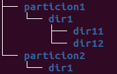

# Práctica de comandos básicos de BASH


## Antes de empezar
Necesitas una máquina virtual con alguna versión de linux, y a esa máquina
le añades un nuevo disco duro virtual de 2 GiB.

## Instrucciones
Rellenar un documento .txt llamado 
**apellido1-apellido2-nombre-práctica-bash.txt** (cambiar apellidos y nombre
por tus apellidos y nombre) donde incluyes:

1. el número de la pregunta
2. el comando o comandos a ejecutar para responderla más alguna explicación 
    extra si se considera necesario

## Comandos que habrá que usar (o no)
- fdisk
- ls (opciones: -l, -h)
- mkdir (opciones: -p)
- mkfs.ext4 (opciones: -L)
- mount (opciones: -o ro, -o remount)
- df (opciones: -h)
- cd 
- touch
- cp (opciones: -l)
- ln (opciones: -s)
- nano
- cat
- mv
- which

## Preguntas
1. Comprueba que el disco duro que acabas de añadir es detectado por el OS
```bash
ls /dev/sd*
```

Dependerá de cuantos discos tuvise la máquina antes, pero suponiendo que
solo había uno deberíamos ver ``sdb`` junto con las particiones del otro disco

2. ¿Cuál es el tipo de fichero del disco duro? ¿Cómo lo sabes?
```bash
ls -l /dev/sdb
```

devolverá algo así:
```bash
brw-rw---- 1 root disk 8, 16 feb 19 18:42 /dev/sdb
```

La `b` del principio significa que es un ficheor que representa un dispositivo 
de bloques


3. Crea 2 particiones primarias de 1 GiB cada una, tipo de partición ext4

Podemos usa la herramienta que queramos, lo más sencillo será con `fdisk`,
luego es simplemente seguir las ordenes del programa

4. Crea la siguiente estructura de directorios en la carpeta reservada a
    los montajes manuales de dispositivos:




La carpeta reservada a montajes manuales es `/mnt/`. Para crear los árboles de
directorios, ejecutamos:

```bash
sudo mkdir -p /mnt/particion1/dir1/dir11
sudo mkdir -p /mnt/particion1/dir1/dir12
sudo mkdir -p /mnt/particion2/dir1
```

5. Monta la primera partición que has hecho antes en `/dir12`, dándole un
label que sea "UNO"

Primero debemos crear el filesystem, dando el label
```bash
sudo mkfs.ext4 -L UNO /dev/sdb1
```

Luego podemos montar:
```bash
sudo mount /dev/sdb1 /mnt/particion1/dir1/dir12
```

6. Comprueba que se ha montado correctamente

Si ejecutamos
```bash
df
```
en el listado debería aparecernos 

7. Monta la partición 2 en `/mnt/particion2/dir1`, dándole un label que sea "DOS"

Igual que antes, creamos filesystem dando un label y luego montamos:
```bash
sudo mkfs.ext4 -L DOS /dev/sdb2
sudo mount /dev/sdb2 /mnt/particion2/dir1/
```

8. De manera relativa, ve hasta el punto de montaje de "DOS"

Asumiendo que no me he movido de mi home, llegamos con:
```bash
cd ./../../mnt/particion2/dir1/
```

9. crea 3 ficheros: uno.txt, dos.txt, tres.txt

```bash
sudo touch uno.txt dos.txt tres.txt
```

10. Sin moverte de ese directorio, crea 2 ficheros en el punto de montaje
    de la partición "UNO", llamados "hola" y "adios"

Se podría hacer de manera relativa o absoluta, lo hago de manera absoluta

```bash
sudo touch /mnt/particion1/dir1/dir12/hola /mnt/particion1/dir1/dir12/adios
```

11. Crea, en la partición "UNO", un hardlink al fichero "hola" que se llame
    "hardlink_a_hola"

Antes de hacer el hardlink, me he desplazado a la ubicación del fichero "hola"
```bash
sudo cp -l hola hardlink_a_hola
```

12. Abre con nano el hardlink y escribe dentro del fichero "hola que tal".
```bash
sudo nano hardlink_a_hola
```

13. Comprueba que se ha escrito "hola que tal" en el fichero "hola"

```bash
cat hola
```
debería devolver "hola que tal" por pantalla

14. Crea un symlink llamado "symlink_a_hardlink" a 
    "hardlink_a_hola" en la partición "DOS" (hay que usar paths relativos)

Primero, me desplazo al directorio donde voy a crear el symlink (donde
está montada la particuión "DOS"). Una vez ahí, ejecutamos:

```bash
sudo ln -s ./../../particion1/dir1/dir12/hardlink_a_hola ./symlink_a_hardlink
```

15. Comprueba que el symlink no esta roto

Basta hacer `ls` y vr que el fichero que hemos creado no está en rojo,
si no en un aguamarino

16. Modifica el contenido del fichero "hola" usando el symlink, añade la linea
    "hola desde symlink"

Basta abrir con nano el symlink y escribir

17. Comprueba que se ha modificado el fichero "hola"

Como antes, basta hacer `cat` sobre el fichero "hola", vermos que muestra
por pantalla la nueva linea

18. Copia el directorio "dir12" dentro del directorio 
    `/mnt/particion1/dir1/dir11`

Por comodidad, me muevo al directorio `/mnt/particion1/dir1/` que contiene ambos

```bash
sudo cp -r ./dir12 ./dir11/
```


19. Remonta la partición "UNO" como solo lectura. Compruba que no puedes 
    modificar el fichero "adios"

```bash
sudo mount -o remount,ro /mnt/particion1/dir1/dir12
```

Si intentamos abrir con `sudo nano` el fichero nos dirá que no es "escribible"

20. Desmonta la partición "UNO".

```bash
sudo umount /mnt/particion1/dir1/dir12
```

21. Comprueba que el symlink que creamos antes en la partición "DOS" está roto.

Si hacemos ``ls`` en la carpeta donde está el symlink, lo veremos en rojo

22. Borra todo lo que está bajo la directorio `/mnt/particion1`

Por comodidad, me desplazo a `/mnt/`

```bash
sudo rm -r ./particion1
```

23. Encuentra todos los ficheros en `/mnt/particion2/dir1` que tienen extensión
    ``.txt``

Por comodidad, me desplazo a esa carpeta:

```bash
ls ./*.txt
```

24. Averigua donde está instalado el programa `poweroff`

```bash
which poweroff
```

25. Apaga la máquina

```bash
sudo poweroff
```