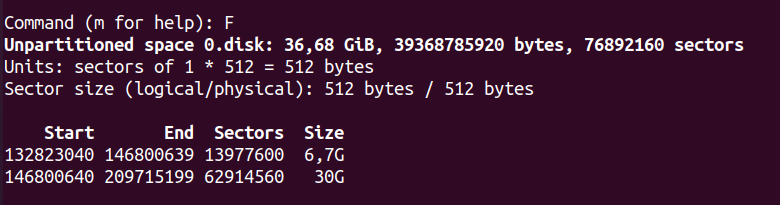
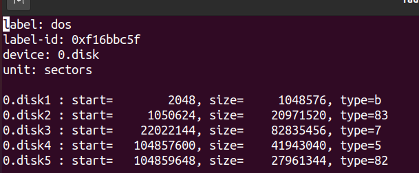

# Enunciado
Dado un disco de 100G, paticionalo con tabla DOS de la siguiente manera:
- 3 particiones primarias consecutivas, de 512MiB, 10GiB y la última que deje
    50GiB de espacio sin usar
- 1 partición extendida de 20GiB
- La primera partición primaria tiene FS W95 FAT32
- La segunda primaria tiene FS ext4
- La tercera tiene FS HPFS/NTFS/exFAT
- Una partición lógica que ocupe 2/3 del volumen extendido, con FS Linux Swap
- Guardar la tabla de particiones en el disco, comprobar que todo está como 
    se pide con las utilidades


## Solución con fdisk
Primero nos movemos a un directorio para trabajar, hay que ser ordenados.
Según entremos en la terminar estaremos en el home del usuario con el que
nos hemos loggeado; podemos o bien crear una carpeta para trabajar ahí:

```
mkdir ejercicio-particiones
cd ./ejercicio-particiones
```

o nos vamos a la carpeta de ficheros temporales del sistema:

```
cd /tmp/
```

Creamos el fichero que va a representar el disco con

```
truncate -s 100G disco.disk
```

Usamos fdisk para que nos cree una tabla de particiones DOS y empecemos a 
definirlas:

```
fdisk disco.disk
```

Creamos una nueva partición con `n`; elegimos `p` para indicar que es primaria,
elegimos 1 como número de la partición, elegimos el sector por defecto donde
comienza va a comenzar la partición (debería ser 2048), que es el primero que 
encuentra libre; elegimos el tamaño de la partición, `+512M`.

Creamos la segunda partición primaria de manera similar; solo cambiará el 
sector de comienzo (de nuevo elegimos el que nos da por defecto, que es el
primero que encuentre), y el tamaño, en este caso `+10G`.

Para la tercera partición primaria, elegimos como tamaño `-50GiB`.

Con esto tenemos creadas las 3 particiones primarias.

Creamos ahora la partición extendida; solo cambia que cuando aparece el menú
de tipo de partición elegimos `e`.

Damos formatos a las particiones. Para cambiar formatos, seleccionamos el
comando `t`; luego seleccionamos la partición 1 y seleccionamos `b` 
que es el código hexadecimal de ese FS.

La segunda partición primaria no hay que tocar nada, ya tiene como FS ext4.

Para la tercera, el código que elegimos es `7`.

El volumen de la partición extendida es 20GiB. Redondeando, 2/3 de 20GiB
son 13.3GiB; creamos una partición lógica de ese tamaño. Cambiamos
su FS usando el código `82`.

Finalmente, guardamos la tabla de particiones con el comando `w`.

Si ha ido todo bien, debemos ver lo siguiente:




## Solución con sfdisk
Los comandos serían los siguientes (ignorar los IDs que de cada disco
serán diferentes):

