# Ejercicio 1

Particionar un disco de 500GB teniendo en cuenta:
- particionado DOS
- se va a instalar GRUB, porque se van a instalar Windows y Linux
- una partición de 100GiB para W10, y otra de 250GiB tabién para W10
- Una partición para swap de Linux. La RAM es 8GiB y no se prevé hibernar
- Partición de 80GiB para Linux

## Solución
Podemos actuar de varias maneras; una posible solución sería la siguiente:
Creamos un fichero que actúe como un disco de 500GiB en Ubuntu con el
comando:
```console
truncate -s 500G 1.disk
```

Usando la herramienta que prefieras (en este ejemplo usaremos ``sfdisk``),
creamos el siguiente particionado:
- Una partición primaria de 32MiB para GRUB, tipo de partición ext4
- Una partición primaria de 100MiB para el Bootmanager de Windows, tipo NTFS
- Una partición primaria de 250MiB para /boot, tipo ext4
- Una partición extendida que ocupe el resto del disco
- Una partición lógica de 100GiB tipo NTFS para Windows
- Una partición lógica de 250GiB tipo NTFS para Windows
- Una partición lógica de 25GiB tipo ext4 para /
- Como no se preveé hibernar, una partición de 3GiB para /swap
- El resto para Ubuntu (52 = 80-25-3), una partición lógica tipo ext4 para /home
- El resto libre

El particionado quedaría así:
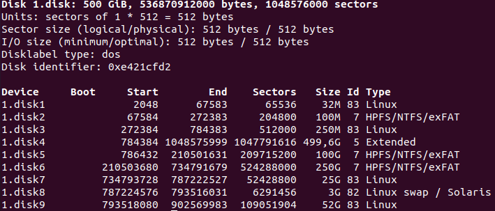

# Ejercicio 2
Hacer la instalación de los OS Windows7/10 y Ubuntu20.04/22.04 en un disco de 1TiB teniendo en cuenta que:

- El arranque va a ser BIOS
- El tamaño de disco reservado para sistema de Windows es de 100GiB, y para datos, de 300GiB
- Para Ubuntu, reservamos:
    - 12GiB para /
    - 200GiB para datos
    - espacio para swap, sabiendo que la RAM es de 8GiB y se prevé hibernación


## Solución
Podemos calcar prácticamente el ejercicio anterior en cuanto a particionado
se refiere; indico las cosas que cambian:

- Como se preveé hibernar y la RAM de la máquina es de 8GiB, el espacio
    reservado para swap debería ser de 11GiB
- Los tamaños de las particiones de sistema y datos de Windows cambian de
    tamaño, igual que la reservada para /home

Entonces nos quedaría el siguiente particionado (hecho en un fichero que
simula un disco que he llamado 2.disk):


Una vez hecho el particionado en un disco "de mentira", hay que dárselo a un 
disco de verdad. Para ello, primero extraemos el particionado a un fichero
mediante (no es la única manera)

```console
sfdisk --dump 2.disk > particionado
```

Con las herramientas de VirtualBox, creamos un nuevo disco duro virtual
de 1TiB:


Con la máquina donde hemos hecho el particionado apagada, enchufamos
este nuevo disco virtual:


Encendemos la máquina y comprobamos que detecta el disco:

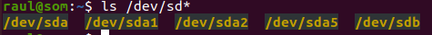

Y finalmente le damos el particionado (hay otras maneras) con:

```console
sudo sfdisk /dev/sdb < particionado
```

(se asume que estoy en la misma carpeta donde está el fichero "particionado)

Con esto, apagamos la máquina, y sacamos el disco duro. 

Ahora tenemos que crear la máquina en donde vamos a hacer la instalación.
Creamos una nueva máquina y le damos las especificaciones necesarias
(8GiB de RAM [si se puede], y tantos procesadores como sea posible).
A la máquina no le creamos un nuevo disco virtual, usamos el que 
hemos creado y dado una tabla de particiones. Sí es importante que
en esta máquina esté desmarcada la opción de "enable EFI", pues queremos
arranque BIOS.


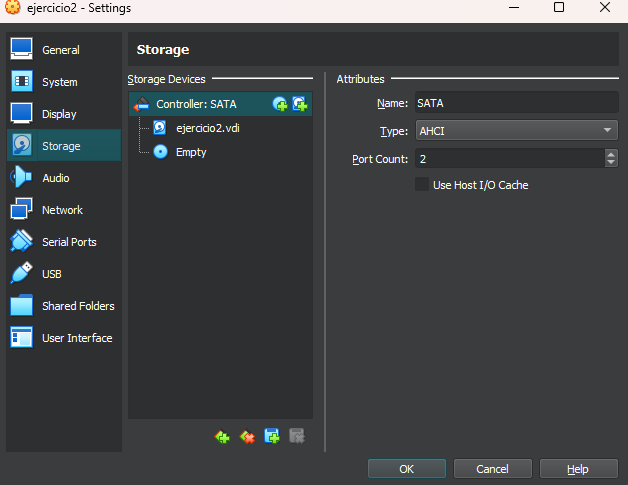

Con la máquina creada, procedemos a instalar los OSs. Metemos en la
unidad de disco la ISO de Windows (7), e iniciamos la máquina.

Casi todas las pantallas del instalador de Windows7 es aceptar licencias
y next; cuando se nos presenta esta:

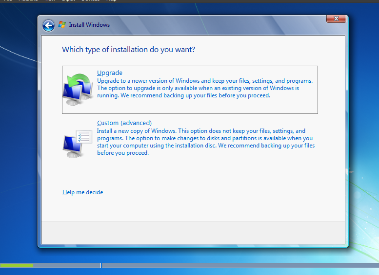

Elegimos "custom", donde veremos el disco con su particionado:

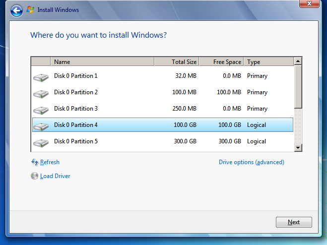

Instalamos Windows en la partición que viene marcada como 4 en la imagen;
es la que reservamos para el sistema.

La instalación no requiere mucho más, aparte de la config post instalación.

Con Windows7 instalado, apagamos la máquina (asegurarse de que tenemos 
seleccionado como boot order la unidad de disco antes que el disco duro),
e introducimos la ISO de Ubuntu20; iniciamos la máquina y debería bootearnos
desde el cd.

Avanzamos por las pantallas hasta llegar a la siguiente:

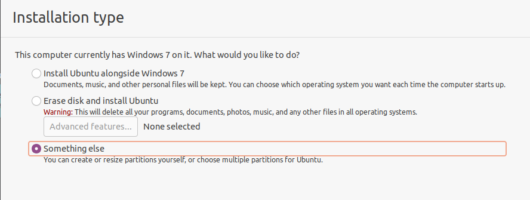

donde elegimos "something else"; veremos el particionado, y solo hay que ir 
indicando, en las particiones que hemos reservado, dónde se van a montar:

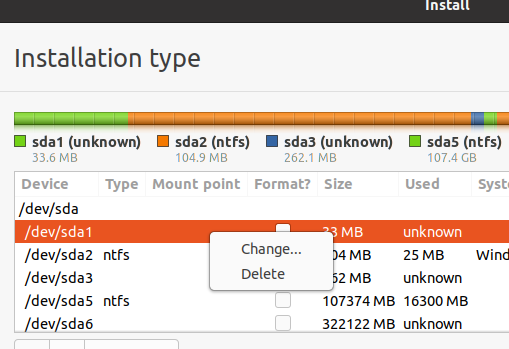


Finalmente, tenemos que elegir donde queremos que se instale el bootmanager 
(GRUB); podemos elegir que se machaque el MBR y tendríamos todo terminado,
ya que al arrancar la máquina, el MBR apuntará a la partición
donde están los ficheros de GRUB y tendremos la pantalla de elección de
bootloader; pero también podemos elegir que GRUB no machaque el MBR seleccioando
que se instale en la partición que le dimos; esta sería mejor opción ya que
en caso de querer desintalar Ubuntu, solo habría que cambiar la partición
activa de nuevo a donde está el bootmanager de Windows y eliminar todas las 
demás. Realmente la opción a elegir depende de lo que se pretenda hacer
con el equipo.

Pero suponiendo que en un futuro queremos elminiar Ubuntu del sistema, tenemos 
que marcar la siguiente opción:


Es decir, decimos que GRUB no machaque el MBR y se instale completamente
en la partición que le hemos designado; de esta manera, en el proceso de 
arranque BIOS se leerá el MBR y este apuntará no a GRUB, si no a la partición
activa.

Tras que se termine la instalación, si iniciamos la máquina, veremos que
no salta GRUB, si no que nos carga diractamente el OS Windows. Esto es porque
el MBR apunta a la partición activa, y como no hemos tocado nada más,
la partición activa es la que contiene el bootmanager de Windows, ya que
Windows lo configura así en la instalación. Para poder elegir entre
los 2 OS (es decir, usar GRUB), tenemos que asegurarnos en la configuración
de la máquina que hemos elegido el boot order con el disco óptico prioritario
al disco duro:


E introducimos de nuevo el disco de instalación de Ubuntu. Esto nos cargará
Ubuntu (elegimos opción "Try Ubuntu"),
y podemos usar la terminal para ver el disco (uso fdisk)


Efectivamente, la partición marcada como activa es justamente la que 
elegimos para que se instalase el bootmanager de Windows. Desde fdisk, podemos
cambiar esto con la opción `a`:

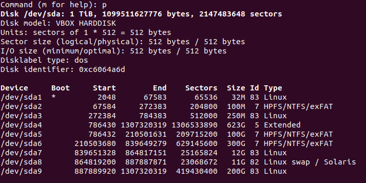

Ahora la partición que está marcada como activa es la partición donde instalamos
GRUB. 

Cuando hagamos el arranque BIOS, el MBR apunta
a la partición activa, que es la de GRUB, y GRUB nos permitirá elegir que OS 
queremos cargar.

Faltaría una cosa por comprobar, que es que este disco solo es arrancable con
BIOS; para ello, vamos a la máquina, y pulsamos que el arranque sea EFI:


Intentamos arrancar la máquina y vemos que no es posible.

# Ejercicio 3
Hacer la instalación de los OS Windows7/10 y Ubuntu20.04/22.04 en un disco de 1TiB teniendo en cuenta que:

- El arranque va a ser UEFI
- El tamaño de disco reservado para sistema de Windows es de 100GiB, y para datos, de 300GiB
- Para Ubuntu, reservamos:
    - 12GiB para /
    - 200GiB para datos
    - espacio para swap, sabiendo que la RAM es de 8GiB y se prevé hibernación

## Solución
Como en este caso el arranque va a ser UEFI, necesitamos, primero, haber
marcado la opción de "habilitar EFI" en la máquina en la que vamos a
hacer las instalaciones.

Y segundo, como el arranque va a ser UEFI, el particionado que hagamos será
GPT (de hecho estamos obligados a que el particionado sea GPT porque
Windows no acepta hacer un arranque UEFI si está instalado en un particionado
tipo DOS).

Con esto en mente, las particiones serán prácticamente las mismas que 
en el arranque BIOS, con una excepción: tenemos que tener una partición
tipo ESP (EFI System Partition, y con File System FAT32, de 100MiB) 
para que se instalen
ahí los bootloaders (o bootmanagers) de los distinos OS que vayamos a
instalar en el disco.

El arranque UEFI cuenta con un Bootmanager que sabe encontrar a los bootloaders
(o bootmanagers) de los OS que se instalan en el disco; aunque podríamos
instalar GRUB (u otro bootmanager) en su propia partición, por simplificar
vamos a usar la partición ESP para instalar GRUB y al bootear, como será
lo último instalado, su entrada en el bootmanager del firmware será la
prioritaria, es decir, a efectos tendremos, tras el arranque, la pantalla
de GRUB.

Por tanto, las particiones que necesitamos son:
1. Una de 100MiB, tipo ESP (0xef00), para los bootloaders de los OSs
2. Una de 100GiB tipo 0x0700 (Microsoft Basic Data) para el OS Windows
3. Una de 300GiB tipo 0x0700 para los datos de Windows
4. Una de 12GiB tipo 0x8300 para /
5. Una de 200GiB tipo 0x8300 para /home
6. Una de 11GiB tipo 0x8200 para swap

Las hacemos con sgdisk en un "disco de mentira":

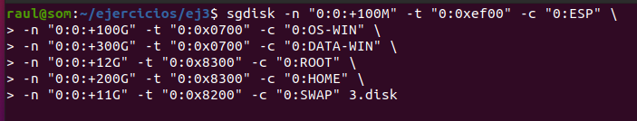
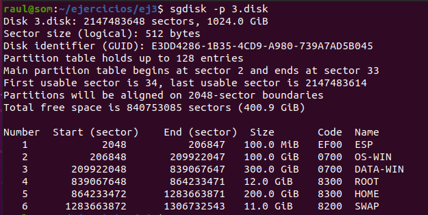

Y una vez hecha la tabla de particiones, la backupeamos a un fichero con
```bash
sgdisk --backup=./particionado 3.disk
```

Con el disco virgen en el sistema, cargamos el fichero de backup con

```bash
sudo sgdisk --load-backup=./particionado /dev/sdb
```

Y apagamos máquina, enchufamos el disco con su particionado a la nueva máquina
e introducioendo el disco de instalación de Windows procedemos a instalar Windows.

Una vez instalado Windows, apagamo la máquina e instroducimos el CD de
la ISO de ubuntu. Y lo más probable es que no lo reconozca e se booteé Windows.
Este comportamiente es correcto, pues UEFI no entiende de boot order, ese
es un concepto de BIOS; lo que debemos hacer es, segñun arranque la máquina,
machacar la tecla ESC (o la que sea según firmware) para acceder al 
bootmanager del firmware (lo que hace el arranque UEFI es buscar la partición
ESP y si hay ahí algo arrancable, lo arranca). Veremos una pantalla así:


Seleccionamos "Boot Manager" y elegimos el CD:


Y arrancará la máquina desde el disco (de hecho nos lanzará GRUB y elegimos
Ubuntu). continuamos la instalación normal de Ubuntu, eligiendo las particiones
como antes, con la diferencia ahora de que le decimos al instalador que queremos
el bootmanager (osea, GRUB) en la partición ESP:


Y solo quedaría comprobar que efectivamente este disco solo es arrancable
UEFI; basta descmarcar el tick de "Enable EFI" y ver que no arranca la máquina.

# Ejercicio 4
Hacer la instalación de los OS Windows7/10 y Ubuntu20.04/22.04 en un disco de 1TiB teniendo en cuenta que:

- El arranque es BIOS, pero se prevé cambiar a UEFI
- El tamaño de disco reservado para sistema de Windows es de 100GiB, y para datos, de 300GiB
- Para Ubuntu, reservamos:
    - 12GiB para /
    - 200GiB para datos
    - espacio para swap, sabiendo que la RAM es de 8GiB y se prevé hibernación

## Solución
La idea de este ejercicio es que tenemos un disco que es arrancable BIOS
con cosas (OS, programas, configs, datos), y queremos que sea TAMBIÉN
arrancable UEFI (porque nos vamos a comprar una PLaca Base nueva), y sin
perder nada por el camino.

Por simplificar, no voy a seguir exactamente las indicaciones de todas las
particiones que necesitamos, si no que vamos a tener un disco de 500GiB
y en una partición de 100GiB metemos Windows y en otra de 100GiB Ubuntu;
mantenemos también la partición de 100MiB para el bootmanager de Windows
y la de 32MiB para GRUB. Es decir, el particionado (DOS) de inicio queda así:

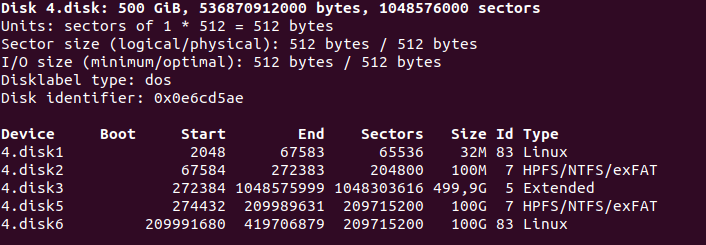

Procedemos a instalar Windows y Ubuntu como en el ejercicio 2.

Una vez que están instalados,