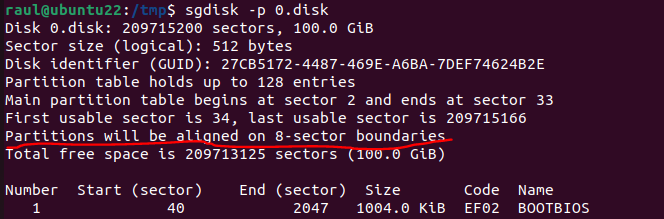
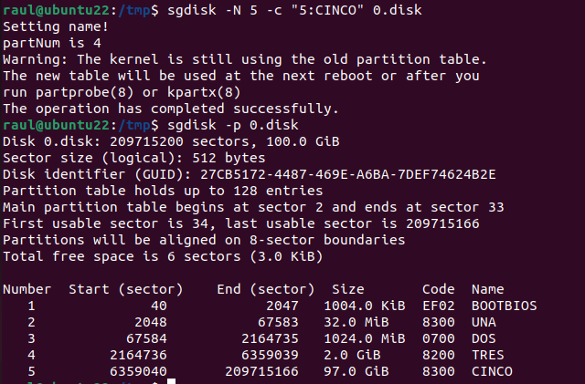
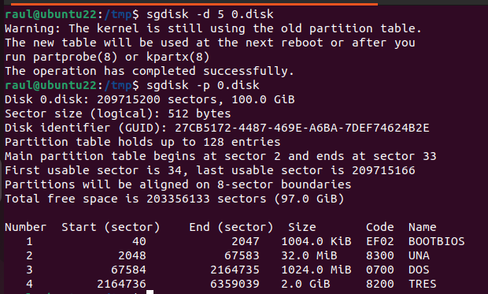
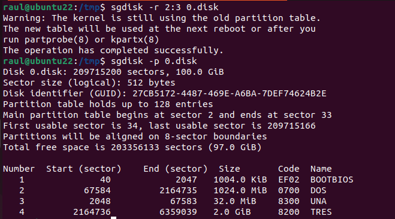

# Común a cualquier ejercicio
Vamos a la carpeta `/tmp/` y creamos un "disco" de 100GiB:


# Particionado GPT para arranque BIOS
Crear 3 particiones, alineadas a 1MiB, consecutivas, de tamaños 32MiB,
1GiB y 2GiB. La segunda partición tiene tipo "Microsoft basic data". 
Las otras 2, "Linux".

También vamos a dejar espacio para instalar GRUB.

El fichero boot.img de GRUB irá en el MBR del disco (recuerda que las 
particiones GTP tienen un MBR de por si acaso). El fichero core.img en 
particionado GTP no debe ir entre el espacio de la tabla y la 
primera partición "util" (la que empieza, habitualmente, en el sector 2048,
que es la que cumple la alineación recomendada de 1MiB) porque en principio
la tabla GPT crece; así que la partición que contenga a core.img irá en la
alineación 1MiB y tendrá tipo "BIOS Boot Partition"; pero lo vamos a hacer
"mal" y poner esa partición entre la tabla GPT y la primera partición útil
por practicar, con una alineación de 4KiB (es la mínima recomendada).

Ejecutamos los comandos:


que lo que hace es: cambiar la alineación a 8 sectores (esto es porque queremos
que la partición que contenga a core.img vaya entre la tabla GPT y la primera
partición útil; como la alineación normal es de 1MiB [2048 sectores], esta 
partición no tiene manera de ir alineada y estar entre la tabla GPT y "la 
primera partición útil" sin cambiar la alinación. La alineación, que se indica 
en sectores, es 8 porque con una cuenta fácil se saca que si un sector tiene
512B/sector y quiero alinear a 4KiB, el número de sectores debe ser [multiplo 
de] 8); luego define una nueva partición que tendrá número de partición
el primero libre (por eso el primer 0), que empezará en el primer sector
disponible que encuentre (por eso el segundo 0), y que acabará en el sector
2047 (porque yo sé que la primera partición que irá alineada a 1MiB es la que
empieza en el sector 2048).

Luego le decimos que el tipo de particón es (para esta partición, por eso el
0) de código "0xef02", que se corresponde con el tipo de partición que necesito,
la BIOS Boot Partition; puedo saber los códigos preguntando a sgdisk con

```console
sgdisk -L
```


finalmente decimos que queremos etiquetar este disco (de ahí el 0) con el label
`BIOSBOOT`.

Lo último solo indicamos que estamos haciendo esta cambio en la tabla de
particiones del disco `0.disk`.

Podemos comprobar que ha ido todo bien con `sgdisk -p 0.disk`



Ojo que como hemos dicho que cambie la alineación, para las siguientes particiones
tenemos que volver a ponerla a 2048.

Crear las otras 3 particiones no tiene mucho misterio, solo hay que buscar el
código del tipo de partición para "Microsoft basic data" que es `0x0700` 
(las de linux no hace falta definir el código pues es el por defecto);
podemos crearlas todas de una con:


Y comprobamos:


Ahora modificamos la partición "TRES" para que su tipo de partición sea
"Linux swap" (código `0x8200`):


Creamos la partición 5 que ocupe todo el resto del espacio:



Y la borramos:



Y cambiamos los ordenes de las particiones:



## Particionado GPT para arranque UEFI
Hay que crear las mismas 3 particiones que antes, solo que ahora creamos una
partición de tipo `ESP` de 100MiB alineada 1MiB para que contenga los
bootloaders de diferntes OS:


## PArticionado arranque híbirdo
Simplemente es hacer las 2 cosas anteriores de una:


