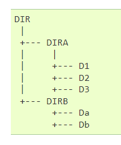

# Ejercicios compresión y empaquetado

1. Crear este arbol de directorios:

Y crear f1.txt dentro de D1, f2.empty dentro de D3, f.zip dentro de DIR,
f3.xxx dentro de Da

2. Copiar el contenido de `/var/sys/syslog` en `Db/syslog`

3. Comprimir en gz y nivel 8 la copia de syslog que hay en Db

4. descomprimir el comprimido anterior en D2/copia.syslog

5. Empaqutar (sin comprimir) todo el árbol creado

6. Empaqutar con compresión `.xz` todo el árbol anterior
 
7. Ver qué contiene el empaquetado que acabas de hacerº

8. Obtener, del empaquetado comprimido, el fichero `copia.syslog` y 
    alamacenarlo en el pwd

9. Empaqutar compriminedo en gz el arbol excluyendo del paquete los syslog
    y f3.xxx