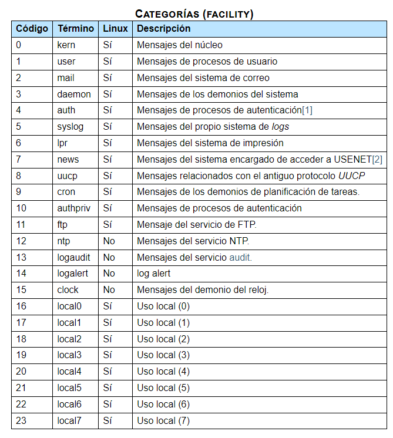
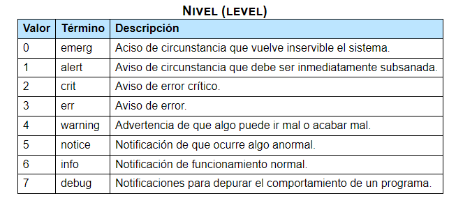
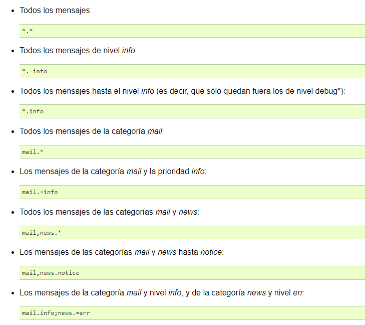

# Monitorización del sistema
Cuando se ejecutan programas (procesos) en el OS, es habitual que esos
programas/procesos/daemons dejen info de lo que hacen
(por ejemplo, apt dice que ha descargado unas actualizaciones,
o el sistema dice que ha habido un intento de login incorrecto, o algo
ha fallado por no tener un recurso disponible...)

Toda esta información queda registrada en diferentes ficheros y de diferentes 
formas, ya que actualmente conviven un sistema "tradicional" de monitorización
junto con otro más moderno, y queda registrada con el propósito de que podamos
consultar qué ha estado pasando en el sistema, por qué ha fallado algo...

## Sistema tradicional de loggeo
Los registros se almacenan bajo `/var/log/`, de 2 maneras:

Algunas aplicaciones mandan mensajes a un daemon concreto (rsyslogd, podemos ver que
está activo con `systemctl status rsyslog`)  que los procesa y 
los escribe al fichero de log correspondiente; otras aplicaciones escribirán
ellas mismas sus propios mensajes de loggeo (que si las cosas se han hecho bien,
estarán almacenados en añgún sitio de `/var/log/`, seguramente una subcarpeta
con el nombre del programa)

OJO: rsyslog es un daemon de sistemas *Debian*, para otras distros puede que 
cambie

### Clasificación de los logs
Al final del día, los logs son mensajes, y como es evidente los mensajes se 
pueden clasificar por "naturaleza" (facility, en inglés) o categoría, 
y por "nivel" o prioridad

Por facility tenemos esta clasificación:



y por nivel tenemos esta clasificación:




### Ficheros
Bajo `/var/log` podemos encontrar un montón de ficheros, unos que vienen 
de rsyslogd y otros que vienen de las propias aplicaciones

El comportamiento por defecto (es configurable) de rsyslogd es escribir
todo en el fichero `/var/log/syslog/` (nota: recomiendo abrir este fichero
con vim en vez de nano o cat porque me añade colores que sea todo más
fácil de ver), pero podemos cambiar, configurando rsyslog, que ciertos
mensajes (ya sea clasificados por facility o por level) se escriban en 
otros ficheros. Los ficheros más comunes que nos podemos encontrar
(o crear nosotras) son:

#### syslog
En ppio contiene todo, menos mensajes de autenticación

#### auth.log
Contiene exclusivamente mensajes sobre autenticaciones contra el sistema

#### kern.log
mensajes del kernel

#### daemon.log
mensajes de la facility deamon (es decir, los servicios escriben aquí)

#### mail.log
Logs del servicio de correo.

#### user.log
Logs de apps de usuario

#### lpr.log
logs de servicio de impresión

El resto de cosa que nos encontremos en /var/log es que es una config alterada
o que hay aplicaciones que escriben sus propios logs sin pasar por rsyslog

#### btmp y wtmp
Estos son un par de ficheros especiales que no gestiona rsyslogd y contienen
info de accesos fallidos al sistema (btmp) y accesos al sistema (wtmp)

Ojo que esto ficheros son binarios, para ver su contenido hemos de hacer:

```bash
utmpdump /var/log/btmp | more
utmpdump /var/log/wtmp | more
```

### Consulta de info
Los ficheros de loggeo (menos btmp y wtmp) son de texto plano y si sabemos
REGEXP podemos sacar toda la info que necesitemos. Como no sabemos REGEXP,
usaremos jornalctl que me lo pone más fácil. Si es importante saber el formato
(que siempre es el mismo) de los registros de estos ficheros, que es:

```bash
<fecha y hora> <nombre_maquina> <nombre_proceso>[<PID>]: <texto del mensaje>
```

### Configurar rsyslog
El fichero de config está obviamente en `/etc/rsyslog.conf`, aunque si vamos
a tocar cosas como siempre es mejor no tocar este fichero y usar
el directorio `/etc/rsyslog.d/` para añadir nuestrar propias configs
de manera modularizada (comprobar que tenemos la linea `$IncludeConfig /etc/rsyslog.d/*.conf`
en el fichero rsyslog.conf)

La manera de netender este fichero es la siguiente: tiene 3 tipos de lineas,
- las que empiezan por `#`, que son comentarios
- las que empiezan por `$`, que son directivas
- las que representan reglas/acciones, es decir, lo qe hacer con cada mensaje

#### Directivas
Hay muchas, algunas que son útiles:

```bash
# Definición de mask, propietarios, permisos por defecto
$Umask 0000
$FileOwner root
$FileGroup adm
$FileCreateMode 0640
$DirCreateMode 0755
```

Este tipo de linea define una serie de permisos para los ficheros que se
vayan a tratar a contonuación. Si queremos un cambio, debemos volver a
escribir las directivas

```bash
$IncludeConfig /etc/rsyslog.d/*.conf
```

Dice que se incluyan los ficheros de configración que existan en la carpeta
rsyslog.d

```bash
$ActionFileDefaultTemplate RSYSLOG_TraditionalFileFormat
```

plantilla del formato de los mensajes

#### Reglas
Dicen qué hay que hacer, suelen constar de 2 cosas: selector (a qué mensajes 
afecta) y acción (qué hacer, en general, escribir en un fichero)

El selector se compone a su vez de categoría y nivel:




#### Acciones
La accion, que en general es escribir a un fichero de log, consiste simplemente
en decir la ruta absoluta hasta ese fichero

```bash
auth,authpriv.*       /var/log/auth.log
```

Se aplicarán todas las reglas encontradas, es decir, si se ve esto:

```bash
auth,authpriv.*        /var/log/auth.log
*.*                    /var/log/syslog
```

Los mensajes de autenticación también se escriben en syslog.
Si los quiero descartar, tengo que poner una ~


```bash
auth,authpriv.*        /var/log/auth.log
auth,authpriv.*        ~
*.*                    /var/log/syslog
```

Finamnete, una vez configurados tus logs a tu manera, es útil usar
la herramienta logger que permite "crear" logs de la categoría y nivel que
queramos, para ver que las cosas se escriben donde deben:

```bash
logger user.warning "un mensaje"
```

### Rotaciones
Los logs que gestiona rsyslog (y en general, los logs que haya en /var/log)
son permanentes, eso queire decir que se escribe y escribe en los ficheros
y ellos crecen y crecen.. hasta que nos dejan sin espacio en disco.

Para ello existe el servicio logrotate, que nos da utilidades para que los logs
no se nos vayan de las manos.

La rotación consiste en, cada cierto tiempo, cpoiar el contenido de los ficheros
de logs aniguos a otro fichero (comprimirlo), vaciar el fichero de registro
y volver a empezar a escribir en él (con los logs má nuevos)

Logrotate no es un servicio que esté siempre ejecutándose, si no que
hay un script (en /etc/cron.daily) que lo invoca diariamente (cron es el servicio
que me permite automatizar tareas)

Para configurar rotaciones tenemos el fichero de configuración en 
/etc/logrotate.conf, donde se supone que debemos definir la configuración
predeterminada de cualquier log; si queremos una rotación específica para un
loggeo concreto, podemos incluirla en la carpeta /etc/logrotate.d/

Si vamos a esa carpeta, veremos que ya hay ficheros de configuración
que se corresponden a aplicaciones que se autogestionan sus logs

En el fichero logrotate.conf habrá algo así:

```bash
# see "man logrotate" for details
# rotate log files weekly
weekly

# use the adm group by default, since this is the owning group
# of /var/log/syslog.
su root adm

# keep 4 weeks worth of backlogs
rotate 4

# create new (empty) log files after rotating old ones
create

# use date as a suffix of the rotated file
#dateext

# uncomment this if you want your log files compressed
#compress

# packages drop log rotation information into this directory
include /etc/logrotate.d

# system-specific logs may be also be configured here.
```

o así:

```bash
# Rotación semanal
weekly

# Conserva 4 semanas
rotate 4

# Compresión (con xz, pero no se comprime por defecto)
compress
compresscmd /usr/bin/xz
compressext .xz

# Ficheros de configuración modular:
include /etc/logrotate.d
```

Es bastante fácil de entender: haz rotacion de logs cada semana; guardame
4 semanas de logs, comprime, incluye confgs específicas de aplicaiones...

En un fichero de config en /logrotate.d/ veremos algo más compacto:

```bash
/var/log/apt/term.log {
  rotate 12
  monthly
  compress
  missingok
  notifempty
}

/var/log/apt/history.log {
  rotate 12
  monthly
  compress
  missingok
  notifempty
}
```

Que tiene un significado muy similar; la primera linea habla del fichero de
logs, el resto de la config específica que se aplica a su rotación.

Entre las directivas que podemos decir para las rotaciones, las comunes son:

- frecuencia de rotación: hourly, daily, weekly, monthly, yearly
- no borrar el fichero de loggeo, si no vaciarlo: copytruncate (útil para 
    servicios que no se pueden parar)
- create <permisos><user><group>: cómo crear el nuevo fichero de loggeo
- delaycompress: retrasa 1 ciclo la compresión
- maxsize: tamaño máximo del fichero de loggeo; si se alcanza, se hará rotación
    incluso si no ha llegado el tiempo de rotar. Se indica `maxsize 10M`, 
    puedes usar k, M, G
- minsize: tamaño mínimo antes de rotar. Si no se alcanza, no se rota
- missingok: que no haya error si no existe el fichero de loggeo
- rotate N: número de rotaciones que sufren los registros

## journalctl
La herramienta moderna de loggeo que de momento convive con rsyslog es
el servicio `systemd-journald.service`, qu tiene su fichero de configuración
en /etc/systemd/journald.conf. Cosas a destacar de ese sistema de loggeo:

- los registros de journald no son persitentes, se borran con cada reboot,
    porque se almacenan en /run/log/journal (run es la carpeta para la info
    de runtime) (se pueden hacer persistentes tocando un poco la config
    y creando el directorio /var/log/journal/)
- journal habla con rsyslogd y le pasa lo que registra, y rsyslog se encarga
    de clasificar y almacenar los logs correcpondientes. Es necesario pues muchos
    programas usan el sistema tradicional de loggeo para obtener info

La ventaja de journalctl es la consulta de logs, que no requiere saber REGEXP

### Consulta de info
Para ver todo basta con invocar al comando `journalctl`, lo cual es poco práctico

Tenemos muchas opciones de filtrado para ver los logs:

- por unidad: `journalctl --unit ssh.service`
- usando wildcards: `journalctl --unit "systemd-*"`
- por nivel de mensaje: `journalctl -p err`
- los del kernel: `journalctl -k`
- desde un momento dado: `journalctl --since "2016-12-16 12:15:00"`
- desde un momento relativo a ahora: `journalctl --since "-10m"` (hay palabras
    especiales como today/yesterday...)
- hasta un momento dado: `journalctl --since "-10m" --until "-5m"` (también de
    maneras relativas o absolutas)
- los generados por un comando concreto: `journalctl /usr/sbin/sshd`
- filtrar por identificador de syslog (lo que está antes del PID): `journalctl -t sshd`
- filtrar por campos, que podemos consultar qué campos tenemos con `journalctl -N`
    Entre los muchísimos campos que hay, los interesantes son:
    - `journalctl SYSLOG_FACILITY=3` -- selecinar la categoría de mensajes
    - `journalctl _TRANSPORT=kernel` -- seleccionar cómo se pasaron a systemd
    - `journalctl _UID=1000` -- los que genera el usuario con UID, puedes poner
        también _GID o _PID para un grupo o proceso
- si pones varios campos en el filtrado se entiende que es un filtrado conjunto
    `journalctl _UID=1000 --since "-10m"`
- si pones varios campos y un signo `+` se entiende que es la suma de los filtrados
    `journalctl SYSLOG_FACILITY=4 + SYSLOG_FACILITY=10`
- para conocer los valores que puede tomar cada "cosa en mayúsculas" hay qu hacer:
    `journalctl -F SYSLOG_FACILITY`
- se pueden conocer los últimos n mensajes con la opción -n:
    `journalctl --unit ssh.service -n44`
- se puede hacer un stream de los mensajes con `journalctl --unit ssh.service -f`