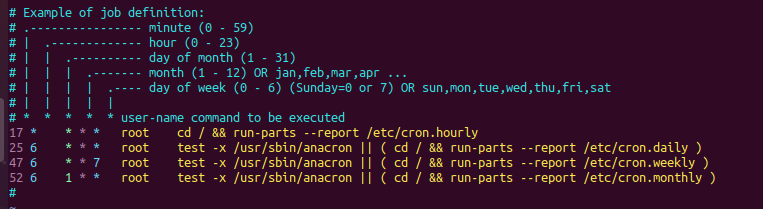

# Planifiación de tareas
Consiste en decirle al OS que ejecute órdenes, no de manera inmediata
como hemos hecho hasta ahora, si no que lo haga a futuro y/o de manera periódica.

## Tareas diferidas
Primero, e importante, el intérprete d estas tareas es al que apunte
`/bin/sh`, que normalmente está configurado por defecto para ser `dash` 
y no `bash`.

Podemos comprobarlo con:

```bash
ls -l /bin/sh
```

Entonces, si queremos que el intérprete sea bash, tendremos que cambiar
ese symlink de dash a bash

La manera de lanzar tareas en diferido es:

```bash
at [<opts>] <momento>
```

Y el comando `at` lee de la stdin, así que se suele jugar con echo (que manda
al stdout) y pipelines

Ejemplo concreto:

```bash
echo "touch /tmp/hola" | at now + 1 min 
```

Creara el fichero "hola" ahora (now)

Lo que se le puede decir al comando at es:

- now: ahora mismo
- noon: proximo mediodia
- midnight: proxima medianoche
- teatime: próximas 16h
- tomorrow: mañana
- next week: proxima semana
- next month: proximo mes
- next monday: próximo lunes (vale decir mon, y vale cualquier día de la semana)
- mm/dd/yyyy: fecha concreta; por ejemplo 03/04/2005 es el 4 de marzo de 2005
- hh:mm: la próxima vez que sea esa hora concreta, en ese formato

Salvo el de la hora, todos los otros comandos se refieren a exactamente la hora
en la que se ejecuta el comando `at`

Obviamente, son combinables: `at 12/31/2025 12:34` 

Además, a los que se refieren a momentos (now, tomorrow...) se les puede
añadir unidades de tiempo:

```bash
at monday + 5 hour
```

Las opciones que tenemos son `min(utes)`, `hour(s)`, `day(s)`, `week(s)`, 
`month(s)`, `year(s)`

Para ver las órdenes en espera de ser ejecutadas, hacemos `atq`
Las órdenes tienen un ID, y podemos ver en qué consisten con
`at -c ID`

Podemos cancelar una orden "en cola" con `atrm ID`

## Planificación de tareas períodicas
Para ello tenemos `cron` que es un daemon que hay que configurar para 
que ejecute las tareas. Como hay que configurar, necesitamos saber donde
está el fichero de configuración y cómo escribir en él

El fichero de config que no hay que tocar está en `/etc/crontab`
Lo bueno de ese fichero es que te explica cómo se debe escribir en un
fichero de config de cron

El resto de config de cron está disperson en distintas carpetas

Primero, entender un fichero de esos, se puede ver en la imagen como hay que 
escribir la info



Hay que decir minuto, hora, dia del mes, mes del año, dia de la semana, 
usuario ejecutor y comando a ejecutar

En resumen, las 5 primeras columnas hablas de la frecuencia de la ejecución,
la sexta de la autoría, y la última es lo que se va a ejecutar en sí

Entendamos las columnas:
- minuto: el minuto en el que se va a ejecutar el comando. Si dices 30,
    el comando se ejcuta a y media. Si dices 10,20,30, e comando se
    ejecuta a las y 10, y 20 e y media. Si dices 0-15, es que se ejecute
    cada minuto entre el minuto 0 y el 15. Si dices /15, es decir cada 15 mins
    osea, a en punto a y 15, a y 30 y a y 45. Finalmente, `*` es todos los minutos
    Se pueden combinar: `0-20/5` es, entre los minutos 0 y 20, cada 5
    osea es lo mismo que escribir `0,5,10,15,20`
- el resto no necesitan una expliación tan detalladas, siguen (mas o menos)
    las mismas reglas

```bash
5  4  *  *  7  root /usr/local/bin/script.sh parametro1 paramentro2
```

Como ejemplo, ese comnado se ejecutará todos los domingos a las 4:05h

Respecto a la organización de la configuración, si hacemos `ls /etc/cron*`
veremos el fichero que no hay que tocar de config global crontab,
el directorio donde meteremos nuestras cosas especiales 
es `/etc/cron.d/` y luego ficheros de daily, hourly...

Esos ficheros no deben tener cosas con el formato explicado; lo 
que contienen son scritps ejecutables, que cron ejecutará según en 
la carpeta que caigan

Para programar una nueva tarea, NO TOCAMOS NINGUN FICHERO, ejecutamos
`crontab -e` y se abre un editor de texto donde metemos la orden y 
su periodicidad en el formato explicado antes.

Se ve que cada usuario tiene sus propios crontabs, que los gestiona el propio
cron. Si quiero er mis cron, haces `crontab -l`. Con la opción -r eliminiamos
el fichero

Un usuario admin puede eliminar/modificar crontabs de otro con `crontab -u user -e`

El directorio `/etc/cron.d/`  lo que contiene son scripts que se vayan a ejecutar
de manera periódica pero cuya frecuencia no sea una de las de por defecto.
Entonces, solo quedaría especificar la frecuencia, para lo cual creamos un 
fichero con la sintaxis de crontab y lo metemos en /etc/cron.d/