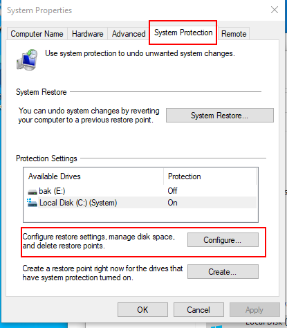
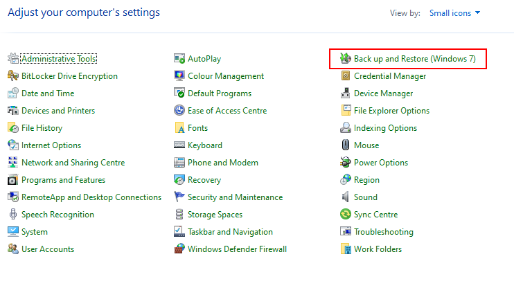

# Copias de seguridad en Windows
Window sofrece varias maneras de proteger tanto OS como datos en caso de 
desastre

## Restaurar el sistema
Es como las snapshots de las VMs, se hace una foto del estado del sistema y 
si algo va mal, se pude volver a ese estado anterior donde las cosas iban bien.

Normalmente lo que va a hacer que quieras restaurar es algún tipo de software
que no está en su versión estable o alguna actualización de sistema que no
ha ido bien.

Para crear puntos de restauración, tenemos que buscar en la barra
"restore" y nos llevará a esta GUI:

Y tan fácil como elegir el disco que contiene el OS, activar la protección
(configuración) y elegir las opciones que más nos gusten, que tampoco son 
muchas. Con la protección activada, podemos hacer puntos de restauración manuales
dando a "create", pero Windows se encargará de hacer putos de restauración
periódicos. 

Para restaurar, basta dar al botón de system restoe y elegir el punto de 
restauración

## Reestablecer el sistema
Esto consiste en devolver el OS a su estado de "recién instalado",
idealmene sin perder los documentos

Útil cuando el OS no va bien y no tienes ni idea de por qué puede ser. Hacer
un reestablecimiento no quita el hacer también copias de seguridad,
ya que podrían perderse datos

Para llegar al menú correcto, pulsas <Win+I> (settings), vas a "update &
security", buscas "recovery" y le das al botón de "Reset"

Y ya, eso hará que el OS vuelva a su estado de "recién instalado"

## Hacer backups de ficheros
Nos vamos al CP y buscamos backup & restore:

Ahí tenemos la herramienta gráfica que nos permite hacer backups de los archivos
En general, no funciona muy bien, así que consideraciones a tener en cuenta:

Windows nos obliga a que la partición donde se haga el backup no sea la misma
particón donde están los ficheros. Además, ni se te ocurra intentar hacer un
backup de imagen del sistema porque no te deja (he buscado las razones y 
no hay nada claro). Entonces, al configurar, lo mejor es elegir la opción
de que yo decido lo que se respalda: nos salen unos menús desplegables
uy monos donde elegimos.

Finalmente elegimos un horiario en el que queremos que se hagan las copias,
y fin