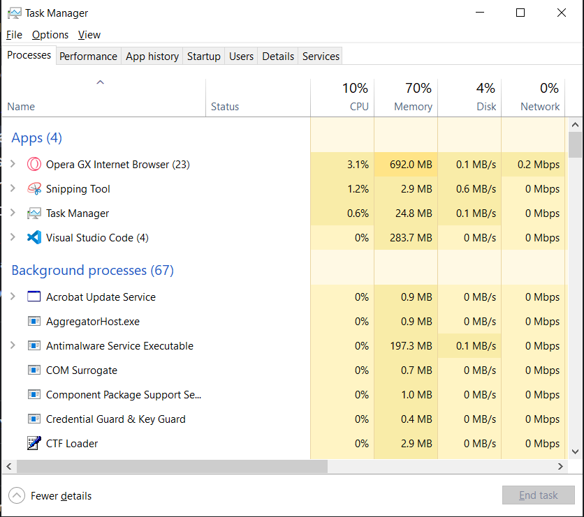
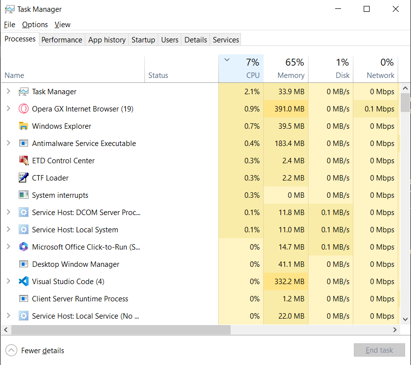
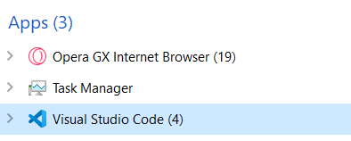
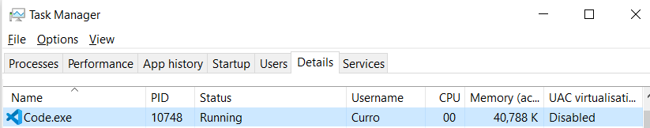

# Gestión de procesos en Windows
Windows proporciona el administrador de tareas, al cual podemos acceder 
fácilmente pulsando `CTRL+MAYUS+ESC`, deberiamos ver algo así:

Ojo que para ver esta vista, debemos tener activadas las opciones 
(se activan en la barra de arriba) view --> group by type e idealmente
también, ne la misma tab, activamos el update speen al high para 
que nos actualice el consumo de recursos rapidito.

Igual que los sitemas Linux, windows es multitarea por lo que puede correr
muchos procesos a la par (si tenemos solo 1 kernel se estará haciendo un time
shared por detrás)

El task manager dispone de varias tabs para distintos propósitos

## Procesos y detalles
En esa tab podemos ver todos los procesos en ejecución actualmente y además
los recursos que se está comiendo del ordenador. Lo más cómodo probablemente
es que podemos picnhar en las columnas para ordenar por la que queramos;
es decir, puedes pinchar en la columna de consumo de CPU para averiguar
qué procesos son los que etán acaparando más CPU, etc...

Esto es bastante útil a la hora de detectar qué está haciendo que el rendimeinto
del sistema no sea el mejor

Además se ve que no solo vemos los procesos, tambien vemos las app que están 
corriendo y los procesos que lanza el propio OS;
toda app tendrá un proceso asociado; si queremos averiguar cuál es,
tenemos que buscar dando al botón derecho la opción de "Go to details"
(nota: algunas apps se compondrán de muchos procesos y podemos ir 
a cada uno de ellos, otras generar un único proceso)

Se ve en la imagen que el número asociado a la app es la cantidad
de procesos que están asociados a esa app. Eligiendo uno de esos
procesos veremos la opción de Go to details y ahí nos llevará a la tab
del task manager que da los detalles del proceso concreto:

Entre otra info útil tenemos el ejecutable, el PID, usuario propietario, 
estado y cuanta memoria y CPU se está comiendo...

Si queremos mataer el proceso, botón derecho --> end task; también desde ahí
podemos establecer la prioridad del proceso. También como opción más radical
podemos killear el process tree, que son los procesos que cuelgan (que dependen)
del proceso. Hacer esto solo si sabes que nos vas a romper nada.

## Tab servicios
Los servicios (los daemons se llamaban en linux) son programas que están 
corriendo en segundo plano esperando a que se les pida algo. Si el proceso
que queremos parar es un servicio, tenemos específicamente esta tab para hacerlo,
aunque podría hacerse desde la de tasks, pero menos recomendable.

Los servicios, que al final son un tipo especial de proceso, suelen corresponderse
con tareas recurrentes, el propio OS está preparado para que, entre otras cosas,
see activen desde el inicio del OS.

La gestión de servicios realmente no procede aquí, el admin de tareas solo permite
cancelar puntualmente un servicio, no hacer la gestión de cuando se inicia
el servicio y qué cosas debe o no hacer