# Gestión de recursos hardware
Primero, para obtener la información básica sobre nuestro equipo, tenemos
que ir a Control Panel (escribir "CP" en la barra de búsqueda), y buscar
el botón de system:

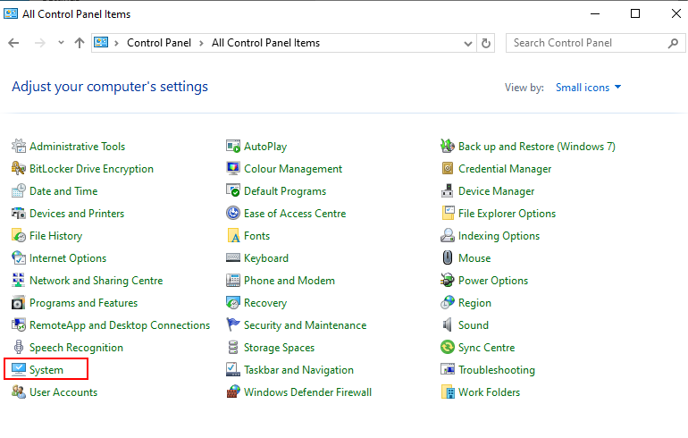

Eso nos llevará a la siguiente pantalla:

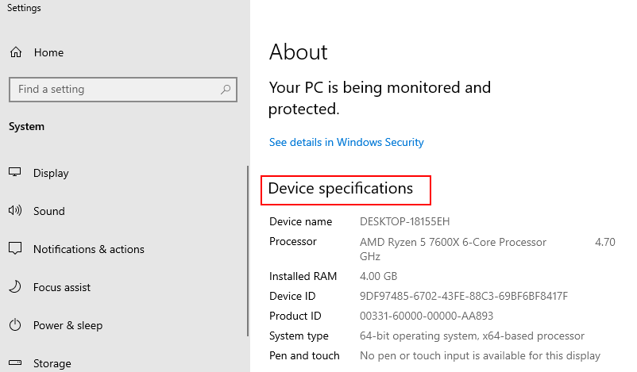
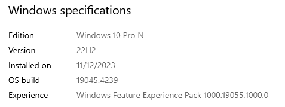

Donde podemos ver tanto la info del dispositivo (procesador, su velocidad,
RAM instalada, tipo de OS) así como las características concretas de
la versión de windows que tenemos instalada

Para saber sobre el espacio de alamcenamiento que tengo, basta ir a la
pestaña de Storage:

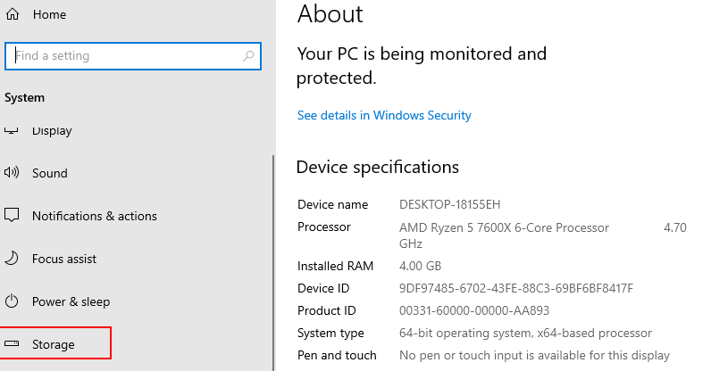
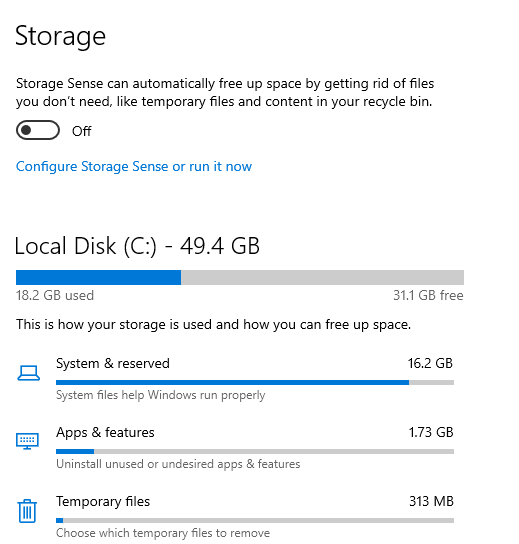

Y obtendremos la información que necesitamos para gestionar correctamente el
sistema, así como acciones recomendadas

Lo siguiente es saber encontrar los dispositivos físicos que detecta el sistema;
para ello podemos acceder o bien desde el CP, o buscando el programa 
`devmgmt.msc` en la barra de búsqueda:

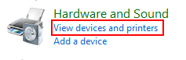

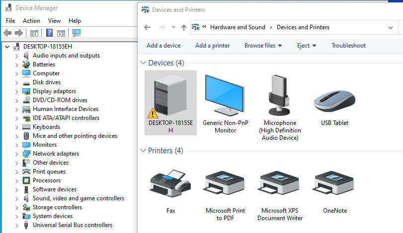

Que nos llevan a estos paneles donde podemos ver el hardware de nuestro sistema
Lo que nos muestran estos paneles son todos los disposivios físicos que
están instalados en el equipo.

También nbos indicará de alguna manera si hay algún probema con el dispositivo,
en general ante cualquier problema de u dispositivo hardware lo primero
que debemos instentar es actualizar el driver del dispositivo, a ver si
con eso se soluciona. Para ello, buscamos el dispositivo problemático y pulsamos
botón derecho para abrir las propiedades o directamentwe damos a actualizar
driver:

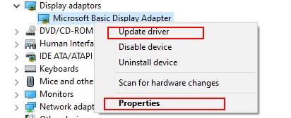

Si eso no soluciona nuestros problemas, nos toca meternos a properties e 
indagar por qué podrían estar funcionando las cosas mal, pero es un 
trabajo muy específico para cada problema específico

## Rendimiento del sistema
Para ver cómo va el sistema (en directo) tenemos el task manager (CTRL+MAYUS+ESC)
en la tab de "performance":

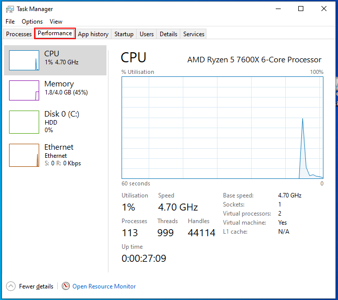

Donde nos da una idea general de qué tal está el equipo y si se están consumiendo
muchos recursos. Aunque está bien para hacerse una idea general, que nos puede
indicar por qué nuestro equipo no está funcionando como es debido,
debemos combinar esta información con las tabs de procesos, servicios para
identificar exactamente quien se está comiendo los recursos del sistema.

Otra opción es abrir el resource monitor, que lo tenemos en la misma tab de
performance, y nos muestra la siguiente pantalla:

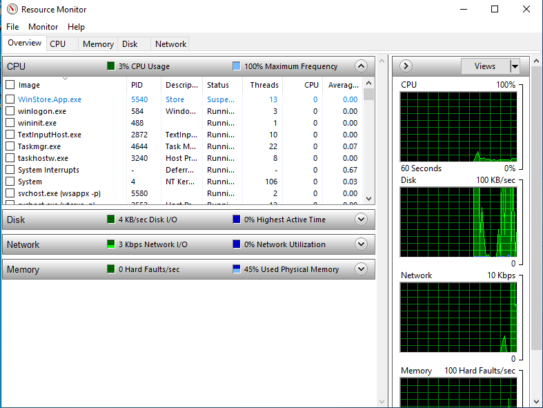

Allí tendremos un overview de todos los procesos que están en el sistema
corriendo actualemnte, junto con tabs específicas para el uso de CPU, uso de
memoria, uso de disco y de red, junto con el lisado de procesos que están 
haciendo uso de los recursos.

Lo cómodo de esta GUI es que podemos gestionar los procesos directamente
desde ahí, basta con dar la botón derecho y nos salen las opciones...

Lo malo suele ser que tenemos que ir jugando con este visor junto con el
admin de tareas para identificar exactamente qué procesos (via el PID) son
los problemáticos

(Supongo que es un buen momento hacer un ejemplo de un poco de forénsica
con por ejemplo Chrome, que se come un montón de RAM)

Otra tab interesante que nos aparece en el task manager es la de 
startup:

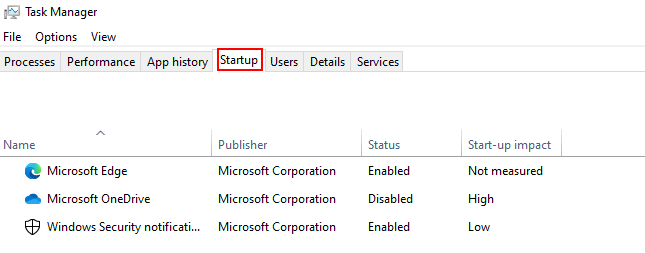

Esta app se refiere a aquellas aplicaciones que se inician automáticamente
cuando se inicia el sistema. Una muy típica es MicrosoftOneDrive para tener
un backup en la nube de nuestros ficheros.

Podemos gestionar directamente desde aquí las app que se inician automáticamente 
en login, siendo especialmente importante el "enable" o "disable" y la info que
nos da el propio sistema soibre el impacto que tienen en el arranque.

Deshabilitar app en arranque que consuman muchos recursos (marcadas con impacto
high) hará que el arranque del sistema sea mucho más rápido, a cambio de
tener que gestinarlas manualmente nosotras mismas despuès

Nota: no toda app tiene por que ser ejecutable en startup, especialmente
las que sean un 3rd party. Podemos ver todas las disponibles buscando
en la barra de búsqueda `startup apps`:

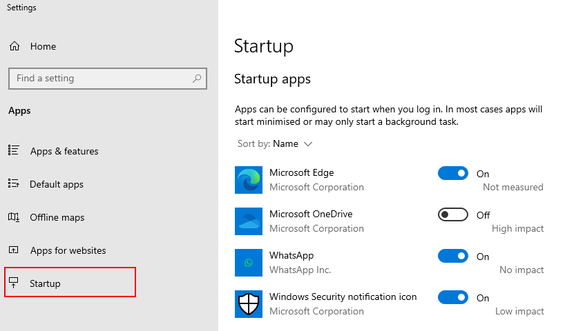

Y habilitando con el botoncito de al lado

## gestion de discos
Para la gestión específica de los discos duros, debemos buscar, en la barra
de búsqueda de windows, `diskmgmt`, y nos llevará a la siguiente interfaz:

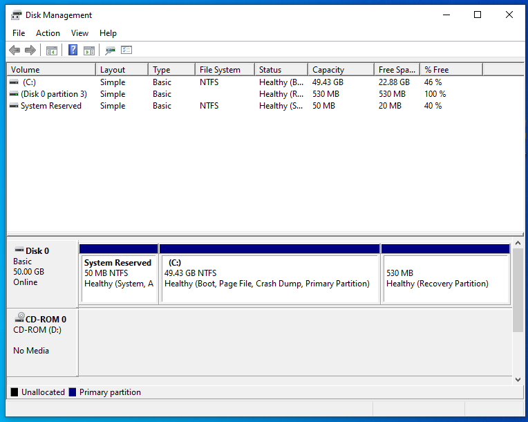

Ahí tenemos toda la información que necesitamos sobre nuestros disposivitos de
almacenamiento (discos, particiones, algunas características extra como
las reservadas del sistema, la activa...)

Podemos hacer también cualquier gestión que necesitemos de nuestros discos 
desde esta misma interfaz. Basta clickear con el botón derecho o bien en
el listado de arriba o en la parte gráfica (ver que al seleccionar cualquiera
de ambas, se resalta la otra):

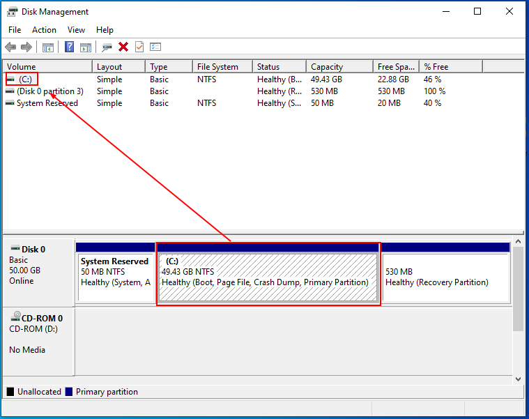

Entre las opciones más comunes son formatear (para alojar un nuevo FS)
y aumentar/reducir el volumen para dar espacio de disco
en caso de que lo necesitemos; así como borrar el volumen (partición)

Por cierto, se verá que aquellas particiones que son esenciales para el sistema,
la propia interfaz gráfica no nos permite "romperlas"

Las opciones de gestión de disco interesantes aparecen cuando, pulsando el
botón derecho, vamos a "propiedades", veremos algo así:

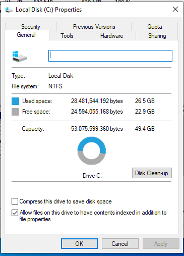

En la tab de general tenemos un info del almacenamiento, FS, y la utilidad
de "limpieza", que sirve para que el OS detecte automáticamente ficheros
innecesarios que puedan estar consumiendo espacio en disco

En la pestaña de herramientas tenemos 2 utilidades: la de búsqueda de errores
en el disco duro y la dde optimización del espacio. Mientras que la de búsqueda
de errores la debemos ejecutar manualmente cunado sospechemos de fallo de disco,
la de optmización normalmente está configurada para que se ejecute periódicamente;
podemos verlo y configurarlo pulsando el botón correspondiente y nos saltará 
otra ventana

En la tab de seguridad tenemos información de los usuarios/grupos y los permisos
que tienen sobre el disco. Toda la gestión la haremos desde ahí.

Es especialmente interesante, sobre todo para equipos que van a ser compartidos
por varias personas, la opción de "quota":

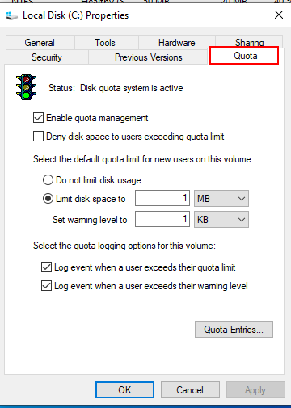

En esta opción se nor permite configurar si queremos o no que se tenga en 
centa el espacio usado por cada usuario del disco duro, pudiendo incluso
bloquear que los usuarios puedan ocupar más espacio del que les es
permitido. Para ver qué usuarios se están comiendo el espacio de disco,
podemos dar al botón de quota entries, que nos llevará a un log de
los "excesos" de quota de cada usuario. También, desde ese mismo panel
podemos especificar reglas concretas para un usuario (por ejemplo, que
no le afecte el límite de quota, o que tenga un límite diferente al
por defecto de volumen), basta pulsar en las propiedades (botón derecho
sobre la entrada del usuario que queremos gestionar)

## Gestion de la memoria
Podemos gestionar mejor la memoria del sistema yendo a "mi PC" -> click dercho,
propiedades, y ahí nos abrirá los "Syustem Settings". Ahí tendremos que buscar
la opción de "propiedades avanzadas", y nos llevará a la siguiente ventana:

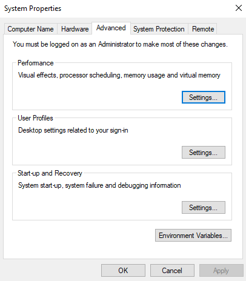

Pulsando en el botón de performance, podemos configurar cómo quremos
que Windows use memoria sobre todo en cosas gráficas. Obviamente,
la elección que se haga dependerá completamente del uso que se quiera dar al
equipo. En esa misma venta, es interesante también ver la pestaña de
avanzado, donde podemos indicarle a Windows si queremos que aloje más 
recursos para los procesos de usuario o para los procesos de segundo plano;
de nuevo, la elección dependerá del uso que se está dando al equipo