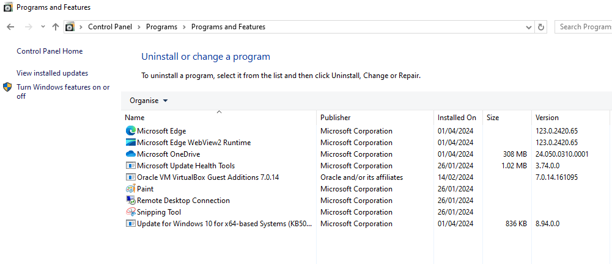

# Gestión software en windows
En general, todo el software que tenemos instalado en un OS windows
es accesible a nosotros via el menú de inicio (pulsa la tecla de Windows).
Ahí tendremos un listado (por orden alfabético) de (casi todas)  las apps.

También podemos ver el software instalado via el panel de control,
buscado en la barra de búsqueda `cp`, y navegando hasta encontrar
"programas" o "programas y características". Nos mostrará un listado
de qué progrmas tenemos instalados:

Físicamente (es decir, los ficheros de los programas) se suelen instalar en
`C:\Program Files` y dentro una carpeta con el nombre del programa.

Por otro lado, los programas suelen usar también, en caso de que sea necesario
(no todos los progrmas lo necesitan) un espacio en la carpeta oculta
`C:\Program Data`. La idea de los contenidos de esta carpeta es la misma
que la de `/var` en sistemas Linux, tiene ficheros que cambian frecuentemente
de contenido (por ejemplo, si instalamos un servidor de DBs, los datos físicos
que almacena el servidor deberían almacenarse ahí). Suele contener tabién los
ficheros de log de los programas.

## Actualización del OS
Windows saca actualizaciones semanales los martes, generalmente
pequeños parches. 

Windows dispone de 2 tipos de actualizaciones:
- de seguridad: corrigen vulnerabilidades del OS, es impotante tenerlas
- de características: introducción de funcionalidades o mejoras del OS. Suelen
    salir 2 veces al año 

Windows está diseñado para que la descarga e instalación de actualizaciones sea
automática. Las actualizaciones de seguridad suelen iniciarse solas en segundo
plano, mientras que las actualizaciones de carateríticas suelen requerir
intervención manual del usuario para ser instaladas.

### Política de actualizaciones
Para averiguar sobre la política de actualizaciones, en la barra de búsqueda
escribes `gpedit` (gp = group policies) (Nota: esto que vamos a hacer
no está disponible en todas la versiones de un Windows, por ejemplo en una
Home no está, pero sí en una PRO o PRO N).

Seleccionamos "computer configuration" --> "Administrative templates"
--> "Windows components" --> "Windows Update" y selecionamos
"configure automatic updates". Nos aparecerá un cuadro de diálogo que nos 
permite elegir entre varias opciones para la política de actualizaciones,
con una página de ayuda a la derecha. Por ejemplo, para hacer que el OS
nos notifique antes de descaragr y actualizar cualquier actualización, 
deberíamos elegir la opción 2.

Tenemos también una serie de opciones referidas a fechas y horas de descarga
y actualización, pero no aplican a todas las opciones elegidas.

En general, pensad que los OS Windows van a ser los que se usen en una oficina
por gente no especializada es sistemas, es decir, usan Windows porque van a 
usar un programa en Windows para hacer su trabajo. Por tanto es importante
configurar bien las cosa para que no estén en medio del trabajo y windows
decida riniciarse por una actualización (a mi me ha pasado y he perdido trabajo).

Por otro lado, nosotros (como usuario admin) siempre podemos preguntar al 
sistema si tiene actualizaciones y decidir si las queremos descargar e instalar.
Solo hay que buscar en la barra de búsqueda "updates" y nos llevará a la 
gui de "Settings"; ahó podremos chequear, descargar e instalar actualizaciones.

Admás ofrece otras opciones como "active hours", "pause updates"... creo que 
todas son bastante autoexplicativas.

### Restauración en caso de problemas
Algunas actualizacione spueden causar problemas a tu sistema, en cuyo
caso lo que debemos hacer es restaurar el sistma a uns estado anterior 
en el que si funcionaba correctamente. Pero esto lo veremos más adelante,
ya que hay que configurar alguna cosilla.

Por ahora, por si se nos instala una actualización que o bien no deseamos o
nos causa problemas en el OS, en settings --> updates --> history tenemos
una opción de desintalar actualizaciones. Por supuesto deberías primero
averiguar cuál es la actualización problemática, pero por suerte tenemos
fechas de cuando se instalaron las actualizaciones, con eso debería ser
suficiente para más o menos tener localizado el foco del problema.

## Instalación de software via Microsoft Store
La MS Store es una plataforma de distribución de apps para dispositivos con el 
OS adecuado. No tiene mucho más misterio que buscarla en la barra de búsqueda
para acceder a ella.

Una vez dentro, consiste en buscar el software que deseas instalar, por ejemplo
linkedin. Lo buscar, das al botón y se descarga a instala el software
en tu OS. La Ms store se encarga de gestionar todo el proceso de la app,
así que en ese sentido te despreocupas. Se supone que es una experiencia 
"conveniente y segura" para la instalación de software. 

Sin embargo, no todo desarrollador va a distribuir su software via la MS Store

### Desinstalación
Podrías pensar que es tan fácil como buscar un botón que diga "uninstall" 
en la propia MS Store, pero por motivos no veo que exista ese botón.
Si no aparece, en la barra de búsqueda buscamos "apps & features" y podremos
desinstalar desde ahí.

## Instalación de software con programas obtenidos de la web
Algunos desarrolladores no distribuyen su software via MS Store, y debemos
instalar los programas o aplicaciones encontando e istalador correcto
en su web o algún otro sitio.

En general, todo software que vayamos a poder instalar en Windows tiene una 
aplicación instaladora que nos v a aabrir un Wizard en el que elegiremos unas 
opciones básicas de configuración. ormalmente también incuyen una aplicación 
desinstaladora, aunque tendremos otros mátodos de desinstalación.

Por ejemplo, vamos a instalar Steam en la máquina; no se distribuye via
MS Store (que yo sepa), por tanto tenemos que ir a la web de descargas
de Steam y buscar el instalador correcto. 

Tras que se nos descargue el progrma instalador, ejecutamos el .exe
y seguimos el wizard.

### Desinstalación
Si queremos desinatalar, podemos hacerlo via programs & settings, apps & features
o buscar el programa desintalador en la propia carpeta de la instalación.

Suele ser recomandble, una vez desintalemos un programa, revisar (en Program Files
y Program Data) que no ha quedado nada por ahí del programa, normalmente
ficheros de configuración para una futura reinstalación.

### Misc.
Aunque en general todos los progrmas en Windows son amigables y te lo ponen
fácil para que los puedas usar sin problemas (es decir, no hay mucho que
configurar y me crean un acceso directo), a veces no es así y hay que
tocar el PATH para que Windows sepa dónde encontrar el programa.

Un poco más sobre esto e ejercicios.