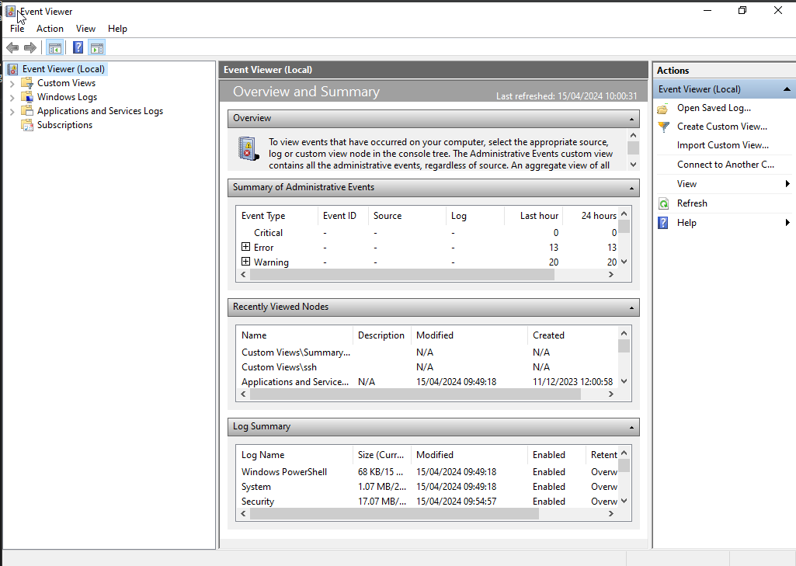
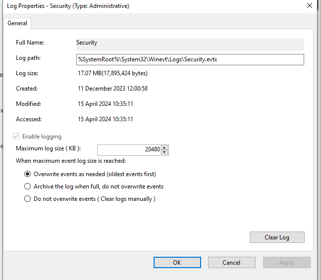
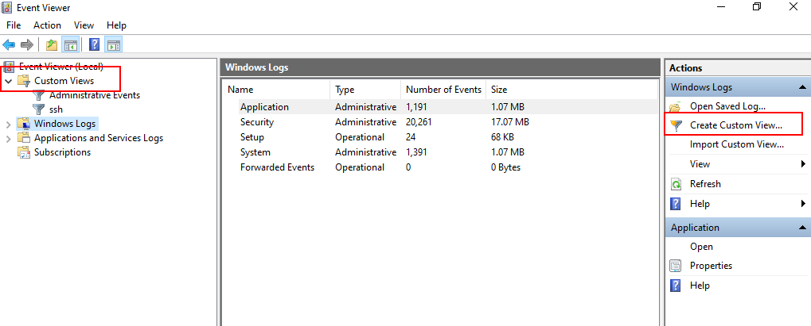
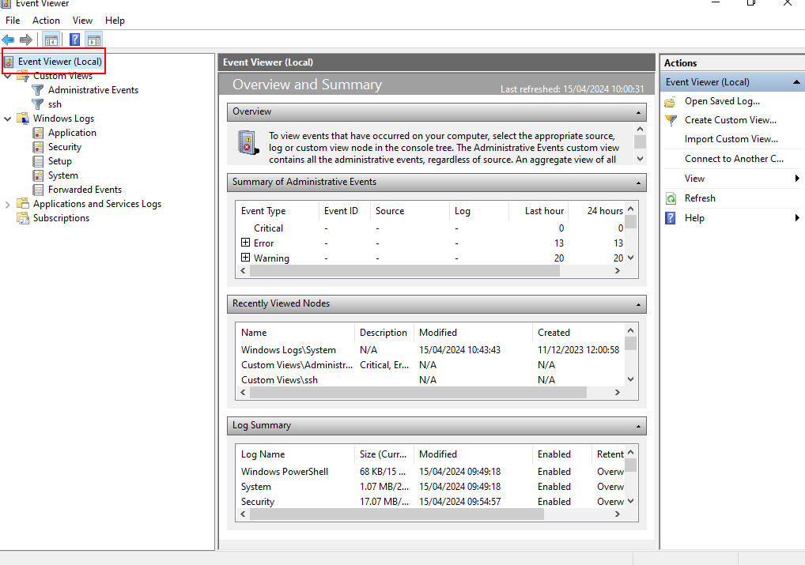

# Monitorización en Windows
La igual que Linux (y cualquier otro OS), Windows cuenta con
un sistema de loggeo que registra la actividad que ocurre en el OS
y nos permite releer la historaia para, en caso de fallo, averiguar
cual ha sido el problema y solucionarlos.

Para llegar a la interfaz gráfica del logger, escribimos en la barra de
búsqueda `event viewer`, nos llevará a la siguiente GUI:

La GUI tiene 3 secciones: panle de navegación, panel de detalles y panael 
de acciones

## Panel de navegación
Es lo que se usa para ver los logs. Windows tiene 5 categorías de logs:
- Application: logs de aplicaciones que corren en local
- Security: eventos sobre logins (con éxito o no), elevación de prvilegios...
- Setup: mensajes de instalación y actualización del OS
- System: mensajes del OS
- Forwarded: son eventos de otras máquinas cuando localhost actúa como "central
    susbcriber"

También merece la pena ver la sección de Application and services log, que
es la wue incluye los logs de hardware y la consola

## Panel detalles
Eligiendo una categoría de logs, en el panel central de detalles
podemos ver todas las entradas de ese log, ordenadas cronológicamente
de más reciente a más antigua. En cualquier caso podemos ordenar por cualquiera 
de las otras columnas

Una de las columnas más importantes es "level", que indica la "gravedad"
del log registrado. Windows tiene 6 niveles:

- Info: indican algo que ha tenido éxito
- Warning: ha ocurrido un evento que puede causar problemas
- Error: un problema significativo
- Critical: Un problema que necesita solución inmediata ha ocurridoi
- audit success/failure: están asociados con eventos de seguridad

En el panel de detalles podemos pinchar en uno de los eventos y en el subpanel
de abajo podremos ver exactamante qué ha pasado

Para exportar un evento concreto podemos dar la botón derecho sobre el evento
y copiarlo a un txt o lo que sea... suele ser útil saber sacar esta información
para proveedores de soporte

## Panel acciones
Permite hacer cosas con lo que hayamos selecionado. Tiene 2 seeciones,
la que se refiere a lo elegido  en el panel de navegación y la que se refiere
a lo elegido en el panel de detalles

Respecto a las acciones de panel de navegación, las interesantes son: filtrar, 
para encontrar un log rápidamente, "clear", para vaciar un fichero de logs,
y "properties" para configurar el comportamiento del logt text"

Ahí podemos ver donde se alacena físicamente en disco el fichero, su tamaño,
fecha creación/acceso... Y las acciones interesante: o borrar el contenido
del fichero, y configurar el tamaño máximo que debe tener; así como 
configurar qué hacer cuando el tamaño máximo se alcanza: archivar los
logs más antiguos, sobreescribirlos o "nada", en el sentido de que tendremos
que, manualmente, vaciar los ficheros de logs

Respecto a las acciones de un log concreto, seguramente la más interesante es 
la de exportar; que es la típica información que se pedirá por parte de un
soporte para hacer troubleshooting

## Custom logs
También podemos crear nuestros propios logs personallizados, basta ir, en el
panel de navegación, a la parde de "custom Views" y seleccionar, en el panel
de acciones, "create custom view". Nos abre una maravillosa GUI que no requiere
mucha explicación

Por motivos (preguntar a Bill Gates) no se puede gestionar desde ahí ese log
(tamaño, fichero físico, rotaciones...) Supongo que lo que ocurre realmente
es que está cogiendo la info de los otros ficheros de log

## Summary
Finalmente, tenemos un panel de resumen:

Que nos hace un resuemn de nuestros logs