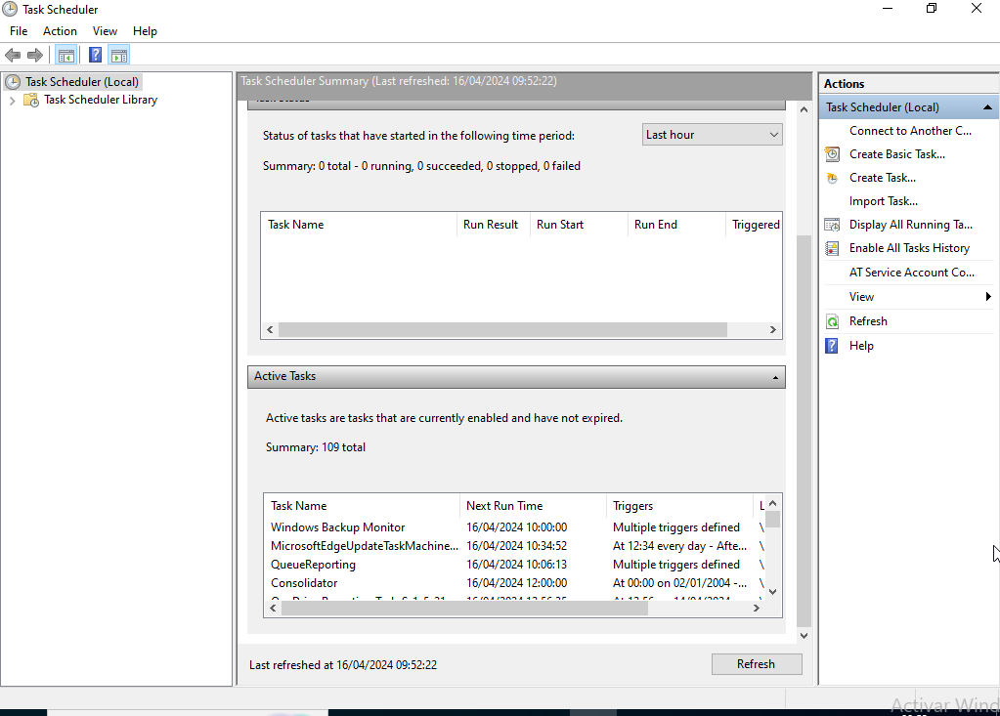
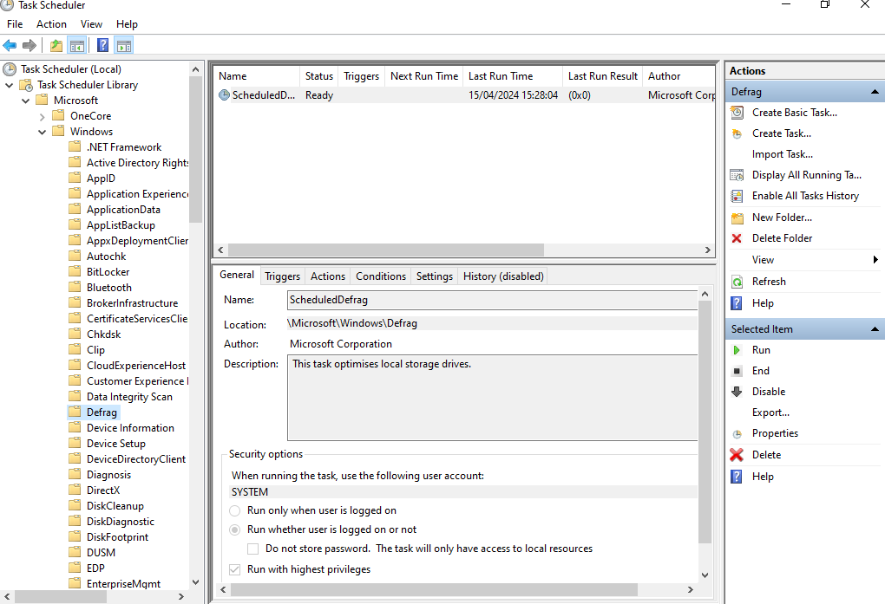

# Planificador de tareas de Windows
Para planificar tareas a futuro o tareas que se vayan a repetir periódicamente,
tenemos el task scheduler.

Para abrirlo, en la barra de búsqueda escribes "task schedules" y nos
llevará a la siguiente interfaz gráfica:

que como muchos otros panels de windows tiene 3 secciones: la de navegación
(izda), la de información (centro) y la de acciones (dcha)

Si queremos ver una tarea concreta de las que ya nos ha planificado Windows,
buscamos con el navegador, por ejemplo aquí vemos la desfragmentación
de discos:

En el panel de info del centro tenemos la info sobre la tarea.
LA pestaña de la general es eso, una idea general de qué hace la tarea,
aunque es importante ver que tenemos una opción de seguridad en ese mismo
espacio.

El tab de triggers permite indicar qué va  hacer que la tarea se ejecute.
Puede ser desde un horario predeterminado, hasta el login/out, inicio del
sistema... Podemos meternos a "properties" de la task para ver todas las 
opciones

Respecto a la tab de acciones, realmente tenemos solo una opción, que es
correr un programa.

La tab condiciones va de la mano de la tab de trigger; se trata de definir
una serie de condiciones que, si no se cumplen, la tarea no se ejecutará.

settigns son configuraciones extra sobre qué tiene que pasar con la tarea

Finamente, la opción de historial, por defecto desactivada, nos dice cuándo
se ha ejecutado la tarea. Si queremos activar el historial de las tareas, 
en el panel e acciones tenemos que pulsar el botón de activar le historial
de todas las tareas.

Finalmente, para una tarea específica, en el panel de información, arriba,
tenemos el resumen de la info que necesitamos. Entre todas las columans de
información, una de las más importantes es la de "last run result", que
indicará un número en HEX con el resultado de la tarea. Si el número es
`0x0`, es que la tarea se ejecutó sin errores, si el número es cualquier otra
cosa, es el código de error que devuelve la ejecución del programa; en caso
de tener un código de error, tenemos que usar esa información para saber qué
pudo ir mal y solucionarlo.

Finalmente, en el panel de acciones (de la tarea seleccionada), tenemos
las opciones de "disable" (desactivar la tarea pero sin borrarla, es decir,
pensando en reactivarla en un futuro), o directamente, eliminar la tarea

Respecto a las acciones de tareas, en general, si queremos crear nuestrar
propias tareas, lo mejor es hacernos una nueva carpeta para tener controladas
las tareas que especifiquemos nosotras

Para crear una nueva tarea, vamos a la carpeta, damos, en el panel de acciones
a "new task", y seguimos el wizard para definirla.

Por ejemplo, para crear una task que ejecute la cmd en login de usuario,
creamos nueva tarea, definimos nombre y seguridad,
creamos un trigger (user login), buscamos el programa (cmd.exe),
definimos (si es necesario) el resto de cosas.. y ya está

Finalmente, si pinchamos en el panel de navegación en task scheduler, tenemos
un resumen de todas las tareas que se han ejecutado (para verlas, panel de en medio, hay
que activar el historial), y de todas las que se van a ejecutar (panel de abajo)