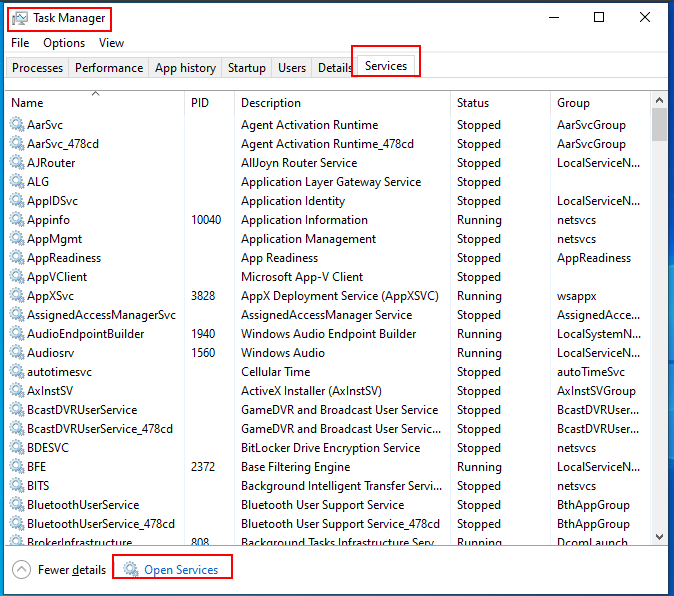
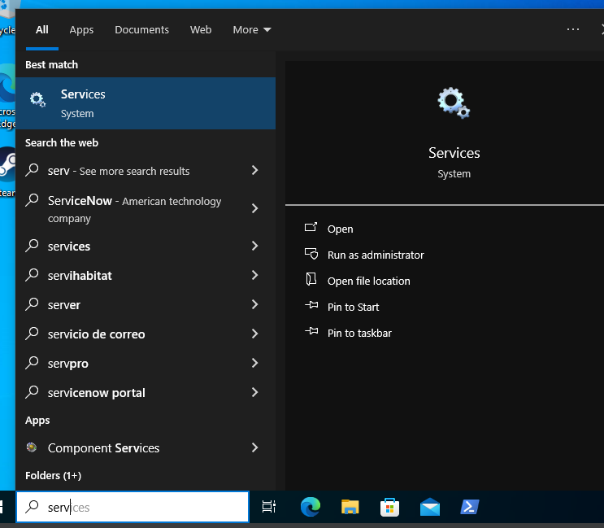
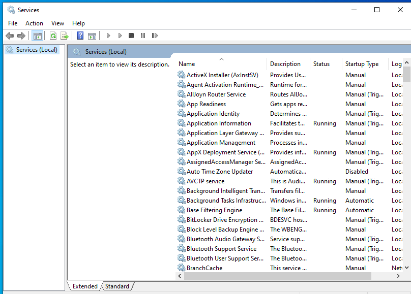
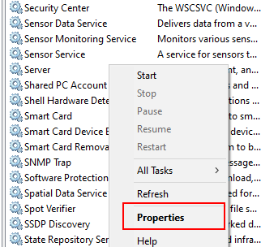
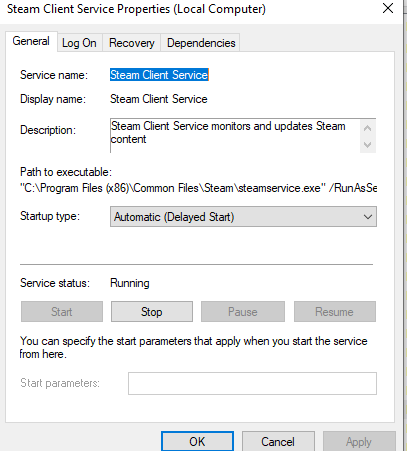
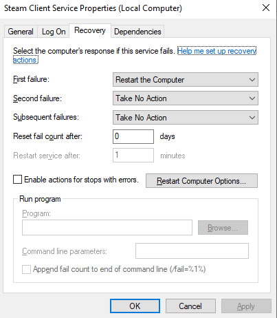

# Servicios es Windows
Conceptualmente es lo mismo que en Linux o cualquier otro OS,
son procesos que están corriendo en background (es decir no interactuan
con el usuario) a la espera de que un usuario (humano o no) les llame para
pedirles algo (datos, ejecutar una tarea...)

Para gestionar los servicioes tenemos una GUI a la que podemos llegar de varias 
maneras; una es abriendo el task manager (CTRL+MAYUS+ESC), yendo a la
pestaña de servicios, veremos un botón para ir a la GUI:

La otra manera es buscar con la barra de tareas "services":

En cualquier caso llegaremos hasta aquí:

Donde tenemos la vista de los servicios que tenemos en el sistema e información 
sobre ellos, en concreto, nombr del servicio, una descripción de lo que hace, 
el estado (aunque el estado se ve mejor en task manager: tiene 3 posibles,
running, stopped, paused) y el startup type, es decir, cómo se inicia el 
servicio

Las opciones de inicio de servicio son:
- automática: se inicia el servicio con el arranque del OS
- auomático (delayed): se inicia con el arranque del OS, pero esperará a que
    otros servicio esenciales y el propio OS estén cargados antes de 
    iniciarse; así reduce la carga de trabajo en el arranque del sistema
- manual: un usuario u otro programa será quien inicie el servicio
- disabled: no podrá iniciarse ni siquiera manualmente. Se marcan disabled
    servicios que no se usan o que son un fallo de seguridad

Para gestionar un servicio, dando al botón derecho sobre el servicio podemos
ir a  propiedades:

Especialmente interesate en la tab de recovery, que nos permite
definir la respuesta que debe tener el sistema ante un fallo del servicio